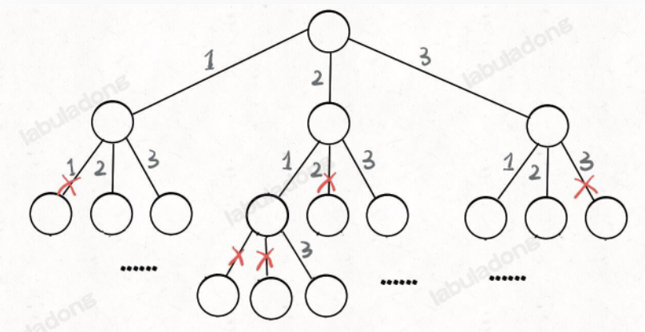

# Ref

https://labuladong.github.io/algo/1/3/

# 算法的本質


**窮舉**

* 機器學習工程師的算法 - 數學建模 & 調參數經驗 - (數學算法)
* 資料結構與演算法 - 計算思維(站在計算機的視角、抽象、化簡實際問題) - (計算機算法)

數學算法 - 仔細觀察、找幾何關係、列方程式、算出答案 --> 如果要進行大規模窮舉來找答案，那麼解題思路大概是出問題了

計算機算法 - 數學公式什麼的交給人類去推導吧! 如果能找到一些巧妙的定理最好，如果找不到就窮舉吧! 只要複雜度允許，沒什麼答案是窮舉不出來的

# 窮舉的關鍵難點

**無遺漏、無冗余**

1. 遺漏 - 答案出錯
2. 冗余 - 拖慢計算機速度

所有計算機算法題都可以從這兩個維度思考

1. 如何窮舉 - 如何無遺漏的窮舉所有解
2. 如何聰明地窮舉 - 避免所有冗余的計算、消耗盡可能少的資源求出答案

# 哪些算法的難點在於如何窮舉?

1. 遞迴
2. 動態規劃

動態規劃的題目千奇百怪，找狀態轉移方程式才是重點，而遞迴窮舉的核心是數學歸納法

# 哪些府啊的南點在於聰明的窮舉?

* 耳熟能詳的非遞迴算法技巧
  * e.g. Union Find --> DFS/BFS 可以做到，但是 Union Find 用數組模擬樹狀結構，連通性操作複雜度 --> O(1) (聰明的窮舉)
  * e.g. 貪心算法 - 從題目發現一些規律(貪心選擇性質) --> 不用完整窮舉就得到答案

## 數組 / LinkedList 系列算法

### 雙指針

1. LinkedList 常見技巧 - 雙指針
   1. HashSet 存走過的節點(遇到重複的說明有環)
   2. 快慢指針 - 避免額外的空間使用
2. Binary Search - 兩端向中心的雙指針
3. 滑動雙口
   1. 找到包含特定字符的最小字串
      1. for loop 窮舉 - 平方級複雜度
      2. 快慢指針走一次
4. 回文串

## 前綴和 & 差分

1. 頻繁計算子數組的和 --> `preSum` 來避免多次循環
2. 頻繁對子數組進行增減 --> `diff` 來避免多數循環

## Binary Tree 系列算法

* Binary Tree 是所有高級算法的基礎，特別是對於遞迴的題目
* Binary Tree 題目的遞迴解法有兩種思路
  * Binary Tree 走一遍得出答案
  * 分解問題 --> 得出答案

* Case Study : 計算 BinaryTree 的最大深度

```python
int res = 0
int depth = 0

# 主函數
int max_depth(root : TreeNode){
   traverse(root)
   return res
}

void traverse(root : TreeNode){
   if (root == null){
      # 已經抵達葉子節點
      res = Math.max(res, depth)
   }
   # pre-order
   depth++;
   traverse(root,left)
   traverse(root,right)
   # post-order
   depth--
}
```

* 用 traverse 走一遍所有的 binary tree 節點，並維護 `depth`，在子節點時更新最大深度

以上程式碼框架是可以對應到 backtracking - 全排列問題

### 全排列問題 in backtracking (走訪 N edges Decision Tree)

* input - 一組不重複的數字
* output - 他們的全排列
* e.g. input : [1,2], output : [1,2], [2,1]
* 此題式暴力窮舉 - 對於給定的數列有 $n$ 個元素，會有 $n!$ 個排列方式

和 N - Tree 走訪的關係

</img>

任何的 backtracking 都可以畫作一顆決策樹
   * level - 在某個狀態 (state) 上
   * edge - 做選擇，到下一個 state 上
   * backtrack - 撤銷選擇，回到上一個 state

```python
def backtrack(choice_list : List[int]):
   for choice in choice_list
      # make a choice
      choice_list.remove(choice)
      path.add(choice)
      backtrack(path, choice_list)
      # undo a choice
      path.remove(choice)
      choice_list.add(choice)
```

只要在遞迴之前做出選擇，在遞迴之後撤銷選擇，就能正確得到每個節點的選擇列表和路徑

所有 backtracking 算法都可以畫作決策樹，雖然這個算法解決全排列不是最有效率的，但是可以協助你做到基本的窮舉

而 backtracking 算法本質上就是 走訪一顆 N-Tree

### Max depth of binary tree (透過分解問題計算出答案)

binary tree 的最大深度，解法 B 

```python
def maxDepth(root : TreeNode) -> int:
   if root is None:
      return 0
   leftMax = maxDepth(root.left)
   rightMax = maxDepth(root.right)
   res = Math.max(leftMax, rightMax) + 1
   
   return res

```

以上形式基本上和動態規劃的 code 如出一徹

pass