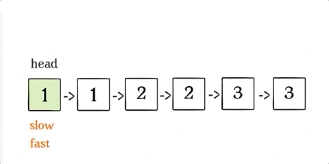

# Ref

* [手把手刷array - 雙指針秒殺7道 array 題目](https://labuladong.github.io/algo/2/20/23/)

# 雙指針

* 雙指針技巧經常用於 - array, linked-list，主要分為 `左右指針`, `快慢指針`
* 左右指針 - 兩個指針相向而行 / 相背而行
  * binary search, 回文, 同個 array 的元素判斷
* 快慢指針 - 同向而行 - 一快一慢
  * 原地修改、原地刪除 array 元素
* linked list 中的技術大概都屬於快慢指針，[ref](https://labuladong.github.io/algo/2/19/18/)，多半使用 fast, slow 兩個指針來操作
  * 判斷鍊錶有沒有環
  * 倒數第K個節點
* array 沒有實質意義的指針，可以把 index 當作指針

# 快慢指針


* **常見的應用希望你原地修改array內容**


## Leetcode 26, 刪除已排序數組中的重複元素
  * input : sorted array : `[0,0,1,2,2,3,3]`
  * output : `[0,1,2,3]`
  * replace in place - 題目要求，不能多 new 一個 array

<br>
<br>
<br>
<br>
<br>
<br>
<br>
<br>
<br>
<br>
<br>
<br>
<br>
<br>
<br>
<br>
<br>
<br>
<br>
<br>
<br>
<br>
<br>
<br>
<br>
<br>


* sol 1 :
  * 重複的元素必定連在一起，每次找到重複就刪除，array 中的元素刪除(`array.remove(element)`)，涉及到資料搬移(copy, paste)
  * sc O(1) , tc : O(N^2)，[ref](https://wiki.python.org/moin/TimeComplexity)
* sol 2 : how about 開一個新的 list，找到重複值不做事，找到不重複值就加入到新的 array?
  * sc : O(N), tc O(N)
* sol 3 : 
  * 透過快慢指針 - slow 走後面，fast 走前面，每找到一個不重複元素，slow += 1 --> `nums[0 .. slow]` 都會是無重複元素，當 `fast` 走完之後，`nums[0 .. slow]` 就會是去重複的結果
  * </img>
  * sc : O(1), tc : O(N)

```python

def removeDuplicates (nums : List[int]) -> List[int]:
    '''
    return 不重複的 array
    '''
    if len(nums) == 0:
        return []
    slow = 0
    fast = 0
    while fast < len(nums):
        if nums[fast] == nums[slow]:
          # 找到重複值，快指針前進
          pass
        if nums[fast] != nums[slow]:
            # 找到獨立值，將獨立值放置array中，將 duplciates 替換掉，快指針繼續前進
            slow += 1
            nums[slow] = nums[fast] 
        fast += 1
    return nums[0:slow]

```

## Leetcode 83, 刪除已排序LinkedList中的重複元素 

https://leetcode.com/problems/remove-duplicates-from-sorted-list/submissions/

以上思維也適用於 leetcode 83，刪除已排序 linked list 中的重複元素，唯一的差異只是把 array 給值變成指針操作

</img>

* 根據語言不同，需要考慮是否要進行 garbage collection， C++ 就需要，python 就不用


## Leetcode 27 - 原地刪除指定元素

https://leetcode.com/problems/remove-element/

<br>

* 除了去重複(原地修改)，也可能會碰到原地刪除
* `nums = [0,1,2,2,3,0,4,2], val = 2`
* out = 5, first at index = 2, final at index at 7, k = 7-5 = 2
* do not allocate extra space for another array

<br>
<br>
<br>
<br>
<br>
<br>
<br>
<br>
<br>
<br>
<br>
<br>
<br>
<br>
<br>
<br>
<br>
<br>
<br>
<br>
<br>
<br>
<br>
<br>
<br>
<br>

* Sol 1 :
  * 單指標 i, 記錄值 first_match_idx, current_match_idx，掃一遍 array
  * tc O(N), sc O(1)
  * 但這個做法沒辦法做到刪除元素
* Sol 2 :
  * 雙指標, fast, slow, 遇到 val 就跳過，剩下的都給 slow
  * 其實要 inplace 刪除，基本上都不是 remove，而是 slicing

```python
slow = 0
fast = 0
iteration 0, slow = 0, fast = 0

num[fast] != 2
num[slow] = nums[fast] # [0]

iteration 1, slow = 1, fast = 1
num[fast] != 2
num[slow] = nums[fast] # [0, 1]

iteration 2, slow = 2, fast = 2

num[fast] == 2

iteration 3, slow = 2, fast = 3

num[fast] == 2

iteration 4, slow = 2, fast = 4

num[fast] != 2

num[slow] = nums[fast] # [0, 1, 3]

...

final num[:slow] = [0,1,3,0,4]

```

## Leetcode 283 - 移動0

```
Input: nums = [0,1,0,3,12]
Output: [1,3,12,0,0]
```

<br>
<br>
<br>
<br>
<br>
<br>
<br>
<br>
<br>
<br>
<br>
<br>
<br>
<br>
<br>
<br>
<br>
<br>
<br>
<br>
<br>
<br>
<br>
<br>
<br>
<br>


* 並沒有要求不能創造新的 array

* sol 1:
  * 把所有的 0 都移到最後面
  * 其實就是刪除0的意思(並非實質意義上的刪除，而是 slicing)，而慢指針後面都放 0
  * tc O(N)
  * sc O(1)
* sol 2:
  * 開一個 array，一個 counter
  * 是 0， counter +=1
  * 非 0， 加入 array
  * tc O(N)
  * sc O(N)

# 滑動窗口

* array 另一大類使用快慢指針的題目是 滑動窗口，而這是另一個主題

# 左右指針

* binary search 基本上就是雙指針，只是是左右指針(相向 / 背向)
* psudo code in python
```python
def binary_search(nums : List[int], target : int) -> int:
  # 左右指針、相向而行
  # 注意，需要 sorted array 才能夠使用
  left = 0
  right = len(nums) - 1
  while (right >= left):
    mid : int = (right + left) // 2 # 整數?
    if nums[mid] == target:
      return mid
    elif nums[mid] < target:
      left = mid + 1
    elif nums[mid] > target:
      right = mid - 1
  return -1
```

## Leetcode 167 - Two Sum II - Input Array Is Sorted

* 一個已經被排序好的 array，給定 target，拆解是哪兩個元素的和
* `numbers = [2, 7, 11, 15], target = 9`, out = `[1,2]`
* 有什麼限制嗎?
  * array 長度 < 3 * 10^4
  * -1000 < 值域 < 1000
  * -1000 < target < 1000
  * test case 只有一個解
  * 每個元素只能被使用一次，而非兩次
* sol 1
  * 雙層 for loop, e1 + e2 == target
  * tc : O(N^2)
  * sc : O(1)
* sol 2 
  * hash table
  * 開一個 hash table，{2 : 0, 7 : 1, 11 : 2, 15 : 3}
  * for loop array, target - e1 in hash table?
  * tc : O(N)
  * sc : O(N)
* sol 3 
  * sorted, 可以 apply binary search like algo

```python
def twoSum(nums : List[int], target : int) -> List[int]:
  # 排序好的 array
  # 左右指標相向而行
  left = 0
  right = len(nums) - 1
  while right > left:
    _sum = nums[left] + nums[right]
    if _sum == target:
      # 題目要求 index 從 1 開始
      return [left+1, right+1]
    elif _sum < target:
      # 太小了，_sum 需要增加，因為已經排序好了，唯一 _sum 變大的方式就是
        left += 1
    elif _sum > target:
      right -= 1
  return [-1, -1]
```

# Leetcode 344 - Reverse String

* 反轉數組，reverse 函數，基本上都是類似的操作方法

```
Input: s = ["h","e","l","l","o"]
Output: ["o","l","l","e","h"]
```

```python
def reverse_string(s : List[str]) -> List[str]:
  # 左右指針相向而行
  left = 0
  right = len(s) - 1
  while left < right:
    # swap element
    tmp = s[left]
    s[left] = s[right]
    s[right] = tmp
    left += 1
    right += 1
    # 相等時 array 不用做事
  return s

```

# 回文檢查

```python
def is_palindrome(s: str) -> bool:
    """
    tc : O(N)
    sc : O(1)
    左右指針，相向而行，左==右才繼續
    """
    left = 0
    right = len(s) - 1
    while left < right:
        if s[left] != s[right]:
            return False
        left += 1
        right -= 1
    return True
```
# Leetcode 5 最長回文子字串

* 回文子字串函數 - 判斷是否為回文，且吐出回文字串
* 回文字串可以是奇數 (一個中心) 或者偶數 (兩個中心)

```python
for 0 <= i < len(s):
    找到以 s[i] 为中心的回文串
    找到以 s[i] 和 s[i+1] 为中心的回文串
    更新答案
```

回文 :

tc : O(k) - 最長的回文字串
sc : O(k)

最長回文(包含回文) : 

tc : O(N)
sc : O(k)

[check here](fucking_algorithm_101/chp1/003_array_leetcode5.py)


