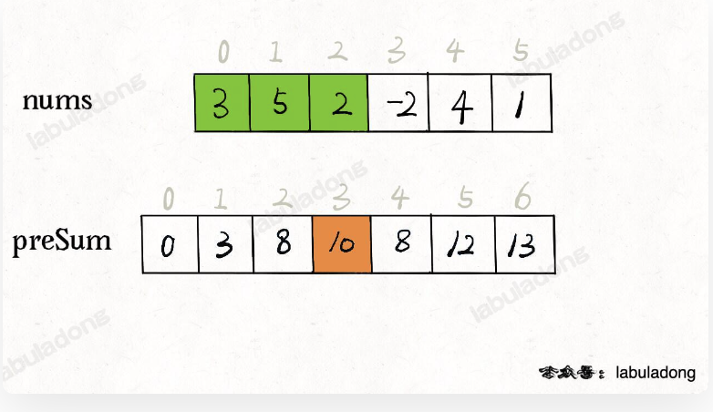
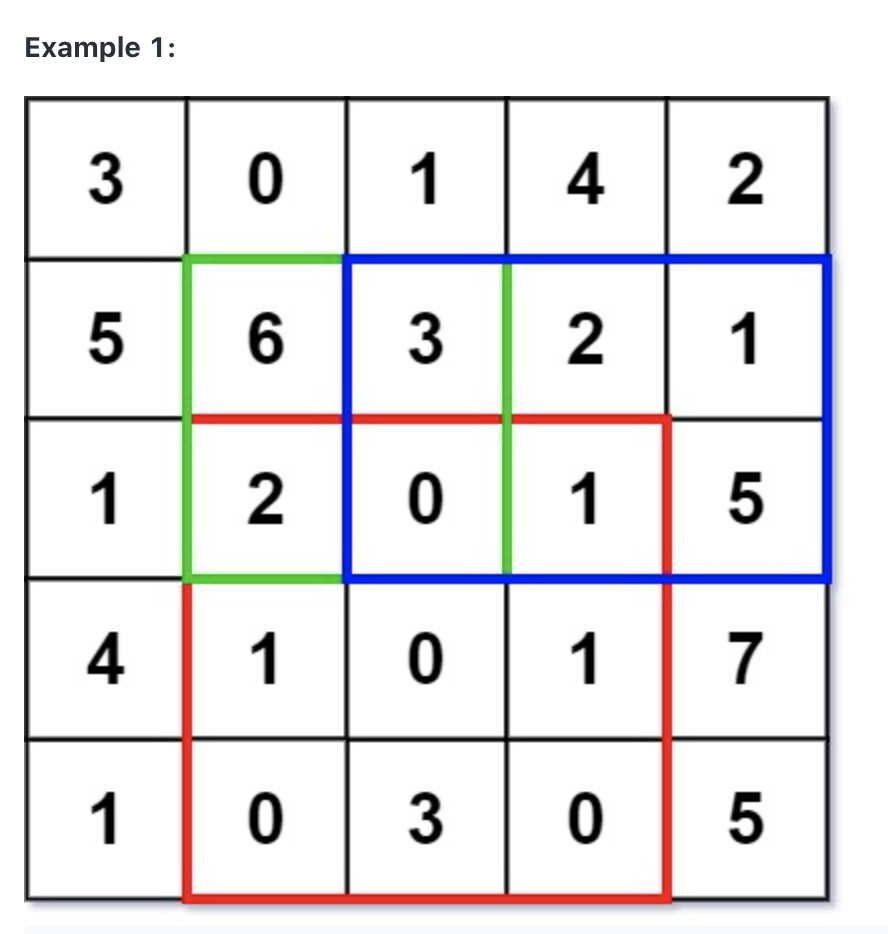
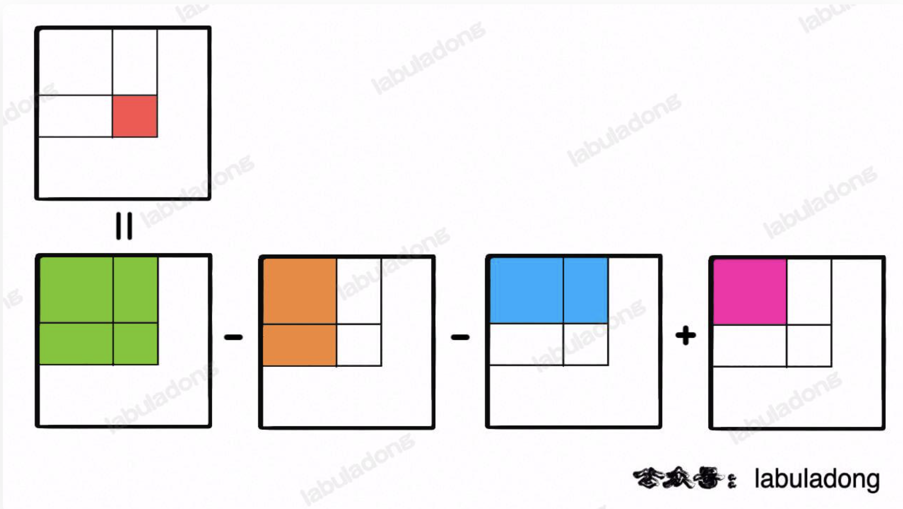
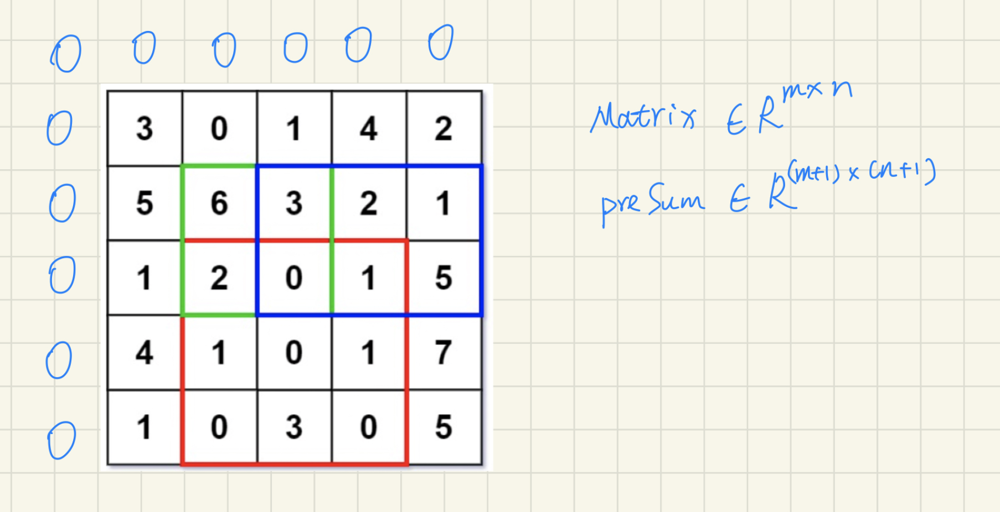
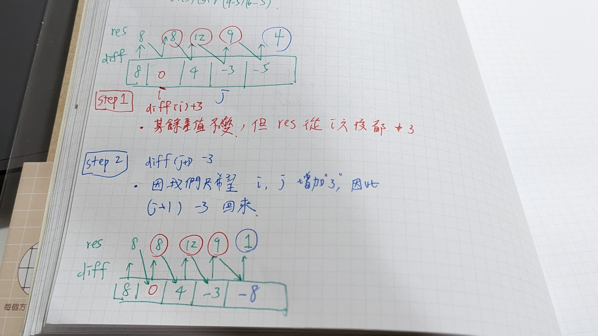
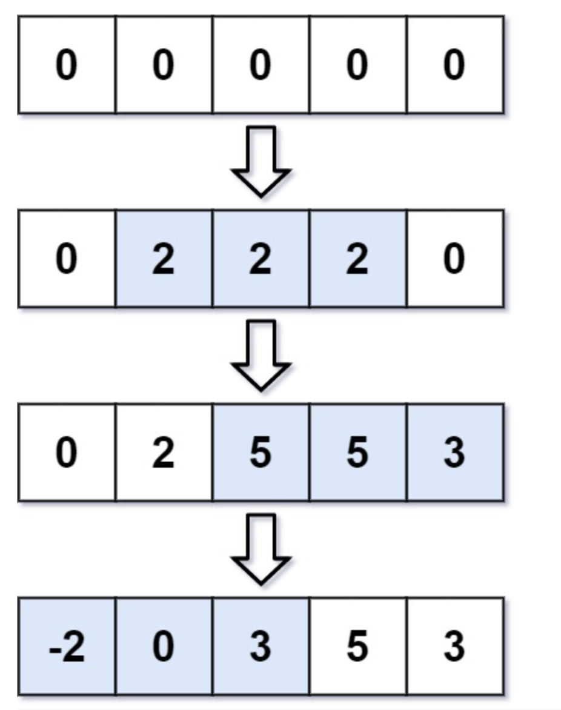

# Ref

* [小而美的算法技巧：前缀和数组](https://labuladong.github.io/algo/2/20/24/)
* [小而美的算法技巧：差分数组](https://labuladong.github.io/algo/2/20/25/)

# 前綴和

* 不修改原始 array ，頻繁查詢某區間內的 **累加和** - 概念很像積分，變成 Area Space 區間相減， 就不用每次都要 loop
* 差分 - 不修改原始 array，頻繁對區間內 **加加減減** - 概念很像微分，變成 Slop Space ，最後再加總起來，就不用每次都要 loop

# 1d array - presum leetcode 303

https://leetcode.com/problems/range-sum-query-immutable/

easy

* an integer array `nums`, implement `sumRange (left, right)` - with immutable array
  * `left <= right` (a.k.a. sorted)

```
Input
["NumArray", "sumRange", "sumRange", "sumRange"]
[[[-2, 0, 3, -5, 2, -1]], [0, 2], [2, 5], [0, 5]]
Output
[null, 1, -1, -3]

Explanation
NumArray numArray = new NumArray([-2, 0, 3, -5, 2, -1]);
numArray.sumRange(0, 2); // return (-2) + 0 + 3 = 1
numArray.sumRange(2, 5); // return 3 + (-5) + 2 + (-1) = -1
numArray.sumRange(0, 5); // return (-2) + 0 + 3 + (-5) + 2 + (-1) = -3
```

```python
class NumArray:

    def __init__(self, nums: List[int]):
        

    def sumRange(self, left: int, right: int) -> int:
        


# Your NumArray object will be instantiated and called as such:
# obj = NumArray(nums)
# param_1 = obj.sumRange(left,right)
```

* 元素值在 -10^5 ~ 10^5
* Array 長度 1 ~ 10^4
* range(left, right), `0 <= left <= right < nums.length`
* sumRange 最多被 call 10^4 次


## Sol 1 Naive Loop

1. Naive Solution, query 數量 q, array大小 n, query(left, right)

```
class NumArray {

    private int[] nums;

    public NumArray(int[] nums) {
        this.nums = nums;
    }
    
    public int sumRange(int left, int right) {
        int res = 0;
        for (int i = left; i <= right; i++) {
            res += nums[i];
        }
        return res;
    }
}
```

* tc : O(q * (max-min)), worst case, min=0, max = n --> O(qn)

## Sol 2 - presum

* 先算好每個值，直接查表
* build presum table
  * sc : O(N)
  * tc : O(N)
* query for multiple query `q`
  * tc O(1)
* Compare sol 1 to sol 2
  * tc : O(qN) --> tc : O(q)
  * sc : O(1) --> sc : O(N)
* Compare to hash table solution
  * hash table 的 key 可以更有彈性， Array 只吃 index，但 hash table 也可以做
  * hash table sol 
    * `{ '0-1' :a, '0-2' : b, '0-3' : c}`
    * `range(1,2) = h['0-2']  - h['0-1']`
    * 時間複雜度、空間複雜度相同
    * 只是這題用 array 在 query 的時候更簡潔

```python
class NumArray:

  def __init__(self, nums: List[int]):
    # build presum array
    # nums=[2,5,1]
    n = len(nums)
    self.presum = [None for i in n + 1]
    presum[0] = 0

    for i in range(1, len(nums)):
      # gives [0, 2, 7, 8]
      presum[i] = presum[i-1] + nums[i - 1]

  def sumRange(self, left: int, right: int) -> int:
      # range(left, right) = presum[right] - presum[left]
      return presum[right + 1] - presum[left]

```

</img>

* presum 多一個 0 不一定有必要，也可以簡化掉

# 查詢給定分數區間內的學生數量

* 場景 : 期中考，每個學生有一個分數
* 有多次查詢，每次查詢都是詢問 分數 range(a, b) 中有幾個學生

## presum

* 過程中很像畫 histogram

```python
scores = [] # 儲存所有學生的分數，e.g. [100, 30, 90]


# [0, 0, .... 1, ...., 1, 0, 1]
count = [0 for i in range(100 + 1)] # 記錄每個分數的學生有幾個
for s in scores:
  count[s] += 1


count_presum = [None for i in range(100 + 1)]
count_presum[0] = 0
for count_idx in range(1, len(count) + 1):
  count_presum[i] = count_presum[i-1] + count[i-1]

def query(count_presum ,left, right):
  return count_presum[right + 1] - count_presum[left]
```

# 2d-array presum leetcode 304

medium 

https://leetcode.com/problems/range-sum-query-2d-immutable/


```
Input
["NumMatrix", "sumRegion", "sumRegion", "sumRegion"]
[
  [
    [[3, 0, 1, 4, 2],
    [5, 6, 3, 2, 1],
    [1, 2, 0, 1, 5],
    [4, 1, 0, 1, 7],
    [1, 0, 3, 0, 5]]
  ],
 [2, 1, 4, 3], [1, 1, 2, 2], [1, 2, 2, 4]
 ]

Output
[null, 8, 11, 12]

Explanation
NumMatrix numMatrix = new NumMatrix([[3, 0, 1, 4, 2], [5, 6, 3, 2, 1], [1, 2, 0, 1, 5], [4, 1, 0, 1, 7], [1, 0, 3, 0, 5]]);
numMatrix.sumRegion(2, 1, 4, 3); // return 8 (i.e sum of the red rectangle)
numMatrix.sumRegion(1, 1, 2, 2); // return 11 (i.e sum of the green rectangle)
numMatrix.sumRegion(1, 2, 2, 4); // return 12 (i.e sum of the blue rectangle)

You must design an algorithm where sumRegion works on O(1) time complexity.
```

</img>

## same idea from presum

</img>

base case : 右上角都是 0.0，且必須 padding 左上角的 0

</img>

```python
class NumMatrix:

    def __init__(self, matrix: List[List[int]]):
      '''
      matrix = [
        [1,2,3],
        [4,5,6]
      ]
      '''
      
      height = len(matrix) # get 2
      width = len(matrix[0]) # first row of matrix, get 3
      
      self.presum_matrix : List[List[int]] = [
        [None for w in range(width + 1)]
        for h in renage(height + 1)
        ]
      
      self.presum_matrix[0][0]= 0

      for h in range(1, height + 1):
        for w in range(1, width + 1):
          self.presum_matrix[h][w] = self.presum_matrix[h - 1][w]
                               + self.presum_matrix[h][w - 1] 
                               + matrix[h - 1][w - 1] 
                               - self.presum_matrix[h - 1][w - 1] # 重複計算到的元素

      # debug
      for h in range(height+1):
        print(self.presum_matrix[h])

    def sumRegion(self, height_from: int, width_from: int, height_to: int, width_to: int) -> int:
      return self.presum_matrix[height_to + 1][width + 1] - self.presum_matrix[height_from][width + 1] - self.presum_matrix[height_to + 1][width] + self.presum_matrix[height_from][width_from]
        


# Your NumMatrix object will be instantiated and called as such:
# obj = NumMatrix(matrix)
# param_1 = obj.sumRegion(row1,col1,row2,col2)
```

# 差分
* 一個 array 頻繁對於區間元素加加減減，可以在差分空間 (differential space)，只進行一次加減，不用加減 N 次

* 複習前綴和主要思想 - 不修改原始 array ，頻繁查詢某區間內的累加和

```Java
class PrefixSum {
    // 前缀和数组
    private int[] prefix;
    
    /* 输入一个数组，构造前缀和 */
    public PrefixSum(int[] nums) {
        prefix = new int[nums.length + 1];
        // 计算 nums 的累加和
        for (int i = 1; i < prefix.length; i++) {
            prefix[i] = prefix[i - 1] + nums[i - 1];
        }
    }

    /* 查询闭区间 [i, j] 的累加和 */
    public int query(int i, int j) {
        return prefix[j + 1] - prefix[i];
    }
}
```

* `prefix[i]` 代表 `nums[0..i-1]`，如果要求 `nums[i..j]`，只需要 `prefix[j+1] - prefix[i]`

* **差分 - 頻繁對原始 array 的某個區間進行增減，e.g. 給定 nums**
  * 需要 `nums[2..6] + 1`
  * 又需要 `nums[3..9] + -3`
  * 又需要 `nums[0..4] + 2`
  * 最後問你 `nums` 是什麼

* Naive Solution : tc : O(qN), q = numbers of query.
* 差分 : 可以做到 tc : O(1)

```Java
int[] diff = new int[nums.length];
// 构造差分数组
diff[0] = nums[0];
for (int i = 1; i < nums.length; i++) {
    diff[i] = nums[i] - nums[i - 1];
}

// 反推原始array
int[] res = new int[diff.length];
// 根据差分数组构造结果数组
res[0] = diff[0];
for (int i = 1; i < diff.length; i++) {
    res[i] = res[i - 1] + diff[i];
}
```

</img>

* 因為 element i, j 增減不影響差分數組，因此可以利用這個特性，讓每一次 query 要操作的次數變成 2 次，而不是 $O(N)$
* 理解了這個概念了，可以實作此差分數組工具

```Java
// 差分数组工具类
class Difference {
    // 差分数组
    private int[] diff;
    
    /* 输入一个初始数组，区间操作将在这个数组上进行 */
    public Difference(int[] nums) {
        assert nums.length > 0;
        diff = new int[nums.length];
        // 根据初始数组构造差分数组
        diff[0] = nums[0];
        for (int i = 1; i < nums.length; i++) {
            diff[i] = nums[i] - nums[i - 1];
        }
    }

    /* 给闭区间 [i, j] 增加 val（可以是负数）*/
    public void increment(int i, int j, int val) {
        diff[i] += val;
        if (j + 1 < diff.length) {
            diff[j + 1] -= val;
        }
    }

    /* 返回结果数组 */
    public int[] result() {
        int[] res = new int[diff.length];
        // 根据差分数组构造结果数组
        res[0] = diff[0];
        for (int i = 1; i < diff.length; i++) {
            res[i] = res[i - 1] + diff[i];
        }
        return res;
    }
}
```


# Leetcode 370

Medium

</img>

```
Input: length = 5, updates = [[1,3,2],[2,4,3],[0,2,-2]]
Output: [-2,0,3,5,3]
```

```
Input: length = 10, updates = [[2,4,6],[5,6,8],[1,9,-4]]
Output: [0,-4,2,2,2,4,4,-4,-4,-4]

```

```
Constraints:

1 <= length <= 105
0 <= updates.length <= 104
0 <= startIdxi <= endIdxi < length
-1000 <= inci <= 1000
```

brute focre : 

1. tc : O(qN)
2. sc : O(1)
  
Diff

1. sc : O(N) - build diff array
2. tc : O(q)

# Leetcode 1109

Medium

https://leetcode.com/problems/corporate-flight-bookings/

* 試著把題目抽象化

* n 個航班，編號 1 ~ n
* 一份航班預定表，第 i 條紀錄為 `bookings[i] = [i, j, k]`
  * 從 i 到 j 每個航班預定了 k 個座位

```
Input: bookings = [[1,2,10],[2,3,20],[2,5,25]], n = 5
Output: [10,55,45,25,25]
Explanation:
Flight labels:        1   2   3   4   5
Booking 1 reserved:  10  10
Booking 2 reserved:      20  20
Booking 3 reserved:      25  25  25  25
Total seats:         10  55  45  25  25
Hence, answer = [10,55,45,25,25]
```

* 翻譯年糕 : 
  * 長度為 `n` 的 array，所有元素都是 0
  * 給你 `bookings`
  * 三元組 `(i, j, k)`，意思是 nums `[i-1, j-1]` 所有元素加上 `k`
  * 最後的 `nums` 數組為何
  * P.S. 題目說 n 從 1 開始計數，但 array 索引從 0 開始
* 因此解法完全和 leetcode 370 相同

# Leetcode 1094

Medium

https://leetcode.com/problems/car-pooling/

* 一台車， capacity `n` 個座位，單向行駛 --> `array`, `size = infinity`, 但 array 的 element 有最大載客量
* `trips` - `[numPassengers_i, from_i, to_i]` --> `add`
* return 是否超過最大承載量

```
Example 1:

Input: trips = [[2,1,5],[3,3,7]], capacity = 4
Output: false
Example 2:

Input: trips = [[2,1,5],[3,3,7]], capacity = 5
Output: true

```

* 只需調整 `to_result` 檢查是否超過 capacity
* array 可以給最大量 1000 + 1 (意思是，先假設 trip 沒辦法超過 1000 趟)