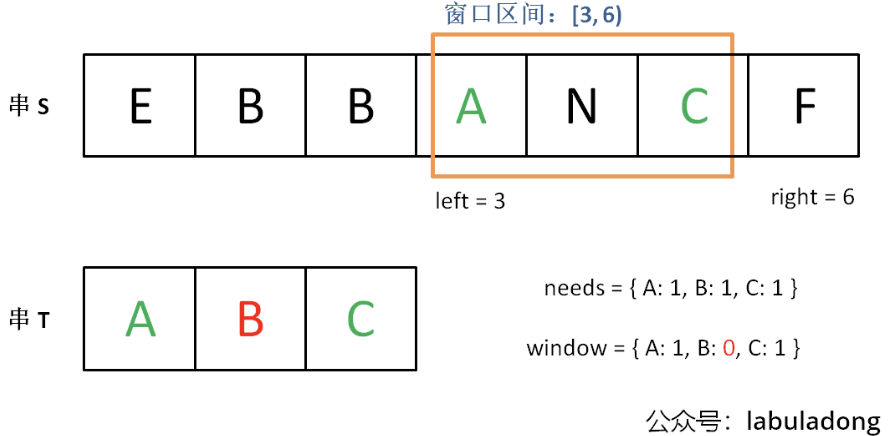

# Ref

[我写了首诗，把滑动窗口算法算法变成了默写题](https://labuladong.online/algo/essential-technique/sliding-window-framework-2/)

* 雙指針三大解法
  * 快慢指針 - 原地修改數組，判斷有沒有 LinkedList 環
  * 左右指針 - 相向而行、背向而行、數組反轉、混文判定、Binary Search
  * 滑動窗口 - 符合條件的最長/最短子數組 - 透過不斷調整窗口大小 - 基本上都是字串處理

# 滑動窗口 (Sliding Window)

找尋符合條件的最長/最短子數組

1. 暴力解

```c++
for (int i = 0; i < nums.size(); i++){
    for (int j=i; j< nums.size(); j++){
        // num[i,j] as sub-array
    }
}
```

tc : O(N^2)

滑動窗口的概念 : 維護一個窗夼，不斷滑動，更新答案，算法邏輯如下

```c++
    while (left < right && right < nums.size()){
        // 窗口變大
        window.add(nums[right]);
        right ++ ;

        while (window needs shrink){
            window.remove(nums[left]);
            left ++;
        }
        
    }
```

滑動窗口的時間複雜度 O(N) ，效率較暴力解來得高

* 兩個 while，時間複雜度仍然為 O(N)，而不是 O(N^2)，理由是，兩個指標都只會單調增加，而不會後退， for loop 當 i = 1, j=1~5, u=2, j=2~5, 因此是 O(N^2)， 相比於滑動窗口， 每個 element 只會進出窗口一次，所以時間複雜度為 O(N)
* 真正困擾大家的，是每一題中，什麼時候擴大窗口，什麼時候縮小窗口，出 bug 時怎麼找 bug

以下提供算法框架

```c++
void slidingWindow(string s){
    // 用合適的資料結構紀錄窗口資料
    // e.g. 計算出現次數 - 用 hashtable
    // e.g. 窗口中的元素和 - 用 int
    unordered_map<char, int> window;
    int left=0, right=0;
    while (right < s.size()){
        char c = s[right]
        window.add(c)
        // 增大窗口
        right++;
        // 進行窗口內資料的更新

        // debug 輸出位置，最終解法不要有 print，因為 IO 操作很耗時
        printf("window:[%d,%d]\n", left, right)

        // 判斷左側窗口要不要收縮
        while (left < right && window need shrink){
            char d = s[left];
            window.remove(d)
            // 縮小窗口
            left++
            // 進行窗口內資料更新
        }
    }
}
```

雖然寫起來，有時候看起來比較囉唆，但重點是算法框架一體適用


# LeetCode 75 - Minimum Window Substring

Hard 

consider string `s`, `t`, return sub-string `s` cover all `t` or None

* `t` 的重複字串，我們尋找的子字串字符數量，不應該小於 `t`
* `s` 如果存在 `t`, 必定是唯一解

e.g.

输入：s = "ADOBECODEBANC", t = "ABC"
输出："BANC"
解释：最小覆盖子串 "BANC" 包含来自字符串 t 的 'A'、'B' 和 'C'。

输入：s = "a", t = "a"
输出："a"
解释：整个字符串 s 是最小覆盖子串。


输入: s = "a", t = "aa"
输出: ""
解释: t 中两个字符 'a' 均应包含在 s 的子串中，
因此没有符合条件的子字符串，返回空字符串。


提示：

m == s.length
n == t.length
1 <= m, n <= 105
s 和 t 由英文字母组成
进阶：你能设计一个在 o(m+n) 时间内解决此问题的算法吗？


暴力解 : 

```python
for i in range(len(s)):
    for j in range(i+1, len(s)):
        if s[i:j] 包含 t 所有字母:
            # 更新答案
            # 時間複雜度 O(N^2)
```

滑動窗口 : 

1. 對於字串 `s` 使用左右指針， left = right = 0, **左閉右開[left, right)**
   1. 設計窗口左閉右開，最方便 [0, 0) - 沒有元素， [0, 1) - 就包含一個元素 0
   2. 雙開 - (0,1) - 仍然沒有元素
   3. 雙閉 - [0,0] - 就有元素
   4. 雙開、雙閉都有邊界處理上的麻煩
2. 先將 right 指針不斷擴大，直到符合要求，接著將左指針往前(縮小窗口)，直到不符合要求，每次更新目前結果
3. 重複 2 ，直到 right 到達 `s` 的盡頭

step 2 - 找到可行解

step 3 - 優化可行解

needs - 必須包含所有 t 有的內容，用 hash-table
window - current window 有的

</img>

把 needs, window 兩個 hashtable 開起來

</img>

增加 right，擴大窗口，直到符合條件

</img>

增加 left，縮小窗口，直到不符合條件

```python
# build hashtable for checking string t 
    need, window = defaultdict(int), defaultdict(int)
    for c in t:
        need[c] += 1

    # 左右指針 & 合法字元數
    left, right = 0, 0
    valid_chars = 0
    
    # 最小覆蓋字數和長度，需每次 iteration 更新
    min_cover_start, min_cover_length = 0, float('inf')

    while right < len(s):
        c = s[right]
        # 增大窗口
        right +=1
        # 進行窗口內資料的更新
        if c in need.keys():
            window[c] += 1
            if window[c] == need[c]:
                # 只有 window[c] 從 0 變成 1，才會合 need[c] 相等，進而讓 valid += 1，如果 window[c] 從1 , 變成 2 ，那麼不會符合
                valid_chars += 1 # valid 

        # debug 輸出位置，最終解法不要有 print，因為 IO 操作很耗時
        if verbose:
            print(left, right, f'window : {s[left:right]}')

        # 判斷左側窗口要不要收縮
        while left < right and valid_chars == len(need):
            # 此回合得到的答案，比當前答案的長度短
            if (right - left) < min_cover_length:
                min_cover_start = left
                min_cover_length = right - left
            
            # 縮減窗口
            d = s[left]
            left += 1
            # 進行窗口內資料更新
            if d in need.keys():
                if window[d] == need[d]:
                    # 只有接等於 1 時， 合法字元數變少，其他情況，則是 window 內的關鍵字次數少一次
                    valid_chars -= 1
                window[d] -= 1
    

    return '' if min_cover_length == float('inf') else s[min_cover_start : min_cover_start + min_cover_length]
```


以上就是滑動窗口的算法思維，接著練習三道題


# Leetcode 567


给你两个字符串 s1 和 s2 ，写一个函数来判断 s2 是否包含 s1 的排列。如果是，返回 true ；否则，返回 false 。

换句话说，s1 的排列之一是 s2 的 子串 。

示例 1：

输入：s1 = "ab" s2 = "eidbaooo"
输出：true
解释：s2 包含 s1 的排列之一 ("ba").
示例 2：

输入：s1= "ab" s2 = "eidboaoo"
输出：false
提示：

1 <= s1.length, s2.length <= 104
s1 和 s2 仅包含小写字母


* 固定窗口型的題目，是滑動窗口的子集合，也可以 1 pass， 透過 hash table 解掉，非固定型，才會需要使用 sliding window，兩種解法都附上了

```python

def sliding_window(s : str, p : str, verbose : bool = True) -> str:
    """
    "cbaebabacd", "abc", [0,6]
    tc : O(N_s)
    sc : O(n_p)
    """
    window, need = defaultdict(int), defaultdict(int)
    # build hashtable for checking permutation
    for c in p:
        need[c] += 1
    left, right, valid_char = 0, 0, 0
    res = []
    
    # 右側窗口，獲得合法解
    while right < len(s):
        c = s[right]
        # 增大窗口
        right += 1
        # 窗口內的資料更新
        if c in need.keys():
            window[c] += 1
            # 獲得合法解，必定從 0 -> 1 才有
            if window[c] == need[c]:
               valid_char += 1 

        # debug
        if verbose:
            print(left, right, f'window : {s[left : right]}', valid_char)

        #左側窗口是否要縮小，優化合法解
        while right - left >= len(p):
            if valid_char == len(need):
                res.append(left)
            
            # 縮減窗口
            d = s[left]
            left += 1

            # 窗口內資料更新
            if d in need.keys():
                if window[d] == need[d]:
                    valid_char -= 1
                window[d] -= 1
            
            # NOTE: 因為其實是固定大小的掃描，所以先更新資料，在縮減窗口
    return res
```


# Leetcode 3

Medium

给定一个字符串 s ，请你找出其中不含有重复字符的 最长子串 的长度。

示例 1:

输入: s = "abcabcbb"
输出: 3 
解释: 因为无重复字符的最长子串是 "abc"，所以其长度为 3。
示例 2:

输入: s = "bbbbb"
输出: 1
解释: 因为无重复字符的最长子串是 "b"，所以其长度为 1。
示例 3:

输入: s = "pwwkew"
输出: 3
解释: 因为无重复字符的最长子串是 "wke"，所以其长度为 3。
     请注意，你的答案必须是 子串 的长度，"pwke" 是一个子序列，不是子串。
提示：

0 <= s.length <= 5 * 104
s 由英文字母、数字、符号和空格组成

1. 暴力解

```python
for i in range(len(s)):
    for j in range(i+1, len(s)):
        len(s[i:j]) == len(set(s[i:j]))
        # O(N^2)
```

2. Sliding Window

```python

left, right = 0, 0
valid_char = 0
window = defaultdict(int)
# need 
max_valid_char = 0
# 右側窗口
while right < len(s):
    c = s[right]
    right += 1 # 窗口增大

    # 窗口內資料更新
    window[c] += 1
    
    # 窗口數字從 0 到 1 時， 產生合法解
    if window[c] == 1:
        valid_char += 1
    
    # 優化可行解，變成最佳解
    while window[c] > 1:
        # 取得最佳解
        max_valid_char = valid_char
        d = s[left]
        # 窗口縮減
        left += 1
        # 窗口內資料更新
        window[c] -= 1
```