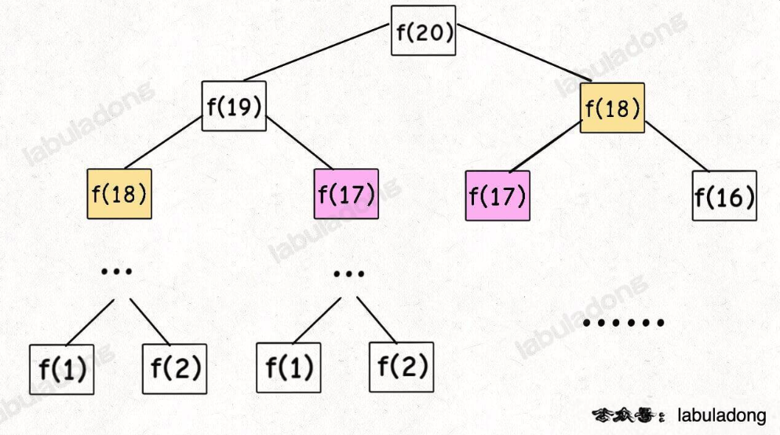
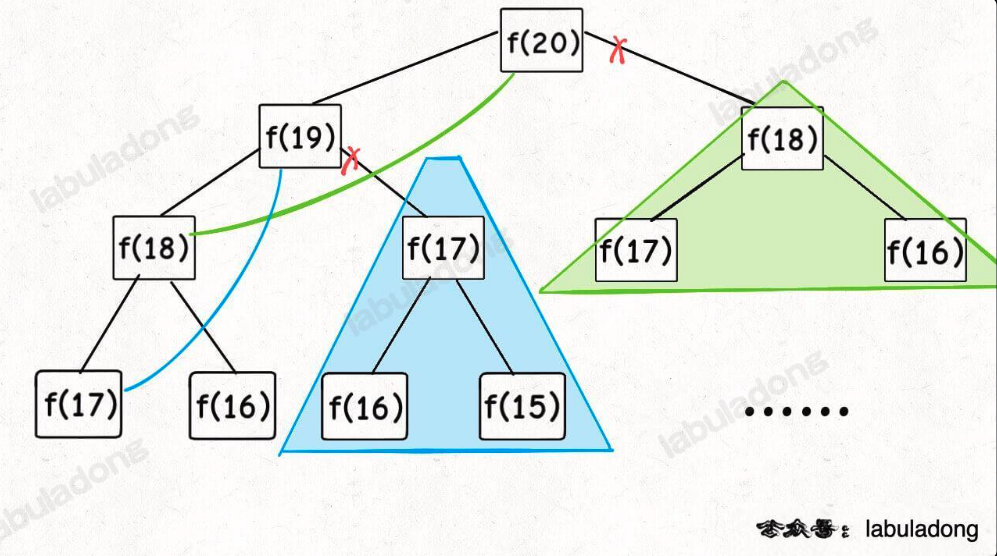
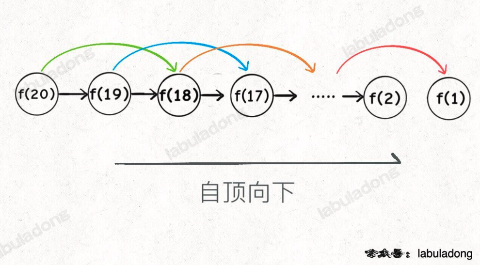
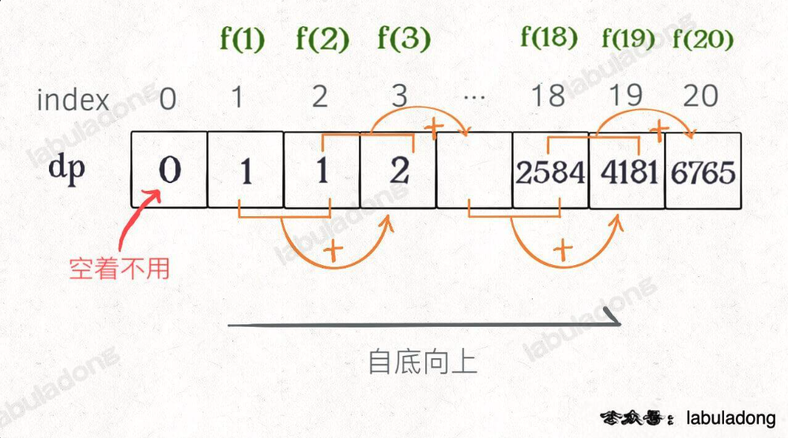
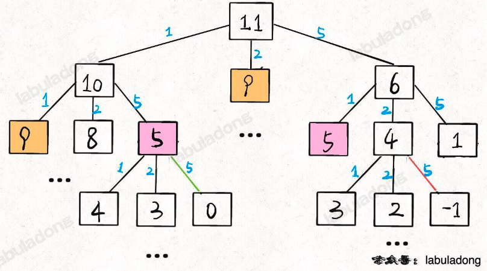
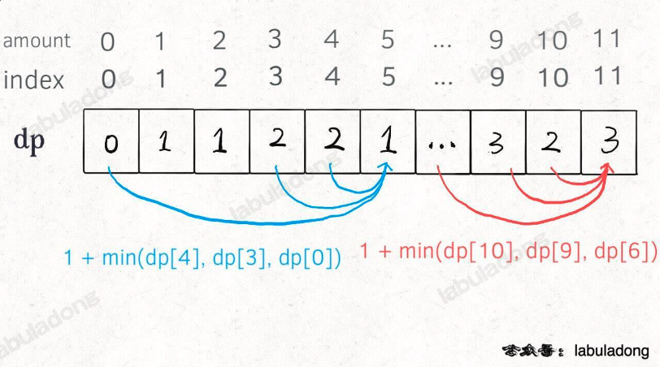

# 動態規劃解題套路框架

https://labuladong.online/algo/essential-technique/dynamic-programming-framework-2/

Dynamic Programming - 最具有技巧、最有意思的

動態規劃其實是運籌學的一種最優化方法，恰巧在電腦科學上運用的比較多， e.g. 最長遞增子序列、最小編輯距離

* 一般型式 - **求極值**
* 核心問題 - **窮舉**
  
* 動態規劃三要素
  * 正確的狀態轉移方程 - 正確地窮舉
  * 最佳子結構 - 子問題的極值是不是原問題的極值
  * 重疊子問題 - 暴力窮舉效率低，可以透過緩存 (DP Table) 來避免重複計算

* 正確的狀態轉移方程 - base case --> 明確狀態 -> 明確選擇

```python

def dp(state_1, state_2, ...):
    for choice in all_choice:
        result = find_extreme(result, dp(state_1, state_2, ...))
    return dp

dp[0][0][...] = base case
```

# 斐波那契數列 - Leetcode 509

```python
def fib(N : int) -> int:
    if N == 0:
        return 0 
    elif N == 1 or N ==2:
        return 1
    else:
        return fib(N-1) + fib(N-2)
```

N = 20 ?



* NOTE: Recursion 最好都畫出樹狀結構，方便分析複雜度
  * 時間複雜度 - 每一個節點都有兩個選擇，依序往下推到 n = 0， $O(2^n)$， base case $O(1)$，相乘 = $O(2^n)$
  * 算法低效的原因 - f(18) 要算兩次， f(17) 也是，依此類推 <--- **找到重疊子問題**

* 帶有 DP Table (Cache) 的 Recursion 

```python
def fib(N : int) -> int:
    memo = [0] * (N+1)
    return dp(memo, N)

def dp(memo : List[int], n : int) -> int:
    # base case
    if n == 0 or n ==1: return n
    if memo[n] != 0:
        return memo[n]
    # 建立 fib, 並且放在 array
    memo[n] = dp(memo, n-1) + dp(memo, n-2)
    return nemo[n]
```

重新檢視 Recursion Tree, 會發現被減支了，剩下 LinkedList





1. 子問題的個數從 2^n --> n
2. 解決子問題的時間 O(1)
3. 相乘 -> O(N)
4. Recursion 通常是自上而下 (f(20) --> ... --> f(1))，動態規劃更常自下而上 (f(1) --> ... f(k))，因此更常看到循環

自下而上的做法

```python
def fib(N : int) -> int:
    if N == 0:
        return 0
    dp = [0] * N+1
    dp[0] = 0
    dp[1] = 1
    for i in range(2, N+1):
        dp[i] = dp[i-1] + dp[i-2]
    return dp[N]
```



* 自下而上，就可以做出同樣的一條 linked list

狀態轉移方程式 - 就是 revursion rule, 寫出來就解一半了


再優化:

dp table 每次其實只用到最後一個值，不用存整個 array


```python
def fib(n : int) -> int:
    if n == 0 or n == 1:
        return n
    dp_i_1, dp_i_2 = 1, 0
    for i in range(2, n+1):
        dp_i = dp_i_1 + dp_i_2
        # 滾動更新
        dp_i_2 = dp_i_1
        dp_i_1 = dp_i
    return dp_i_1

```


* 動態規劃三要素
- [x] - 正確的狀態轉移方程 - 正確地窮舉
- [ ] **沒有求極值 - 最佳子結構 - 子問題的極值是不是原問題的極值**
- [x] 重疊子問題 - 暴力窮舉效率低，可以透過緩存 (DP Table) 來避免重複計算

# 湊零錢問題 - Leetcode 322

k 種面值的硬幣，面值分別為 c1, c2, ... ck 每種硬幣數量無限，給一個總金額 `amount`，最少需要幾枚硬幣湊出該金額? 不可能湊出來則 return -1

e.g. k=3, c1=1, c2=2, c3=5, amount = 11 
return 3, 5+5+1 = 11

* 電腦怎麼處理 - 窮舉
* 每次從最大的面額開始扣值，依序扣到最小 (子問題)
  * 子問題是原問題的極值
  * 是重疊子問題
* 求最少

* NOTE: 如果每一次扣掉硬幣的狀況，會互相影響，那麼就不能 DP 了

1. 暴力 Recursion
   1. base case - amount = 0, return 
   2. 狀態 - amount 要一直減少
   3. 狀態可以有的選擇
      1. 所有面額，由大到小

```python

def coinChange(coins : List[int], amount : int) -> int:
    return dp(coins, amount)


# 湊出金額 n ， 至少需要 dp(coins, n) 個硬幣
# psudo code
def dp(coins : List[int], n : int) -> int:
    res = float('inf')
    # 做選擇，選擇需要硬幣最少的結果
    for coin in coins:
        res = min(res, sub_problem +1)
    return res
```

此題的狀態轉移方程式

```python
dp(n) = 
0, n=0
-1, n < 0
min{dp(n-coin) + 1} | coin belong to coins # 不同找錢方法，看哪一個硬幣數最少 O(k) 個選擇

```


```python

def coinChange(coins : List[int], amount : int) -> int:
    return dp(coins, amount)

# consider amount = 7, coins = [5,2,1]
# consider amount = 5, coins = [5,2,1]
def dp(coins, amount):
    # base case 
    if amount == 0 : return 0
    if amount < 0 : return -1

    # recursion
    res = float('inf')
    for coin in coins:
        # 當作子問題解，本函數不一定知道答案
        # 每個子問題都去扣掉一個 coin，當作當前 amount，接著就變成子問題
        sub_problem = dp(coins, amount - coin)
        # 子問題無解時則跳過
        if sub_problem == -1:
            continue
        # 子問題中選擇最優解， += 1 (因為是 return 硬幣的數量，而 base case 是找完零錢，每回答一次問題，加一個硬幣)
        res = min(res, sub_problem + 1)
    return res if res != float('inf') else -1
```



time complexity : 

目標金額 n，每次有 k 個選擇，假設硬幣最小是 1 元， 節點的數量會是 k^n
tc : O(k^n) --> k個選擇做n次 (1元做n次)

很多子樹是重複計算的，一樣可以 cache 結果，直接取用


```python

def coinChange(coins : List[int], amount : int) -> int:
    memo = [-666] * (amount + 1) 
    # [0, 1, 2, 2] 
    # 零錢 0 需要最少 0 枚硬幣
    # 零錢 1 需要最少 1 枚硬幣 (1)
    # 零錢 2 需要最少 2 枚硬幣 (1 + 1)
    # 零錢 3 需要最少 2 枚硬幣 (2 + 1)

    def dp(coins : List[int], amount : int) -> int:
        # base case 
        if amount == 0 : return 0
        if amount < 0 : return -1

        if memo[amount] != -666:
            # 如果有 cache ， 直接取出來
            return memo[amount]
        res = float('inf')
        for coin in coins:
            
            sub_problem = dp(coins, amount - coin)
            
            if sub_problem == -1:
                continue
            res = min(res, sub_problem + 1)
        return res if res != float('inf') else -1
    
    return dp(coins, amount)
```

子問題總數不超過 n 個
處理一個子問題 k 個選擇

時間複雜度 from $O(k^n)$ --> $O(kn)$


# 迭代版 (由下而上)

從下而上使用 dp table 來消除重疊子問題


```python
def coinChange(coins : List[int], amount : int) -> int:
    '''
    [5,2,1], 0 --> 0
    [5,2,1], 1 --> 1
    [5,2,1], 2 --> 1
    [5,2,1], 3 --> 2
    [5,2,1], 4 --> 2
    [5,2,1], 5 --> 1
    '''
    dp = [float('inf')] * (amount + 1)

    dp[0] = 0 # base case, 零錢是0元時，給0個硬幣可以找開

    # 一路跑到 amount (給定的零錢值) <-- 所有狀態的取值
    for i in range(len(dp)):
        # 內層，所有選擇，此題要的是最小值
        for coin in coins:
            # 子問題無解，跳過
            if dp[i] - coin < 0:
                continue
            # dp[i] 的值會隨著每個 coin 而找出不同的硬幣數量，要找最少的
            dp[i] = min(dp[i], 1 + dp[i - coin])
            # dp[1] 會掉到 dp[0], dp[2] 會掉到 dp[0], dp[3] 會掉到 dp[1], dp[4] 會掉到 dp[2], dp[5] 會掉到 dp[0]

    return -1 if dp[amount] == float('inf') else dp[amount]
```



tc : O(kn) - dp table O(N), min O(k)

sc : O(N)


# 總結

電腦科學沒有什麼特殊的技巧 - 他就是窮舉
算法設計 -  先想怎麼窮舉 ( recursion & 狀態方程式 )、在想怎麼聰明的窮舉 (利用 cache or dp_table)