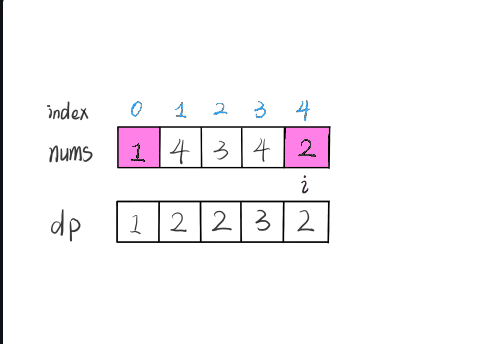
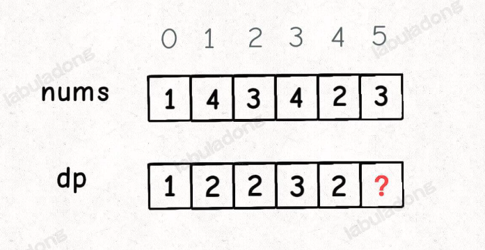
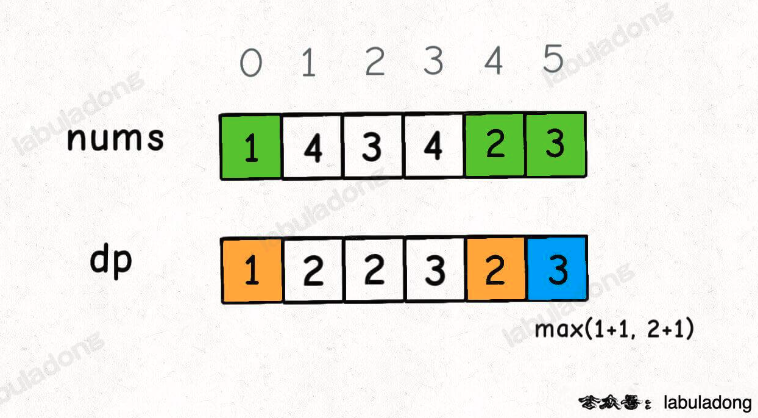
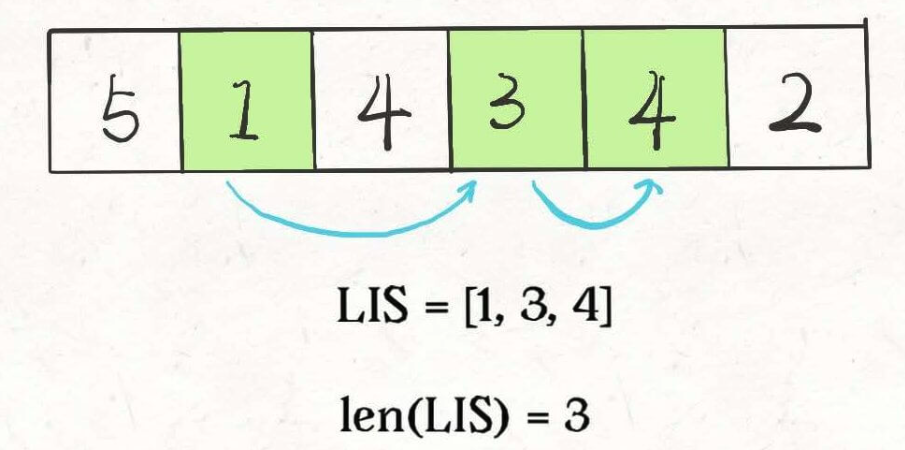
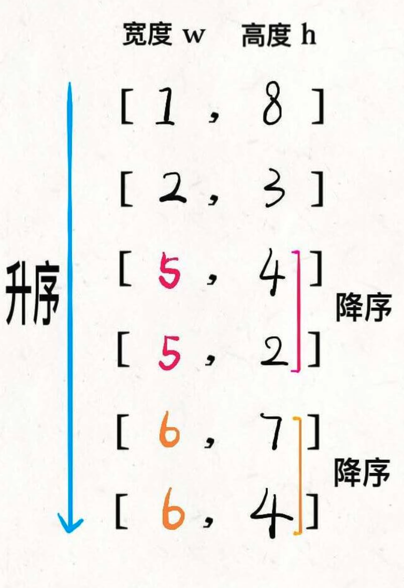
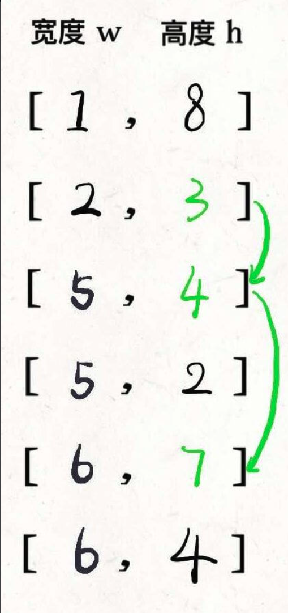

# 動態規劃設計 - 最長遞增子序列

1. 定義了 base case
2. 找到問題的狀態
3. 怎麼選擇? - 利用高一學到的**數學歸納法**


# Leetcode 300 - Longest increasing subsequence

unsorted sequences

nums=[10,9,2,5,3,7,101,18]

subsequence=[2,3,7, 101]

output=4

* 子序列，不一定連續
* 子串 - 一定連續

Sol 1 : 每個 element 都可以當作頭，接著從同個 array 選下一個遞增值

tc : N * (N-1) * N-2, * N-3, ... = $N!$

dp 思維 - 

1. base case - 以自己為尾端的最長遞增序列數量
2. sub problem, 以 nums[i] 為結尾的最長遞增序數量 - dp table

index = [0, 1, 2, 3, 4]

nums = [1, 4, 3, 4, 2]

dp = [1, 2, 3, 3, 2]



* 以上 dp 結果是用肉眼看出來的，怎麼寫成歸納式，需要用到數學歸納法
我們已經知道 dp[n] 的定義， n+1 可以推導出來嗎?



假設現在 nums[5] = 3, dp[5] 怎麼從 dp[4] 變出來?

1. 條件是遞增序列，數字是3，需要找到整個數列比 3 小的數量，然後 + 1
2. nums[0:5] 哪些小於 3 ? 用一個 for loop 可以找到
3. 以每個元素為結尾的最誠遞增序列，正是 dp 的定義， +1 即可
4. 舉例 - nums[0], nums[4] 是 1, 2 ，存在比 nums[5] = 3 小的值， nums[5] 可以參與變成子序列，取出個別 dp table += 1 



* 至此，可以從 nums[0] 一路心算到 nums[5] ， 來驗證公式正確性，就可以寫 Code 了

```python

def length_of_lis(nums : List[int]) -> int:
    '''
    nums=[1,4,3,4]
    dp = [1,2,2,3]
    return 3
    '''
    # dp[n]，以第n個 element 為結尾的最長遞增序列數量
    dp = [1] * len(nums) # 每個 elements 的 base case 都是 1
    for i in range(len(nums)):
        for j in range(i):
            if nums[j] <= nums[i]:
                # nums[i] 可以成為 子序列遞增的一部分
                dp[i] = max(dp[i], dp[j] + 1) # tc : O(1)
    return max(dp)

```

tc : O(N^2)
sc : O(N)

##  總結

1. 明確的 dp 數組定義很重要，必須從 dp [0:... i-1] 求出 dp[i]，一但邏輯正確，題目就做完了
2. 如果沒辦法完成 (1)
   1. 重新定義 dp 數組
   2. dp 數組儲存的資訊不夠，先拓展到 2, 3 維

# Leetcode 354 - 俄羅斯娃娃信封套

给你一个二维整数数组 envelopes ，其中 envelopes[i] = [wi, hi] ，表示第 i 个信封的宽度和高度。

当另一个信封的宽度和高度都比这个信封大的时候，这个信封就可以放进另一个信封里，如同俄罗斯套娃一样。

请计算 最多能有多少个 信封能组成一组“俄罗斯套娃”信封（即可以把一个信封放到另一个信封里面）。

注意：不允许旋转信封。

 
示例 1：

输入：envelopes = [[5,4],[6,4],[6,7],[2,3]]
输出：3
解释：最多信封的个数为 3, 组合为: [2,3] => [5,4] => [6,7]。
示例 2：

输入：envelopes = [[1,1],[1,1],[1,1]]
输出：1
提示：

1 <= envelopes.length <= 105

envelopes[i].length == 2

1 <= wi, hi <= 105

這一題其實和最長子序列一樣，只是變成2維，因為永遠只能大的數字套小的數字，然而 Longest Increasing Subsequence (LIS) 要如何變成2維呢?




1. 透過面積 - ? 1*10 > 3x3，但是不能套
2. 先對 width 做升序排序，在按照 h 降序排序
3. 對 h 做最長子序列，寬度必定是遞增的，同高度不可嵌套







```python

def max_envelops(envelopes : List[List[int]]) -> int:
    '''
    envelopes = [
        [w, h],
        [w, h],
        [w, h],
        ...
    ]
    输入：envelopes = [[5,4],[6,4],[6,7],[2,3]]
    输出：3
    解释：最多信封的个数为 3, 组合为: [2,3] => [5,4] => [6,7]。
    '''
    n = len(envelops)
    envelops.sort(key=lambda x : (x[0], -x[1]))
    heights = [x[1] for x in envelopes]
    return length_of_lis(heights)
```

tc : O(nlogn) (排序) + O(n^2) = o(n^2)

sc : O(n) heights
