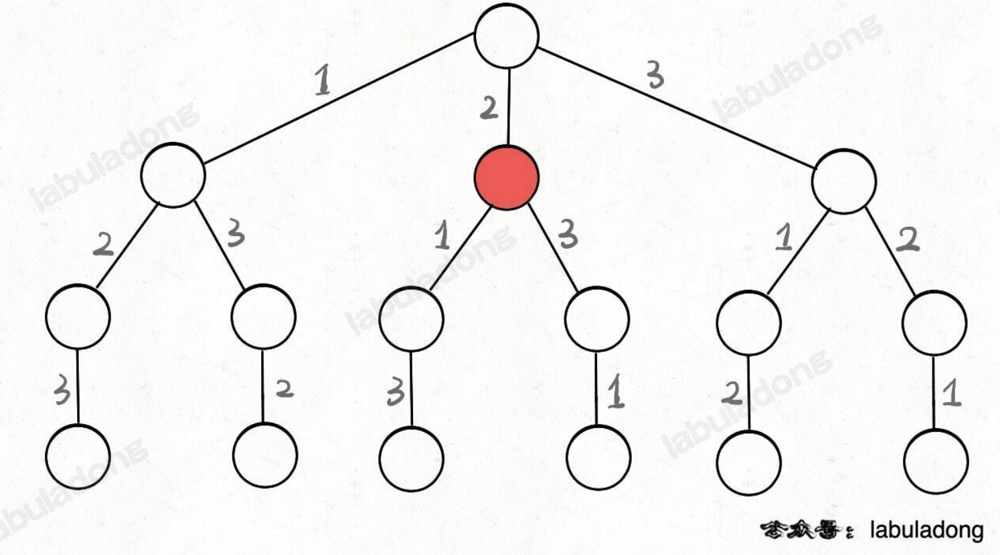
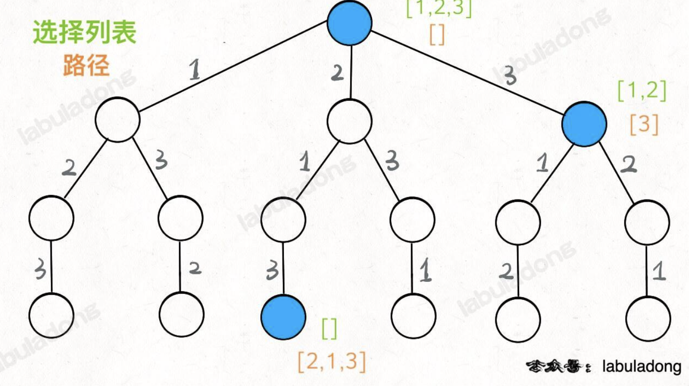

# Ref

[回溯算法解题套路框架](https://labuladong.online/algo/essential-technique/backtrack-framework/)

* 和 DFS 相似，基本上就是暴力窮舉
* DFS - iterate 所有 edges
* DFS - iterate 所有 vertex
* 簡單說就是 iterate 一顆決策樹，樹的節點存放個一個合法答案

對於每一個節點

* 路徑 - 已經做出的所擇
* 選擇列表 - 當前可以做的選擇
* 結束條件 - 到達決策數底層，無法再選擇

```python
result = []
def backtrack(路徑, 選擇):
   if 滿足結束條件:
      result.add(路徑)
      return
   for 選擇 in 選擇列表:
      做選擇
      backtrack(路徑, 選擇列表)
      撤銷選擇
```

# Leetcode 46 - Permutations

https://leetcode.com/problems/permutations/description/

Medium


Given an array nums of distinct integers, return all the possible permutations. You can return the answer in any order.

 

Example 1:

Input: nums = [1,2,3]
Output: [[1,2,3],[1,3,2],[2,1,3],[2,3,1],[3,1,2],[3,2,1]]

Example 2:

Input: nums = [0,1]
Output: [[0,1],[1,0]]

Example 3:

Input: nums = [1]
Output: [[1]]
 

Constraints:

1 <= nums.length <= 6
-10 <= nums[i] <= 10
All the integers of nums are unique.


* 題目的 scale 不大， nums 只有最多 6個，表示可能是解法應該是暴力解
* Example 1 高中就會做了，會有 3! 個排列，決策數 (回朔樹如下)




* 紅色節點上，正在選擇 1 & 3，因為 2 選過了，往下亦然，選過 2, 1, 只剩 3 可以選
* 紅色節點上
  * [2] --> 路徑
  * [1,3] --> 選擇列表 (還可以做選擇的)
  * [] --> 當選擇列表為空 --> 結束條件

把以上概念融合，重做標示

* 選擇列表為綠色
* 橘色是路徑



* backtrack 函數就像一個指針，在這顆覺這樹上遊走，同時確保每個節點的屬性


```python
from typing import List

class Solution:
   def __init__(self):
      self.res = []

   # 主函数，输入一组不重复的数字，返回它们的全排列
   def permute(self, nums: List[int]) -> List[List[int]]:
      # nums = [1,2,3]
      # 记录「路径」
      track = []
      # 「路径」中的元素会被标记为 true，避免重复使用
      used = [False] * len(nums)
      # used = [False, False, False]
      
      self.backtrack(nums, track, used)
      return self.res
   
   # 路徑 : track
   # 選擇列表: nums 中不存在於 track 的元素
   # 結束條件: nums 中的元素全在 track 中出現
   def backtrack(self, nums:List[int], track: List[int], used:List[bool]) -> None:
      if len(track) == len(nums):
         self.res.append(track.copy())
         # res = [[1,2,3]]
         return 
      
      for i in range(len(nums)):
         # 排除不合法的選擇
         if used[i]:
            # nums[i] 已經在 track 中，跳過
            continue
         
            # 做選擇，記錄進 track
            track.append(nums[i])
            used[i] = True
            # level = 0, track = [1], used = [True, False, False]
            # level = 1, track = [1,2], used = [True, True, False]
            # level = 2, track = [1,2, 3], used = [True, True, True]
            # 進入下一層決策樹
            self.backtrack(nums, track, used)
            # 取消選擇
            track.pop()
            userd[i] = False
            # level = 2, track = [1,2], used = [True, True, False]
            # track = [1], used = [True, False, False]
            # track = [1,3], used = [True, False, False]
            # used 可以作為剪支策略，有的實作甚至透過 swap，但這裡不展開
```

* TC : O(N!), 沒辦法減少，因為必定要走完整顆決策樹
* SC : O(N!), return solution 必定是 N!
* backtracking 算法的特色 --> 純暴力窮舉，不像 DP 有重疊子問題，一般來說複雜度都很高


# N-Queens Leetcode 51

https://leetcode.com/problems/n-queens/description/

HARD

Input: n = 4
Output: [
   [".Q..",
   "...Q",
   "Q...",
   "..Q."],
   ["..Q.",
   "Q...",
   "...Q",
   ".Q.."]
   ]

Explanation: There exist two distinct solutions to the 4-queens puzzle as shown above

Example 2:

Input: n = 1
Output: [["Q"]]


Constraints:

1 <= n <= 9

* 皇后可以攻擊同一行、同一列、左上左下右上右下4個方向的任意單位

* N=8 時，數學家高斯醫生都沒有數清楚 8皇后問題可以有幾種可能方式，但我們的算法不到幾秒就可以算出來
* 不過注意，加上 isValid，TC 來到 O(N * N!)

# Other Applications

* 例如數獨
* 只需要一組解 - 終止條件放一個 found, found = True 直接 return，不用全部找完
* N-Queens 2 - 直接套 NQueens 即可