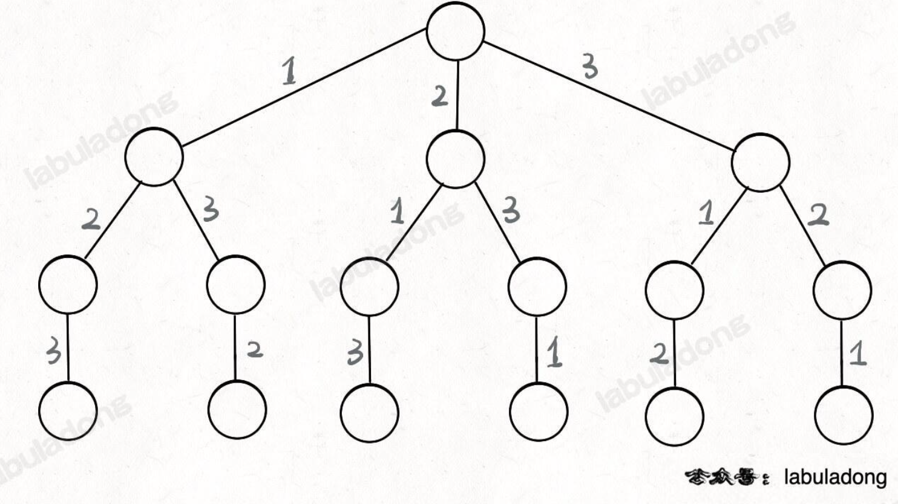

# Ref

[回溯算法解题套路框架](https://labuladong.online/algo/essential-technique/backtrack-framework/)

* 和 DFS 相似，基本上就是暴力窮舉
* DFS - iterate 所有 edges
* DFS - iterate 所有 vertex
* 簡單說就是 iterate 一顆決策樹，樹的節點存放個一個合法答案

對於每一個節點

* 路徑 - 已經做出的所擇
* 選擇列表 - 當前可以做的選擇
* 結束條件 - 到達決策數底層，無法再選擇

```python
result = []
def backtrack(路徑, 選擇):
   if 滿足結束條件:
      result.add(路徑)
      return
   for 選擇 in 選擇列表:
      做選擇
      backtrack(路徑, 選擇列表)
      撤銷選擇
```

# Leetcode 46 - Permutations

https://leetcode.com/problems/permutations/description/

Medium

input : [1,2,3]

output : [[1,2,3],[1,3,2],[2,1,3],[2,3,1],[3,1,2],[3,2,1]]

* 高中就會做了，會有 3! 個排列，決策數 (回朔樹如下)




* 紅色節點上，正在選擇 1 & 3，因為 2 選過了，往下亦然，選過 2, 1, 只剩 3 可以選
* 紅色節點上
  * [2] --> 路徑
  * [1,3] --> 選擇列表 (還可以做選擇的)
  * [] --> 當選擇列表為空 --> 結束條件

把以上概念融合，重做標示

* 選擇列表為綠色
* 橘色是路徑


* backtrack 函數就像一個指針，在這顆覺這樹上遊走，同時確保每個節點的屬性