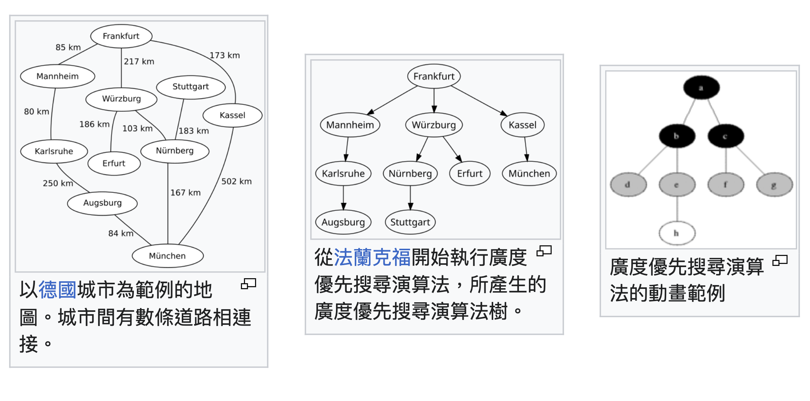
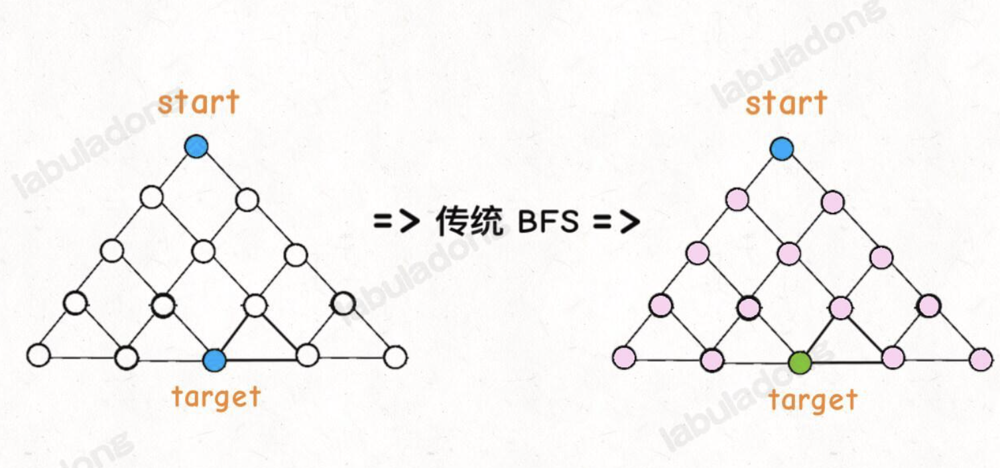
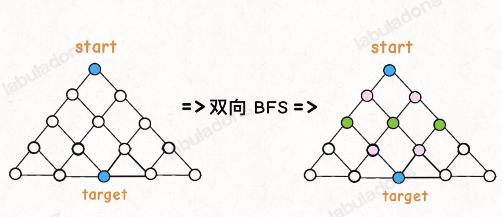

# Ref

[BFS 算法解题套路框架](https://labuladong.online/algo/essential-technique/bfs-framework/)


DFS(深度優先搜索) - using recusion, back-tracking is one of the dfs algorithm.

BFS

1. problem --> graph(or tree)
2. traverse the graph/tree, add node into queue

BFS 

- 找到的路徑一定是最短的(經過最少次節點)
- 空間複雜度大於 DFS

* 常見場景

given `start`
some ways you could apply operation

given `target`

ask minimized steps

* e.g. 走迷宮
* 兩個單詞，把a換成b
* 連連看遊戲，如何最少步數完成連線
* 給定數字 0, operation a, operation b, target t, 問最少操作次數的解

[Day9 -- Brute Force - DFS & BFS](https://ithelp.ithome.com.tw/articles/10237752)

[廣度優先搜尋 - wiki](https://zh.wikipedia.org/zh-tw/%E5%B9%BF%E5%BA%A6%E4%BC%98%E5%85%88%E6%90%9C%E7%B4%A2)

* BFS - 從圖的資料結構來說來說，必定可以得到最短路徑，而這類問題也被稱為最短路徑問題 (Shortest Path)
  * 路徑導航 (vertex --> poi, edge - path)，但是 volicity 可能會使得 path 是有權重的，所以不會那麼單純
  * 迷宮路線
  * 電力網的串連是否完善
  * ...



framework

```python


from typing import List, Set
from collections import deque


class Node:
    def __init__(self, val: int):
        self.val = val
        self.neighbors = []

def BFS(start: Node, target:Node) -> int:
   q = deque()
   visited = set() # 走過的不再走了
   q.append(start)
   visited.add(start)

   step = 0
   while q:
      step += 1
      size = len(q)
      # 將當前 queue 中所有節點向四周擴散
      for i in range(size):
         cur = q.poplieft()
         # step = 1, get start
         
         # 如果命中瘩案， return
         if cur == target:
            return step
         # 沒有命中答案，將需要探索的節點加入 queue
         for x in cur.neighbors:
            if x not in visited:
               # 會依序加入，並且在下一個 step 中 popleft
               q.append(x)
               isited.add(x)
   return -1
```
* NOTE: 如果不重再重複的狀況，就不需要 visited

# Leetcode 111 Minimum Depth of Binary Tree

https://leetcode.com/problems/minimum-depth-of-binary-tree/description/

* Easy
* 分析 - 結束條件 - 葉子節點 (left, right all null)
* 每次 depth 增加一次，所有節點都會往前邁一步，這保證第一次到達終點時，是最少步數
* DFS - 每一個節點都要走到，而且會先走最左邊最底，時間複雜度高
* DFS - 線, BFS - 面

節點數量 N

* DFS - SC : O(logN), tc : O(2^N) - loop over all nodes without cache
* BFS - SC : O(N/2) --> O(N), tc : O(2^N) - loop over all nodes without cache

* DFS 一般來說空間複雜度還是比較低，程式碼也比較好寫 (通常是透過遞迴)， BFS 一班用於找尋 "最短路徑"

# Leetcode 752 Open the lock

https://leetcode.com/problems/open-the-lock/description/

* 密碼鎖問題 - 要從 `0000` 轉到 target, e.g. `0009`
* 先不管死鎖，完全窮舉找最短步數 - 是一個 BFS 問題
* 每一次 action 只能 +- 1 (0~9)，4個號碼
  * 假設 src = `0000` (節點)
  * action = 1, `1000`, `9000`, `0100`, `0900`, ... - 8種可能 (8個 level = 1 的節點)
  * BFS, until targets

```python
def openLock(deadends: List[str], target: str) -> int
```

# Time Complexity

[TC & SC leetcode 752](https://vocus.cc/article/65c60dd3fd897800012059f2)

* 我們是採用字串 `0000`, 每個步驟是將字串中的字元改變，透過 list 的 index 操作 - O(1)
* 每個節點會長出 8 個邊 節點數 V，邊的數量 E，(E = 8V)，所有組合是固定的(節點數是固定的， `0000` --> `9999` 共 10^4 個節點)
* 因為 0000 ~ 9999 是固定的，所以 tc : O(1), sc : O(1)，不論 target 給多少，都是 O(1)
* 但如果 digits 的數量 `k`, tc, sc = O(10^k)
* 如果希望 sc 更小， tc 一樣 --> [iterative deepening DFS](https://zh.wikipedia.org/wiki/%E8%BF%AD%E4%BB%A3%E6%B7%B1%E5%8C%96%E6%B7%B1%E5%BA%A6%E4%BC%98%E5%85%88%E6%90%9C%E7%B4%A2)

## 雙向 BFS

* 傳統 BFS --> 會需要窮舉所有 nodes, edges
* 雙向 BFS --> 只要尋找半顆樹，根據 target 做指向性搜尋





## Leetcode 773 Sliding Puzzle

https://labuladong.online/algo/practice-in-action/sliding-puzzle/#%E4%B8%80%E3%80%81%E9%A2%98%E7%9B%AE%E8%A7%A3%E6%9E%90

hard

https://leetcode.com/problems/sliding-puzzle/

#