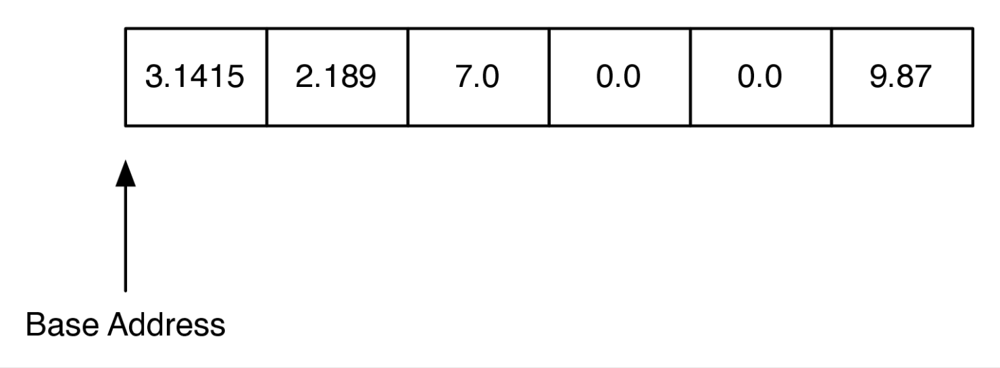
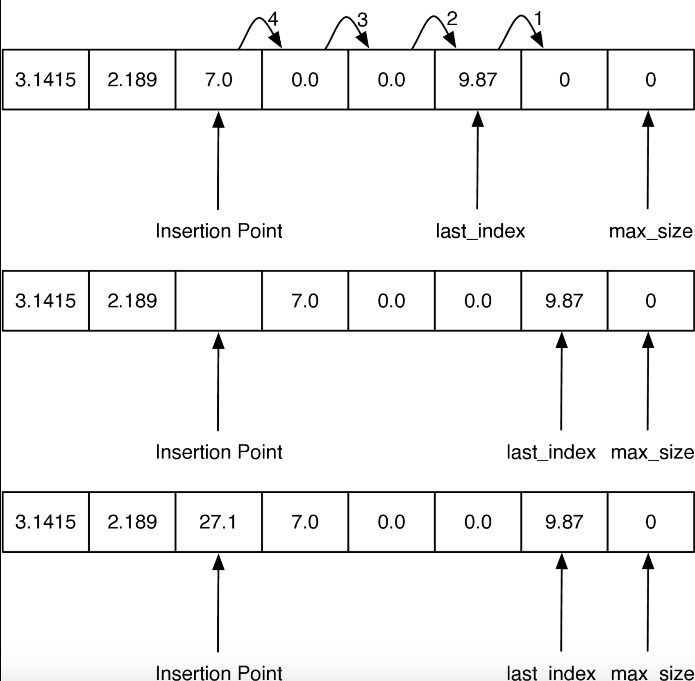

# Python Lists Revisited

1. The performance of linked-list does not match python list.
2. Python list actually be implement using C.
3. Here we desmonstrate the key idea using python.
4. If you build your own list in python, you might get **worse** performance comparing to original python implementation.

# Array and Memory

1. Python use array as base structure which is the same as C, C++ and Java.
2. array is a comtinuous block of bytes in the computer's memory. The block is divided up into n-bytes chinks where n is based on the data type that is stored in the array.

</img>

3. In python, each floating point number use 16 bytes[1] of nemory. So the array in Figure 1 uses a total of 96 bytes.
4. The base address is the location where the array starts :

e.g. 

``` Python
<__main__.Foo object at 0x5eca30>
```

shows that the object `Foo` is soted at memory address `0x5eca30` . The address is very important because an array implements the index opeator using a very simple calculation:

``` Python
item_address = base_address + index * size_of_object
```

For example, suppore our array stats at location `0x00040` which is 64 is decimal. To calculate the location of the object at position 4 in the array we simply do the arthmetic : 64 + 4 * 16 = 128. Clearly tis kind of calculation is $O(1)$. Of course this comes with some risk. 

what risk? 

1. Since an array is of a fixed size, one cannot just add things on to the end of the array indefinity.

2. In some languages, like C, the bounds of the array are not even checked. So even though our array only has six elementys in it, it is not a runtime error when you assign a value to index 7. As you might image this can cause big problem that are hard to track down.

3. In the Linux operating system, accessing a value that is beyound the boundaries of an array will often produce the rather uninformative error meddasge **segmentation violation**

# General Strategy of Python

1. Python use an array that holds references(called pointers in C) to other objects
2. Python use a strategy called **over-allocation** to allocate an array with space for more object than is needed initially.
3. When the initial array is finally filled up, a new, bigger array is over-allocated and the contents of the old array are copied to the new array.

What's the advantage?

1. The index opeator and assigning to an array location are both $O(1)$
2. The append opeations is $O(1)$ on average, but $O(N)$ in the worst case.(when copy original to the new array)
3. Popping from the end of the list is $O(1)$
4. Deleteing an item from the list is $O(N)$
5. Inserting an item into an arbitary positon is $O(N)$

Let's implemnt the idea in python.
we use list itself to mimic a array (which is a stupid idea, but it work)

``` Python
class ArrayList:
    def __init__(self):
        self.size_exponent = 0
        self.max_size = 0
        self.last_index = 0
        self.my_array = []

    def append(self, val):
        if self.last_index > self.max_size - 1:
            self.__resize()
        self.my_array[self.last_index] = val
        self.last_index += 1

    def __resize(self):
        new_size = 2 ** self.size_exponent
        print("new_size = ", new_size)
        new_array = [0] * new_size
        for i in range(self.max_size):  
            new_array[i] = self.my_array[i]

        self.max_size = new_size
        self.my_array = new_array
        self.size_exponent += 1
```

As we mentioned above, when we perform `append` , we need to check out array size. If too small, Resize our array to a bigger one(which cost time to copy elements)

Our over-allocation strategy when growing bigger size array, we use $2^{size_exponent}$. Is python use this? no python using `1.125` as base number plus a contant. 

The Python developer designed this strategy as a good tradeoff for computers of varying CPU and memory speeds.

Such a strategy leads a sequence of array size of 0, 4, 8, 16, 25, 35, 46, 72, 88, ...

</img>

If you wanna insert something. you need to traverse the array to get the position you wanna insert. Thus. It takes $O(N)$

``` Python
def insert(self, idx, val):
    if self.last_index > self.max_size - 1:
        self.__resize()
    for i in range(self.last_index, idx - 1, -1):
        self.my_array[i + 1] = self.my_array[i]
    self.last_index += 1
    self.my_array[idx] = val

def __getitem__(self, idx):
    if idx < self.last_index:
        return self.my_array[idx]
    raise LookupError("index out of bounds")

def __setitem__(self, idx, val):
    if idx < self.last_index:
        self.my_array[idx] = val
    raise LookupError("index out of bounds")
```

Now you have the ability to build a python list using `array` and allocated strategy. How nice!

# Reference

[9.2. Python Lists Revisited](https://runestone.academy/runestone/books/published/pythonds3/Advanced/pylists.html)

# Review @ 20220804

[ref](https://wiki.python.org/moin/TimeComplexity)

operations on python list

method|python list| linked list|
------|-----------|------------|
copy  |$O(N)$     |      $O(N)$|
append|$O(1)$ (in general over allocated), $O(N)$ for worst case    |      $O(N)$|
pop last  |$O(1)$     |      $O(N)$|
pop intermediate  |$O(N)$ (need to move the remain)     |      $O(N)$ (if N is last)|
insert head  |$O(N)$     |      **$O(1)$** (just assign pointer)|
insert intermediate  |$O(N)$     |      $O(N)$|
get item  |$O(1)$     |      $O(N)$|
set item  |$O(1)$     |      $O(N)$|
