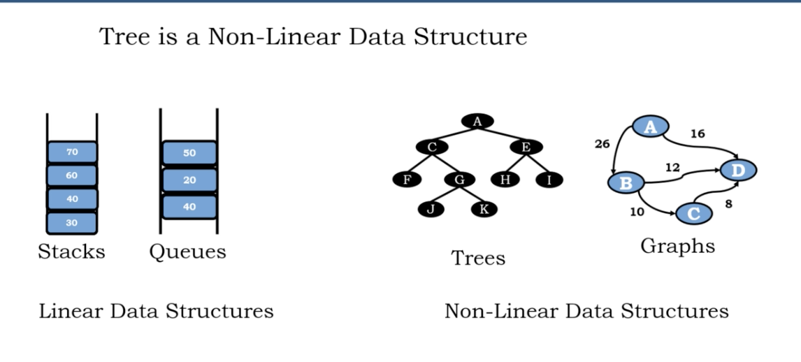
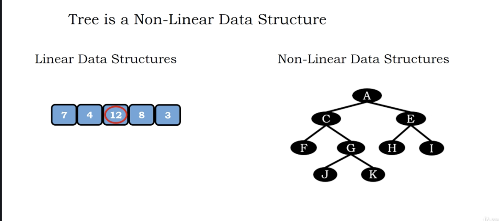
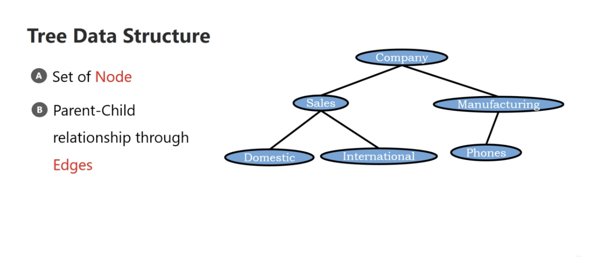

# Tree Introduction

1. The most important data structure in computing
2. Non-lenear data structure
3. hierarchical nature

</img>
</img>

# Definition

1. set of nodes
2. parent-child relationship through edges
3. number of nodes $N$, number of edges $N-1$

</img>
