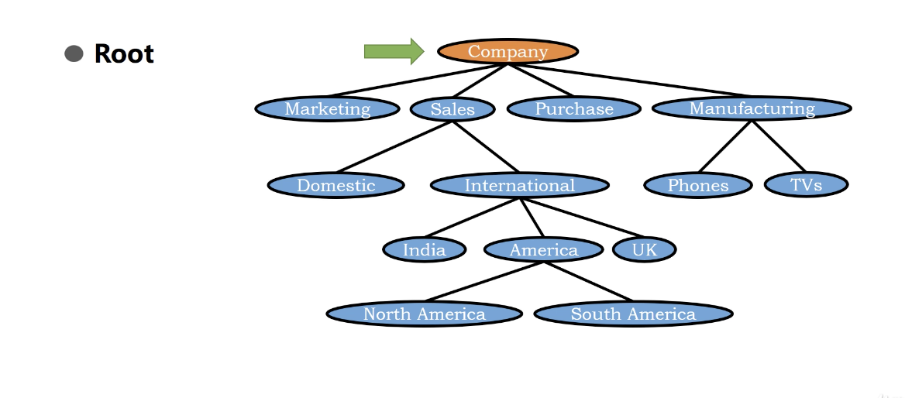

# Tree - Terminology(I)

Terminology - 術語

1. Tree can be empty(same idea like stack/queue/DEQue is empty)

   * This idea looks normal but it's important which make us can defined tree recursively. 

2. for a non-empty tree, **root** is the toppest node

</img>

3. for a non-empty tree, **siblibgs** is the node which in the same level

</img>

4. for a non-empty tree, external node/leaf node is the node which has no child.

</img>

5. for a non-empty tree, internal node/non-leaf node is the node which more than one chilrens

</img>

6. for a non-empty tree, edge is a pair of nodes$(u, v)$ such that $u$ is parent of $v$

</img>

7. for a non-empty tree, path is a sequence of nodes such that two consecutive nodes froms an edge

</img>
  

8. for a non-empty tree,sub tree - any node with a child/children is a subtree

</img>
</img>
</img>

9. for a non-empty tree, forest is a collection of trees

if we remove the root node, then we have a lot of trees(they are original subtree). now we have a forest.

</img>

</img>
