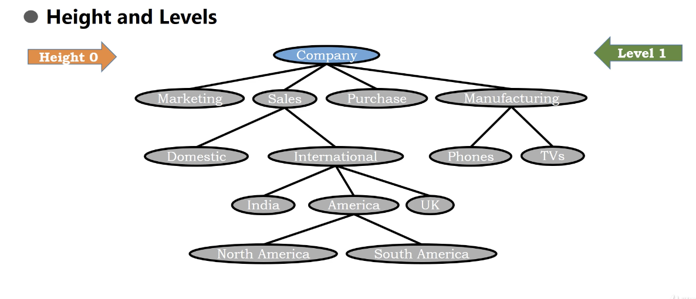
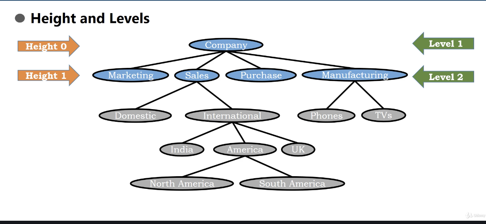
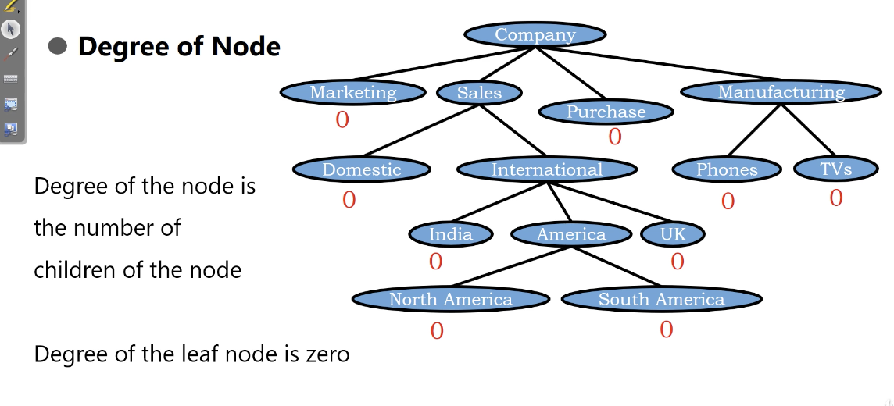
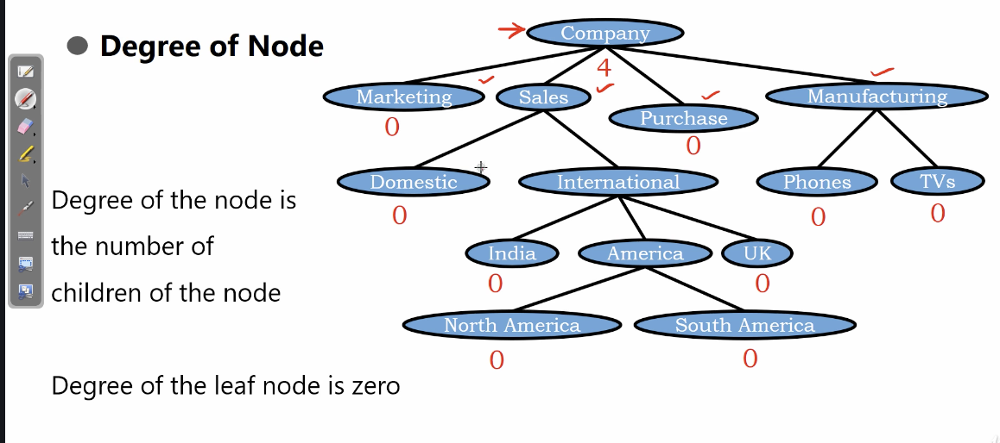
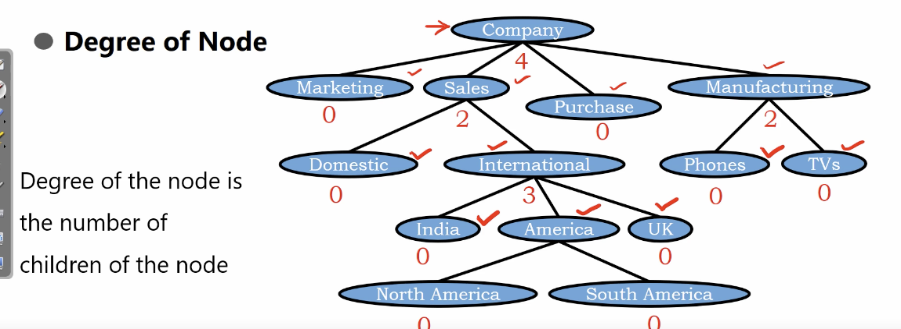
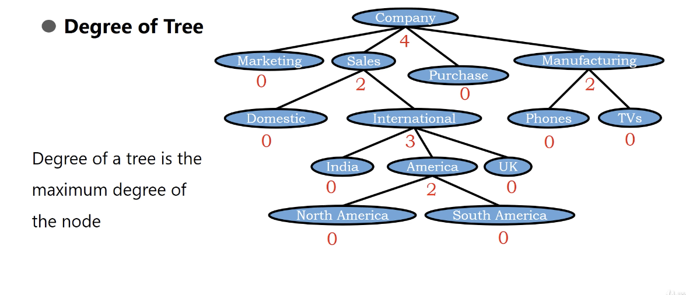
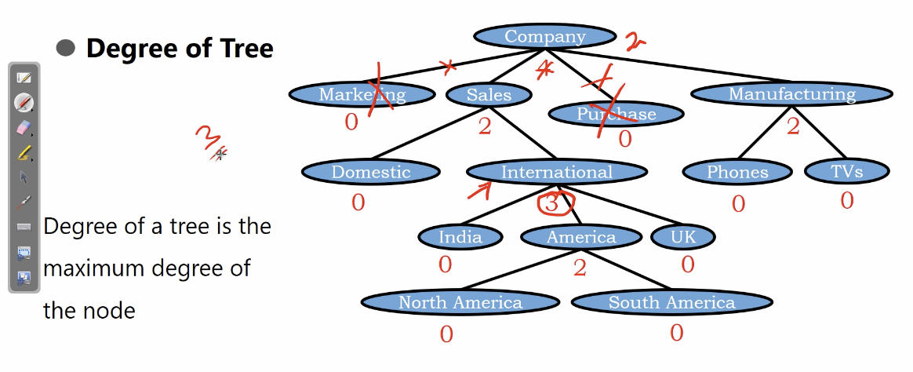

# Tree - Terminology(II)

## Height and Levels

</img>
</img>

level implys the node when the child goes to the root

hight implys the edges when the child goes to the root

## Degree of Node

Degree of the node is the number of clidren of the node

1. leaf mode, degree = 0
2. root in this case, degree = 4
3. Sales, degree = 2
4. Manufacturing, degree = 2
5. International, degree = 3

</img>
</img>
</img>

## Degree of Tree

Degree of a tree is the maximum degree of the node

</img>

Degree is this tree is 4.

</img>

If we erease the Marketing and Purchase, We have a tree which degree is 3(International is the maximum)
