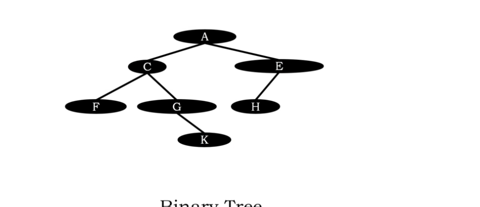

# Binary Tree

1. Every node has at most two children.
2. Every cild nodes is labelled as left child and right child.
3. Left child precedes right child in order of nodes(?)

below is a binary tree
</img>

below is not a binary tree
</img>

below is a binary tree(?)
</img>

below is a binary tree(left skewed binary tree)

</img>

below is a binary tree(right skewed binary tree)

</img>

Maximum number of nodes in a binary tree of hieght $h$ is 

$$
N=2^{h+1} - 1
$$

</img>
