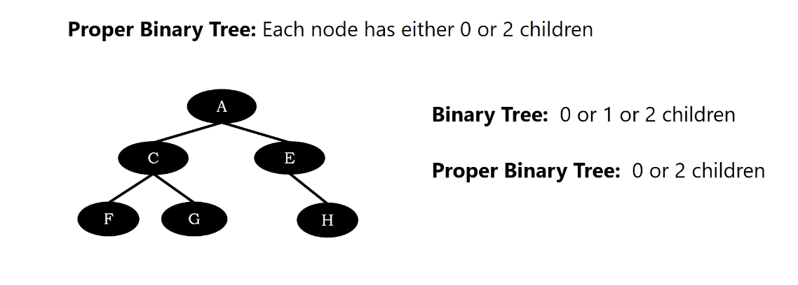

# Proper Binary Tree

Each node has either 0 or 2 children.

below is not a proper binary tree.

</img>

below is a proper binary tree

</img>

below, figure 1 is a proper binary tree
below, figure 2 is not a proper binary tree
below, figure 3 is not a proper binary tree

</img>

below, figure 1 is a proper binary tree
below, figure 2 is not a proper binary tree

</img>

below is not a binary tree

</img>
