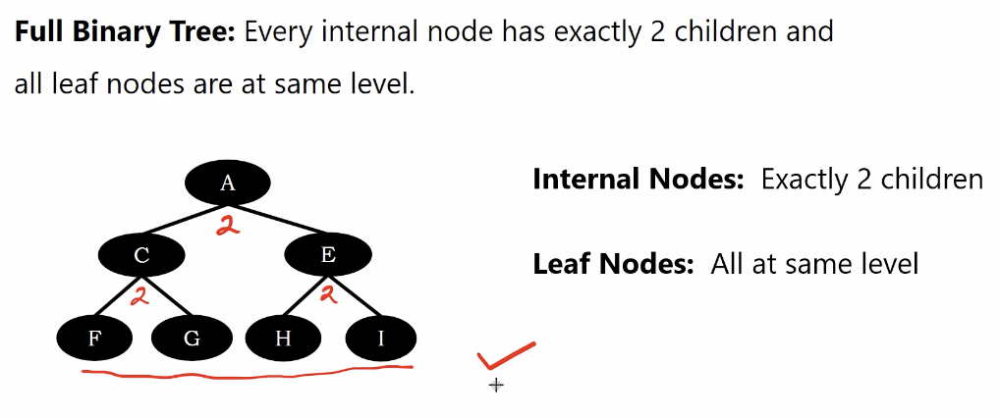
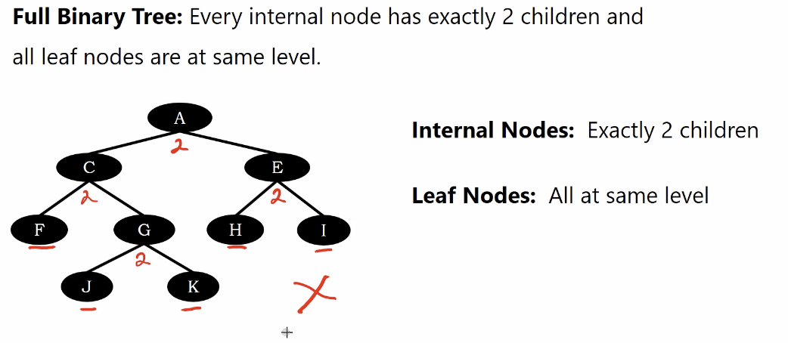
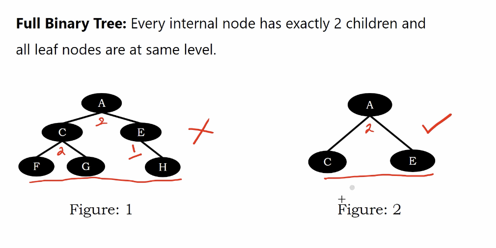
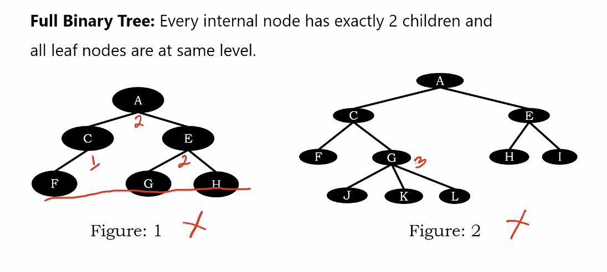
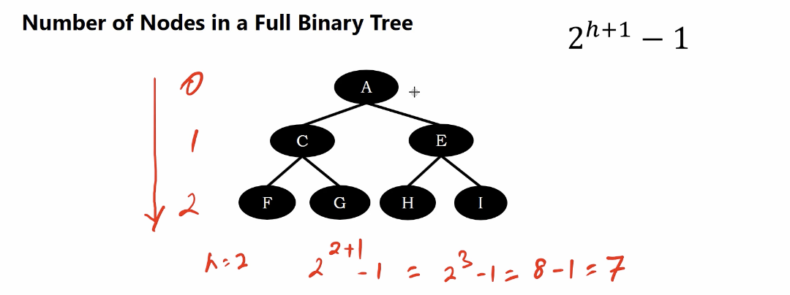

# Full Binary Tree

1. Every internal node has exactly 2 children
2. All leaf nodes are at same level
3. With hieght $h$, number of nodes $N = 2^{h+1} -1$

According to this definition, we can traverse a tree to check is the tree is a full binary tree or not(it will be very helpful for checking index healthy in database)

below is a full binary tree

</img>

below is not a full binary tree

</img>

below, 

figure 1 is not a binary tree

figure 2 is  a binary tree

</img>

below, 

figure 1 is not a binary tree

figure 2 is not a binary tree

</img>

# Number of nodes in a full binary tree

</img>

which is exactly the maximum number of binary tree.
