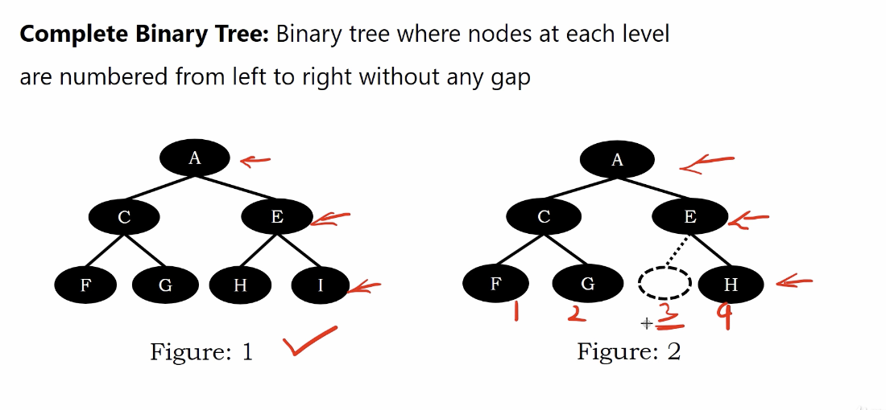
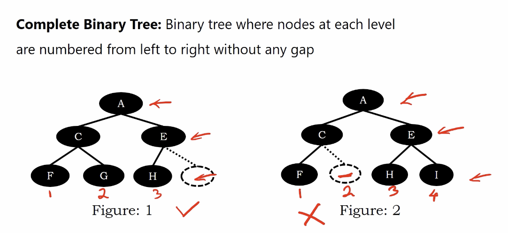
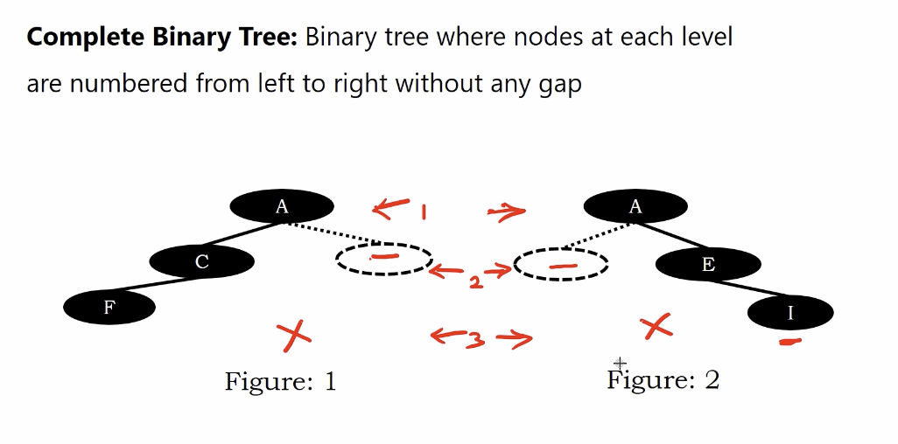
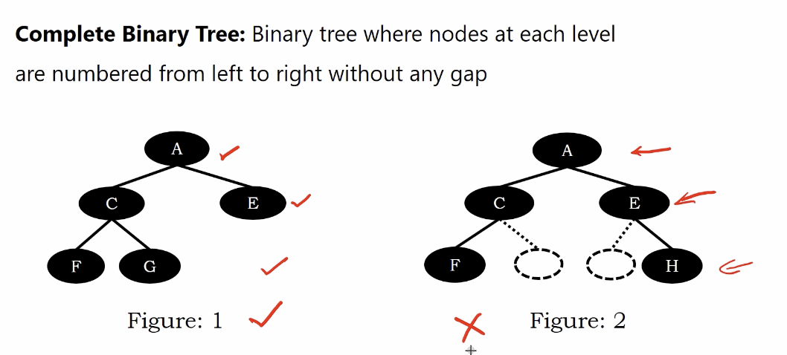
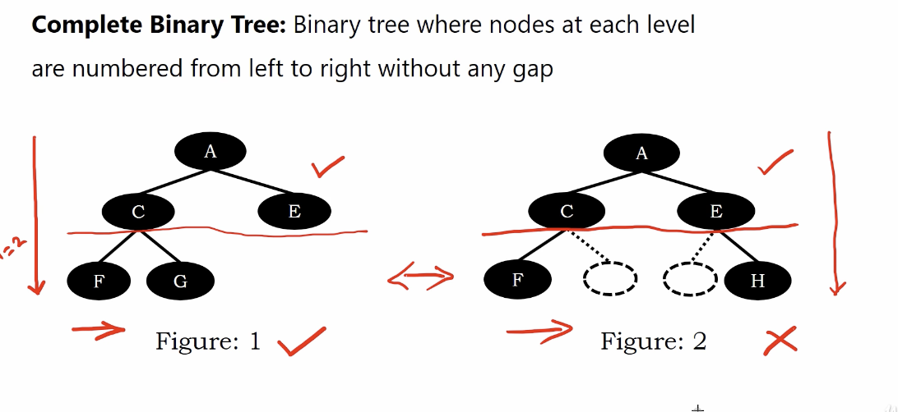

# Complete Binary Tree

Binary tree where nodes at each level are numbered from left to right without any gap

below, figure 1 is complete binary tree, figure 2 is not complete tree

</img>

below, figure 1 is complete binary tree, figure 2 is not complete tree

</img>

below, figure 1 is not a complete binary tree, figure 2 is not a compelete binary tree

</img>

below, figure 1 is a complete binary tree, figure 2 is not a complete binary tree

</img>

# Mathematical definition

How can we use math or code to check a tree is a compelete tree or not?

Also, we wanna make this fomula is robust (100%  match all of the compelete trees)

Yes, the mathematician find a rule!

Consider a tree with height $h$, 

1. The subtree with hieght $h-1$ should be a full binary tree
2. The leaves at height $h$ from left to right must not have any gap.

</img>
