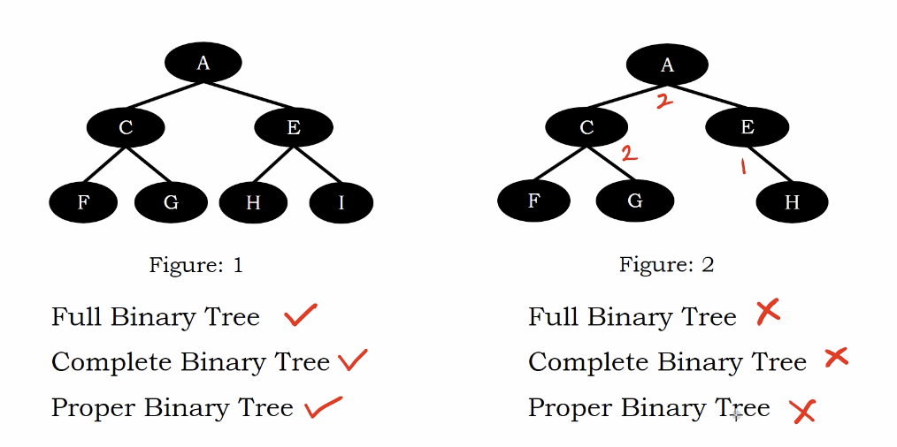

# Full vs Complete vs Proper Binary Tree

Full Binary Tree : The tree which contains most leaves $2^{h+1} -  1$ with height $h$.

Complete Binary Tree : No gap in each level from left to right.

Porper Binary Tree : Each node with 0 or 2 chilren.

# Example 1 

Left

FBT - $h = 2$, $N$ leaves = 7

CBT - no gap

PBT - 2 or 0 children rach node

Right

FBT - $N$ leaves != $2^{3} - 1$ with $h=2$

CBT - there is a gap at level 3

PBT - node E has only one child.

</img>

# Example 2

FBT - $N$ leaves = 7 -> no one fit

CBT - no gap for all level from left to right -> left

PBT - each node with 0 or 2 chilren -> no one fit

</img>

# Example 3

FBT - $N$ leaves = 7 -> no one fit

CBT - no gap for all level from left to right -> left

PBT - each node with 0 or 2 chilren -> left

</img>

# Rules

We can see that if a tree is a Full Binary Tree

It should be a Complete Binary Tree and Proper Binsry Tree

But is is a single directional rule

FBT -> CBT -> PBT

# Implemetation hint

FBT - represented through arrays. - we need to allocate that much amount of space and the memory to store maximum elements

CBT - represented thout heap data structure.

That's why we need to have a clear understanding about a tree is FBT / CBT / PBT or not.
