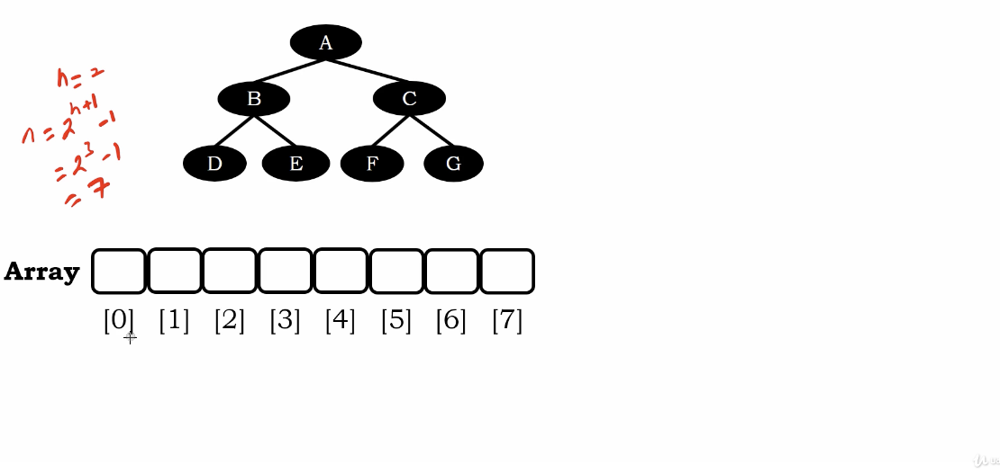
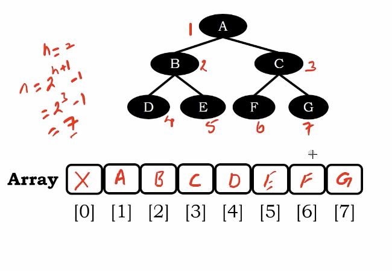
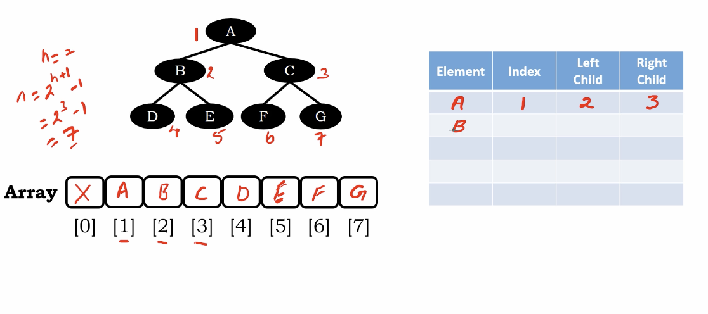
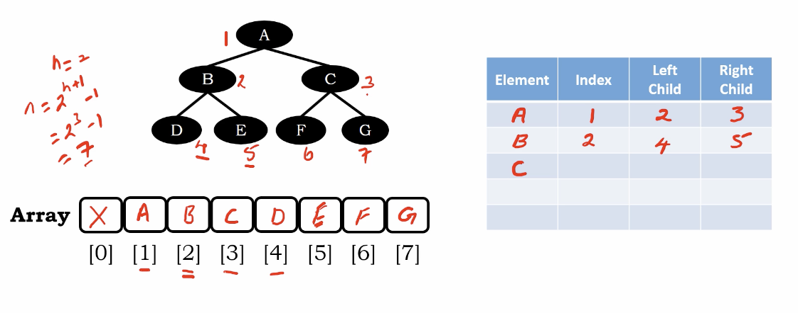
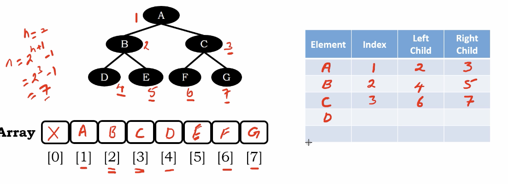
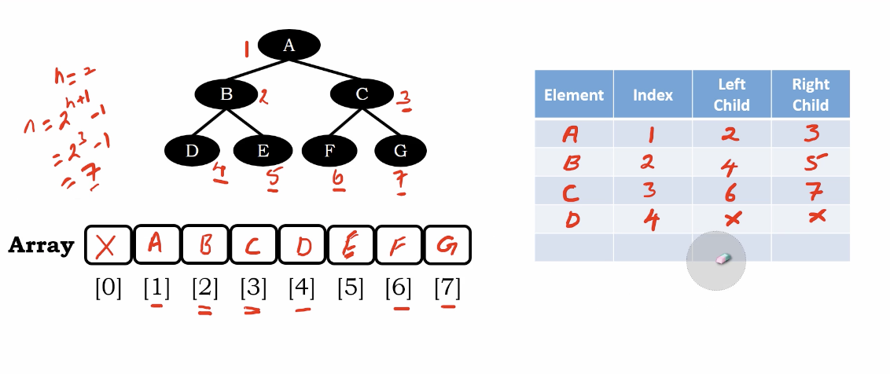
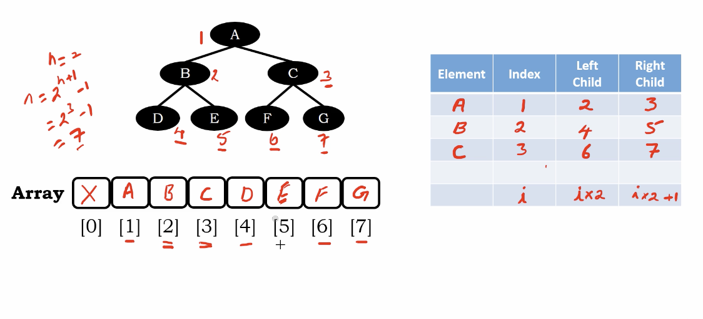

# Full vs Complete vs Proper Binary Tree

We have a abstract data structure, we need to make computer build a binary tree. and operating on them.

WHat data structure do we have so far?

1. Arrays - fixed size
2. Linked List - dynamically allocate memory

Let's introduce a array representation here

# Binary in an array

the maximum $N$ of leaves with a binary tree with height $h$ is $2^{h+1} - 1$

</img>

we won't use index zero. we only need 7 buckets

the order?

following by level, left to right

</img>

If we use a linear data structure(array) to represent non linear data structure(tree)

Some information will be lost.

As the figure above, we lost the level information, and left to right information.

If we really want to do so(keep the information), we need another table to record a element, which index is it's left child and right child.

Consider node A

</img>

Consider node B

</img>

Consider node C

</img>

Consider node D 

</img>

Consider any node $i$ in Full Binary Tree

</img>

we can use the fomula $2i$ (left child), $2i + 1$(right child)

if we are get a node index with $i$, we can find out the left child and right child.

same way, if we get a node with index $p$, we can find out its parent.

we will samply use `p // 2` to get the parent.

These formula is very helpful in Heap's data structure.
