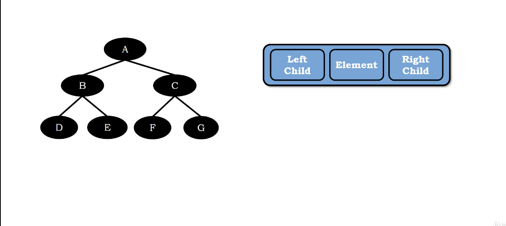
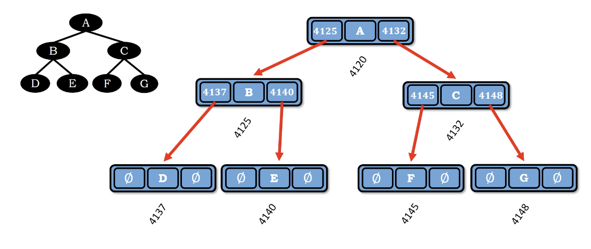
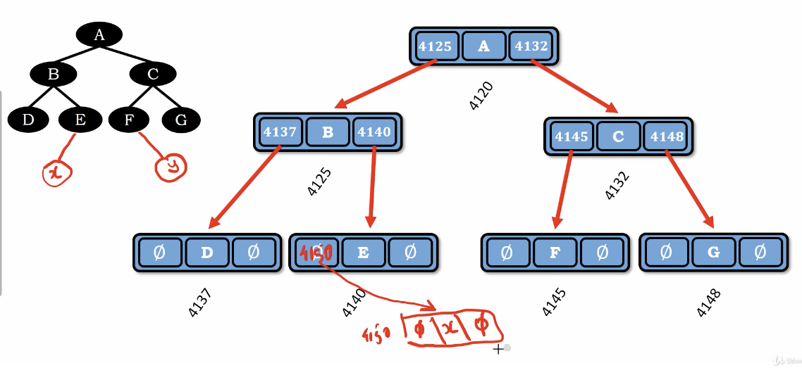
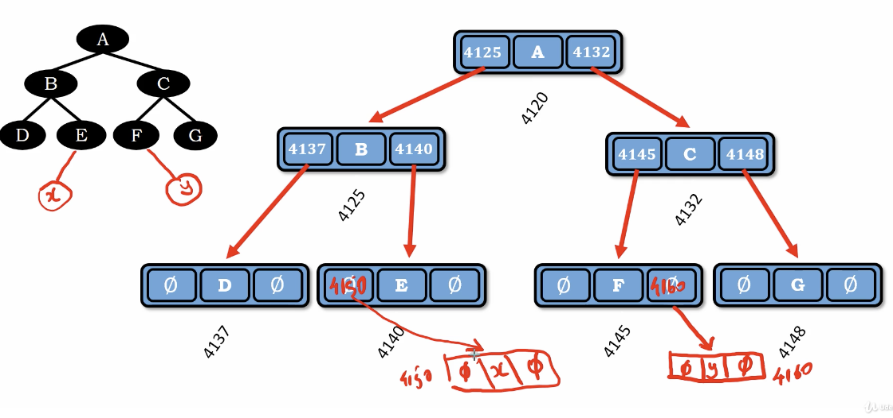

# Binary Tree linked list

</img>
</img>

extending the node with two pointer(reference)

hence, the node has the abilities to reference two node(which is a tree)

the reference of leaf node will indicate null

## How we add node into a tree?

</img>
</img>
