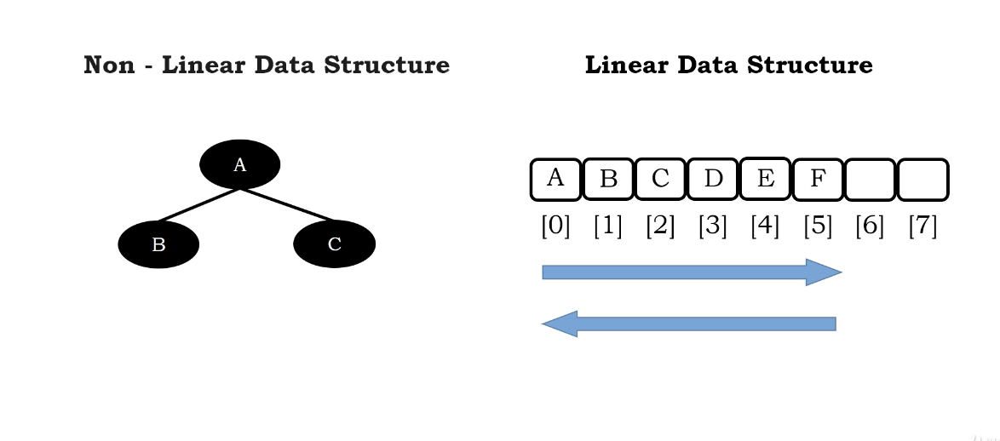

# Traversing binary tree

In linear data structure, traversing is very easy to think about and implement(a for loop)

</img>

There are 4 different traversal techniques about traversing binary trees

1. Inorder Traversal
2. Perorder Traversal
3. Postorder Traversal
4. Level order Traversal
