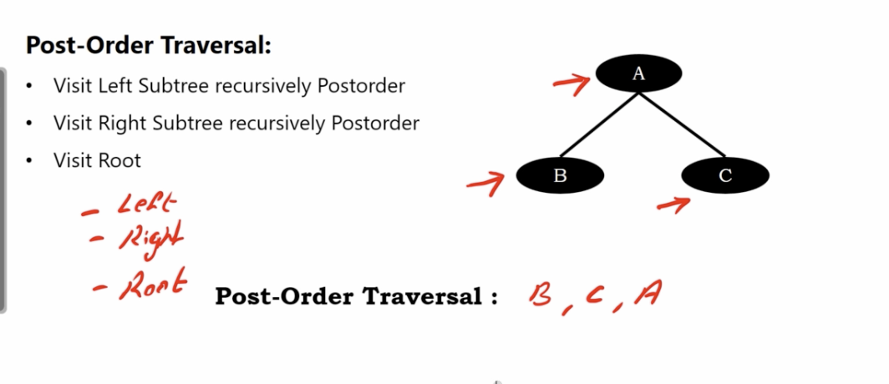
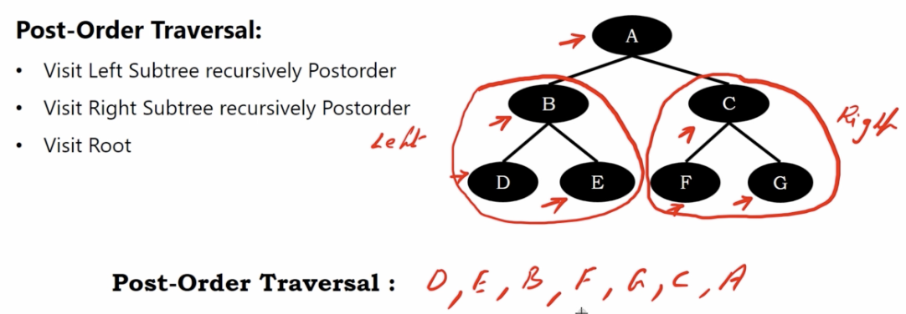
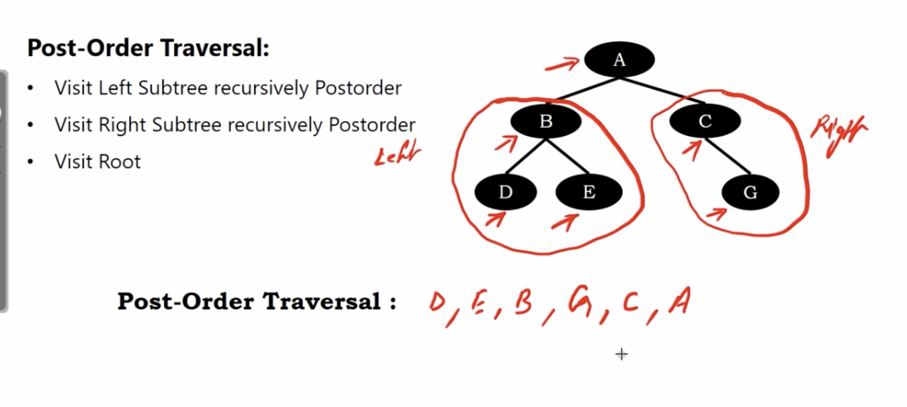
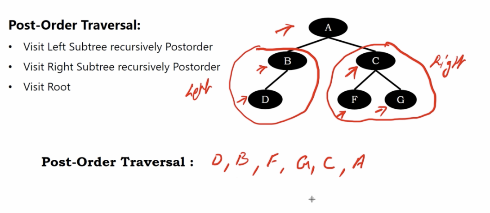

# binary tree postorder traversal

1. visit left subtree recursively postorder
2. visit right subtree recursively postorder
3. root

# Example 1

</img>

# Example 2

</img>

# Example 3

</img>

# Example 4

</img>
