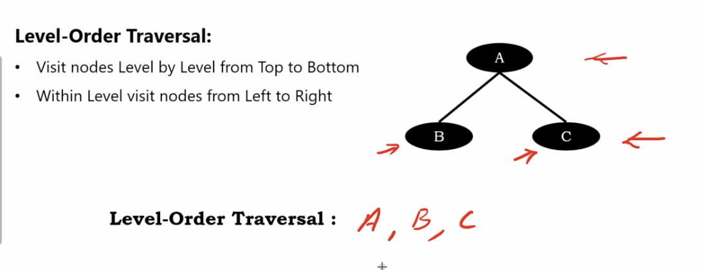
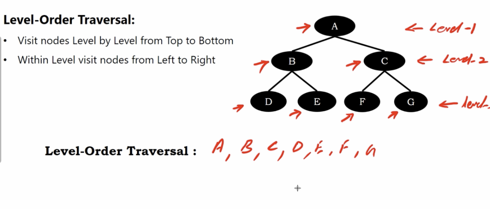
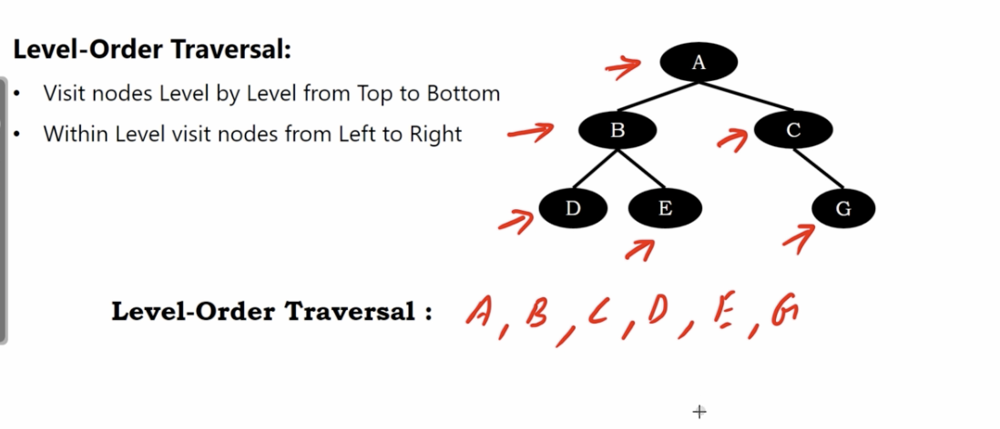
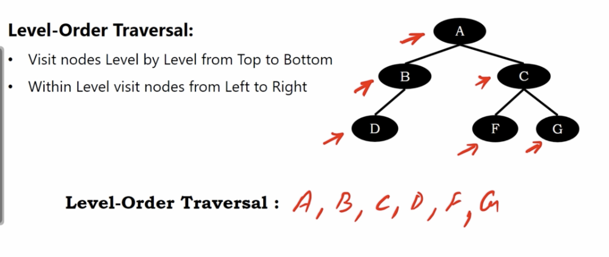

# binary tree level order traversal

1. visit nodes level ny level from top to bottom
2. within level visit nodes from left to right

This is the simplest trchnique of traversing a binary tree.
But it's the most difficult to implement inm any programming language.

# Example 1

</img>

# Example 2

</img>

# Example 3

</img>

# Example 4

</img>
