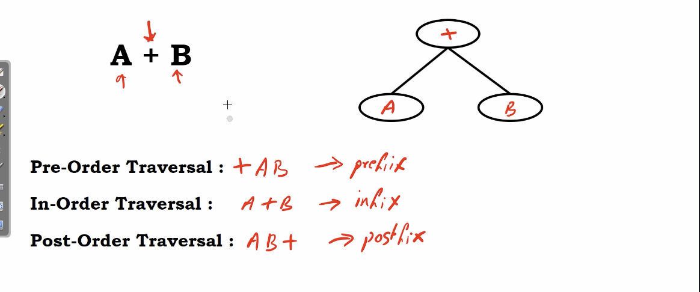

# remembering binary tree traversals

consider a simple expression :
$$
A+B
$$

we konw $+$ is an operator, A, B are operand.

</img>

we can observe that there is a mathematical meaning to the pre-order/in-order/post-order pattern.
