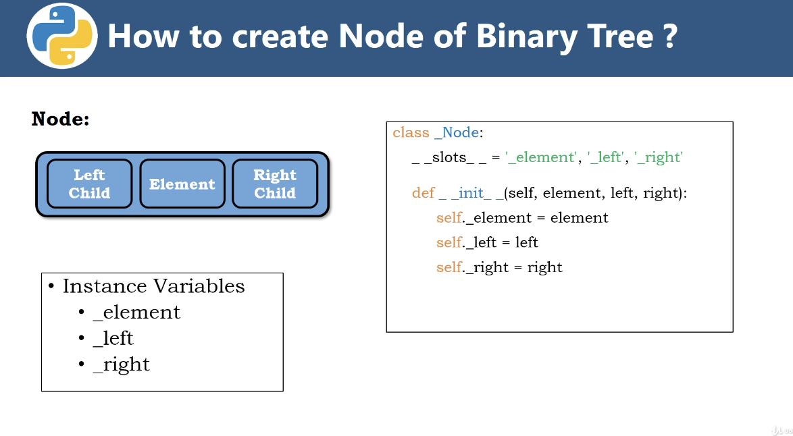
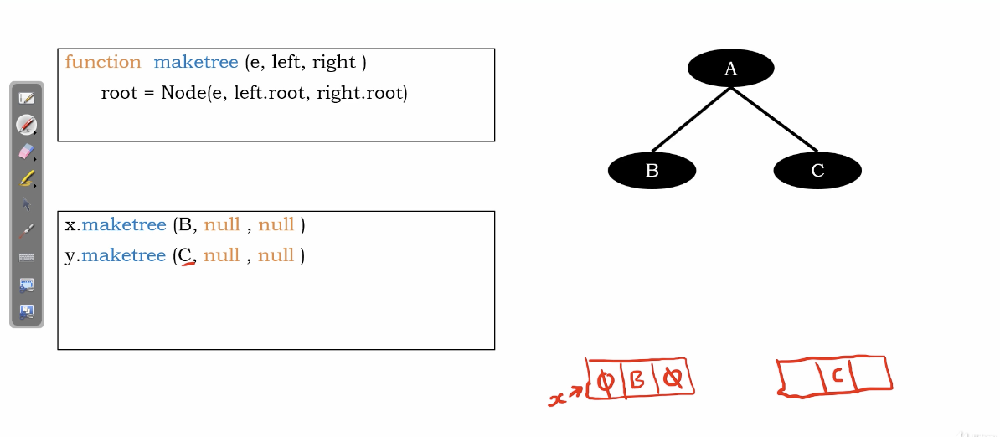
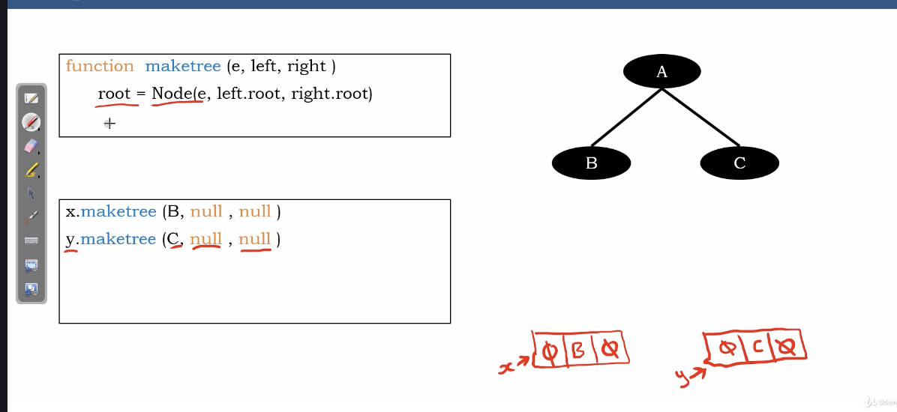
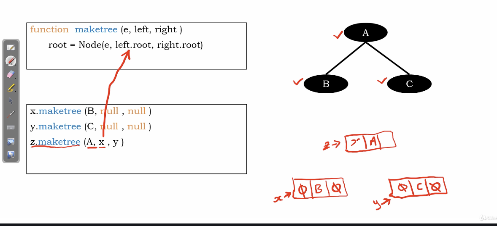
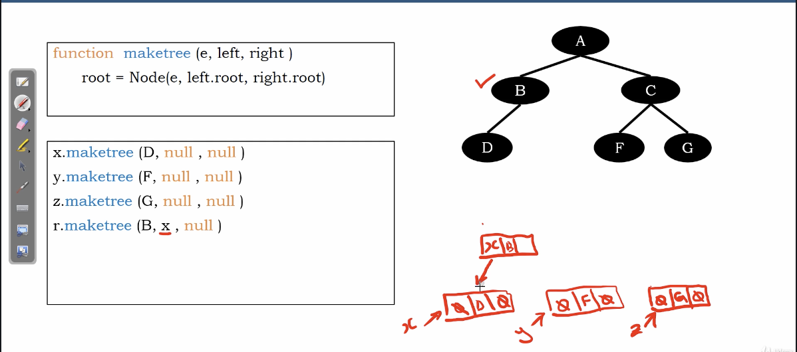
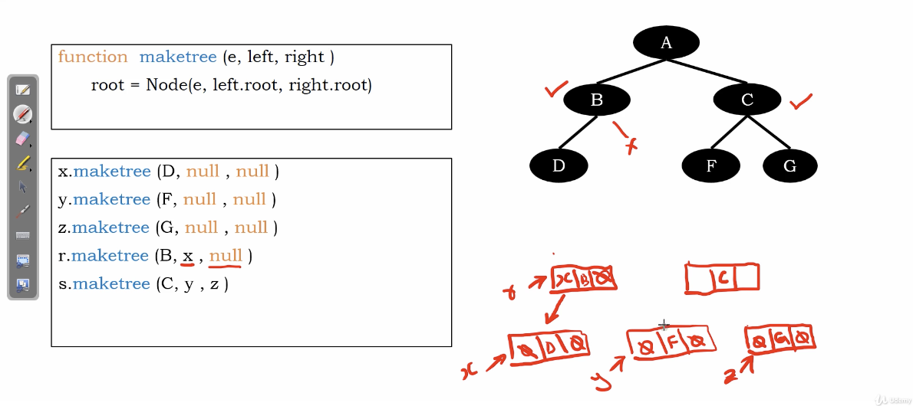
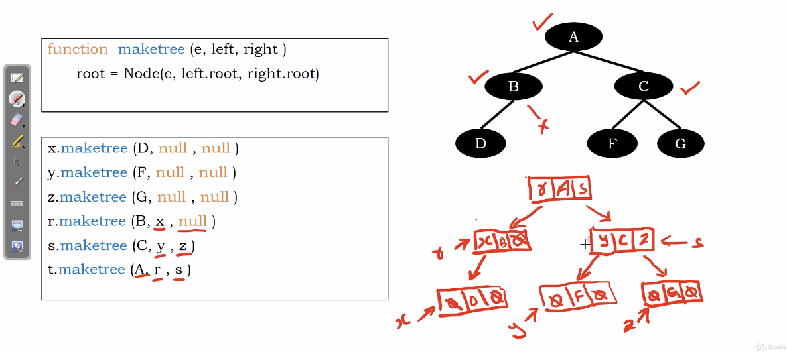

# create binary tree 

## node

two pointer : left child, right child

data : element

</img>

## make_tree

### Case I

</img>

</img>

</img>

Steps 

1. create node
2. point the node into another node

### Case II

</img>

</img>

</img>
