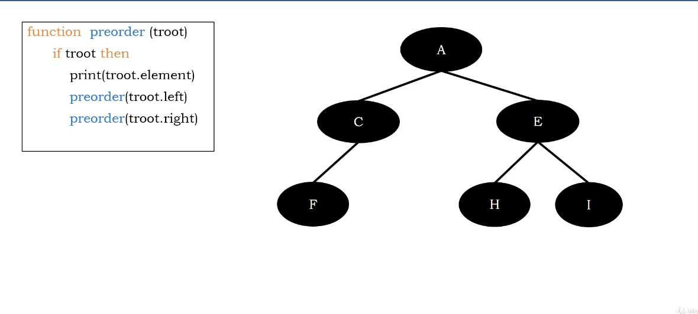
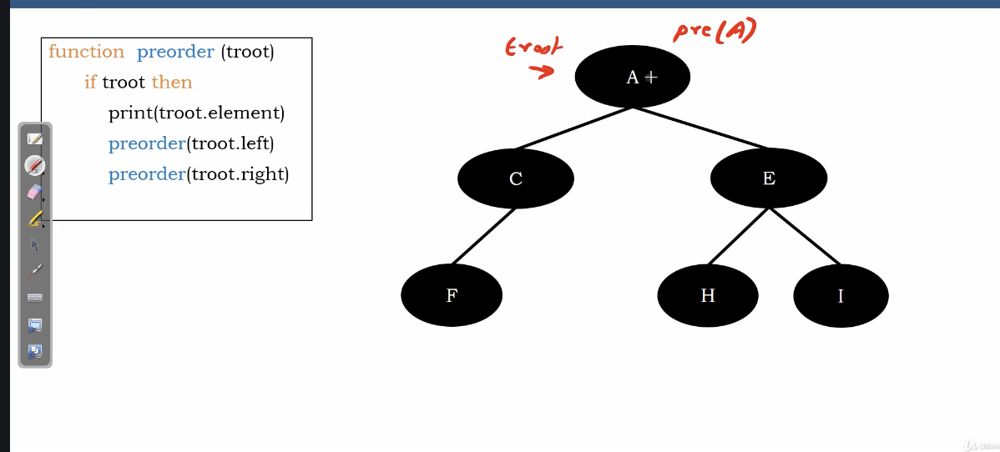
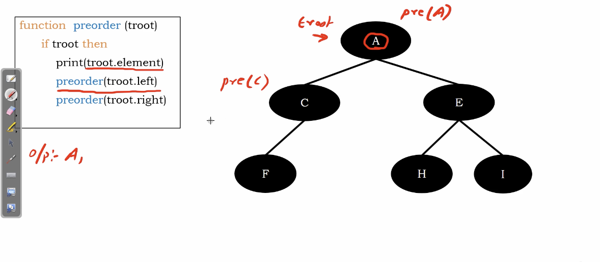
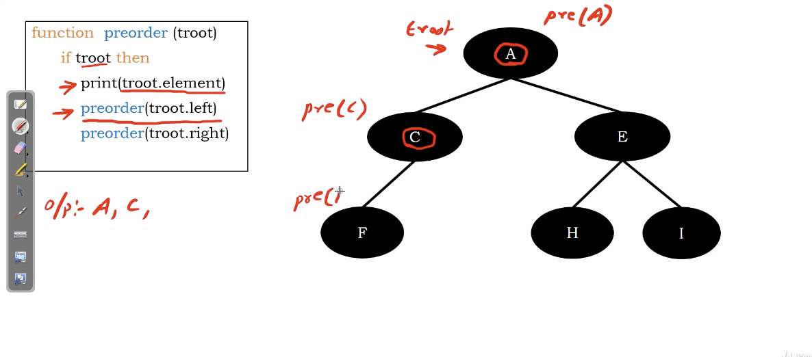
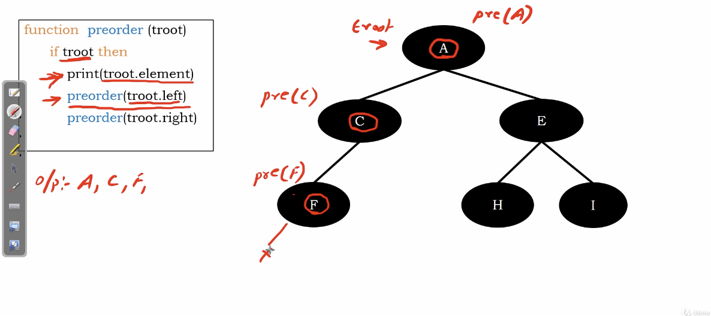
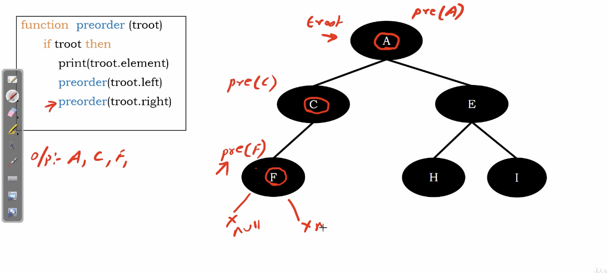
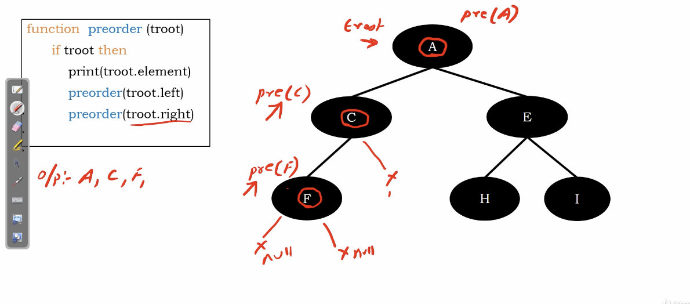
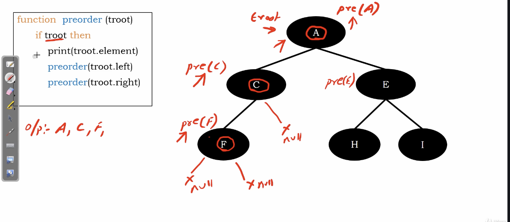
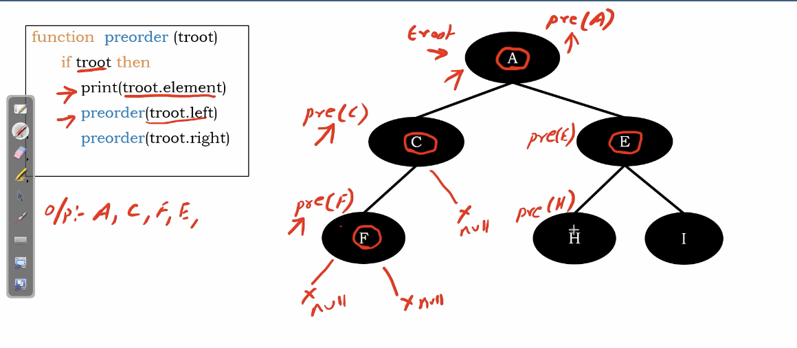

# preorder traversaltree 

1. visit root
2. visit left subtree recursively preorder
3. visit right subtree recursively preorder

</img>

we do it in a recursion fashion.

# Seeing hwo it working

</img>

function stack 1 : we enter $A$, then the function go to check $C$

</img>

function stack 2 : we enter $C$, then the function go to check $F$

</img>

function stack 3 : we enter $F$, then the function go to check $left~~of~~F$

</img>

function stack 4 : troot is None, return.

back to function stack 3 : continue to visit $right~~of~~F$

function stack 4 : troot is None, return.

back to function stack 3 : function complete, return

back to function stack 2 : continue to visit $right~~of~~C$

</img>

function stack 3 : troot is None, return

back to function stack 2 : function complete

</img>

back to function stack 1 : continue to visit $right~~of~~A$ 

</img>

function stack 2 : we enter $E$, then the function go to check $left~~of~~E$

</img>

# Complexity Analysis

Function calls : for complete binary tree, basically $2^{l}$, l represent as level
