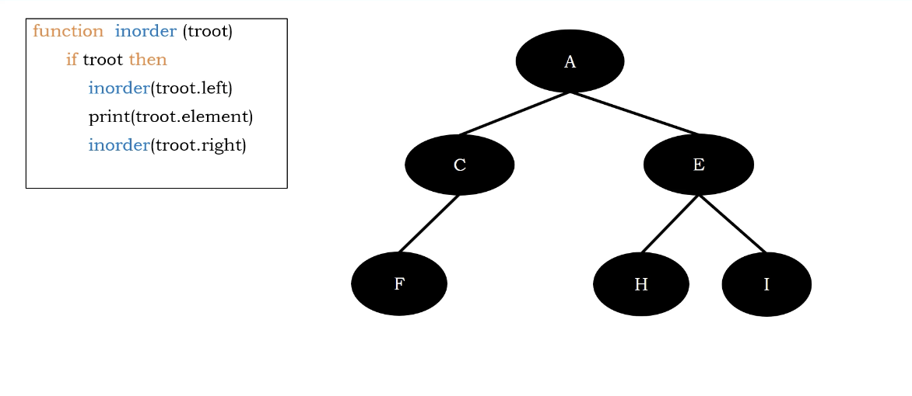
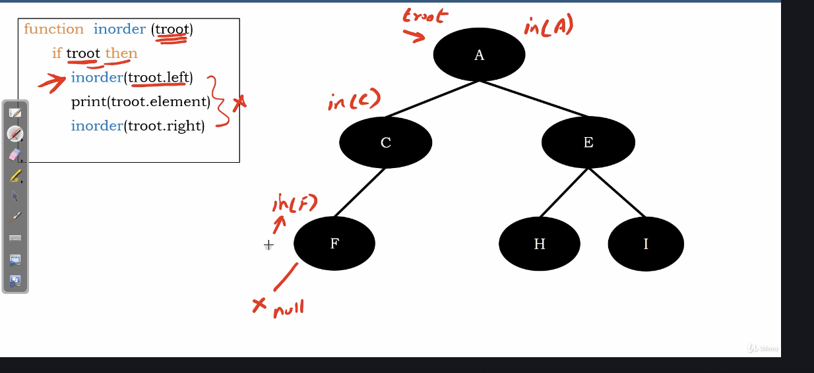
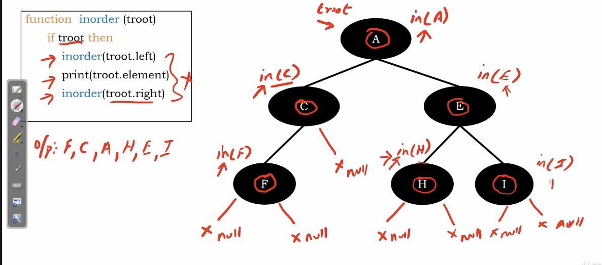

# inorder traversal

1. visit left subtree recursively inorder
2. visit root 
3. visit right subtree recursively inorder

</img>

check left first.

The difference between preorder is the arrangement, nothing special.

</img>

</img>
