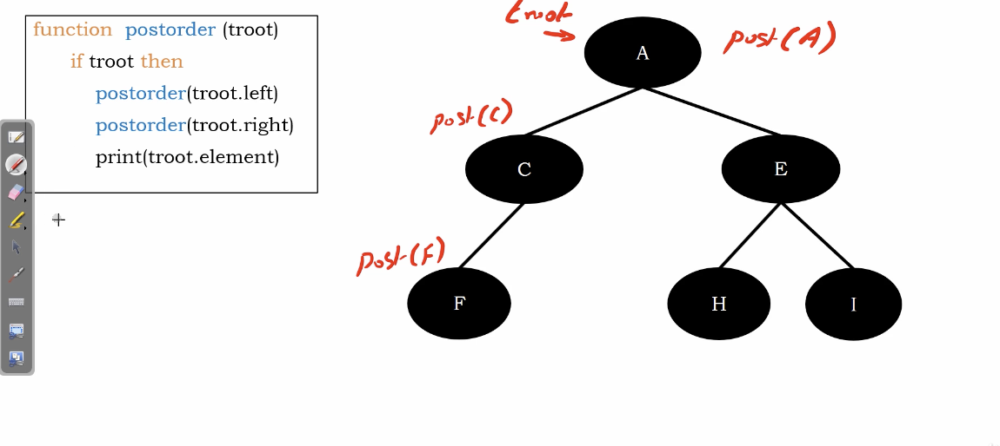
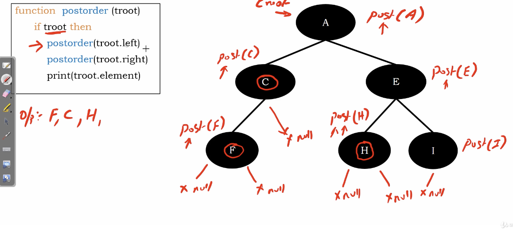

# postorder traversal

1. visit left subtree recursively postorder
2. visit right subtree recursively postorder
3. root

</img>

The difference between preorder ans inorder is just arrangement.

</img>
