# Level Order Traversal

1. enter the level
2. use queue to visit all leaves
3. level += 1 

queue : the line up. like line in front of the atm.

# Algorithm

``` Python
function levelorder()
  Q = Queue()
  t = root
  print(t.element) # visited the root
  Q.enqueue(t)
  while ! Q.is_empty()
    t = Q.dequeue() # for first iteration, we got the root
    if t.left then
        print(t.left.element)
        Q.enqueue(t.left) # enqueue the next level node, if there is a node.
    if t.right then
        print(t.right.element)
        Q.enqueue(t.right) # enqueue the next level node, if there is a node.
    # if there is any node in the queue, loop keep going.
  
```

In this code, we traverse the left node of certain level first.

# Example

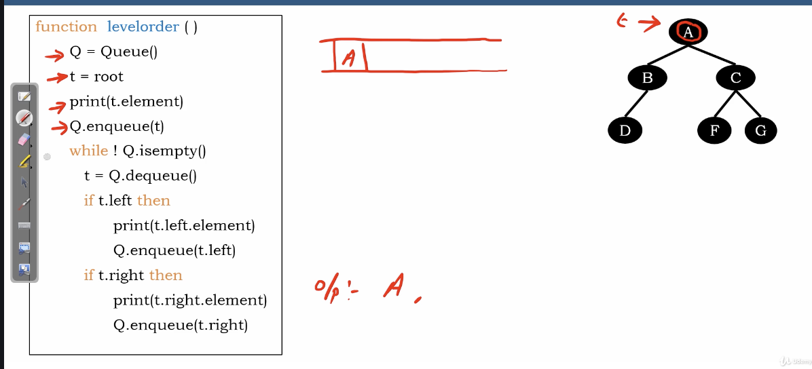</img>

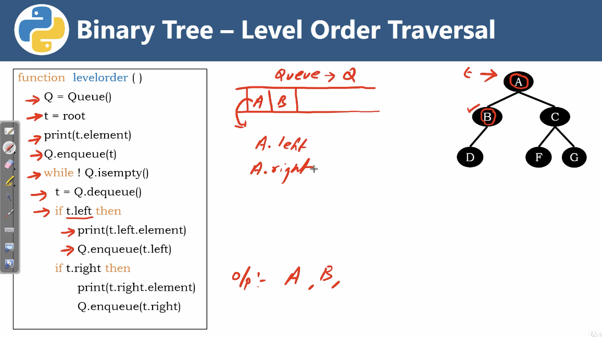</img>

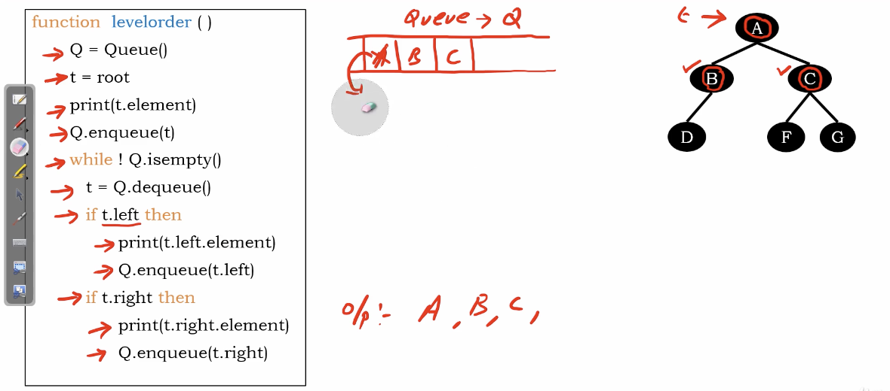</img>

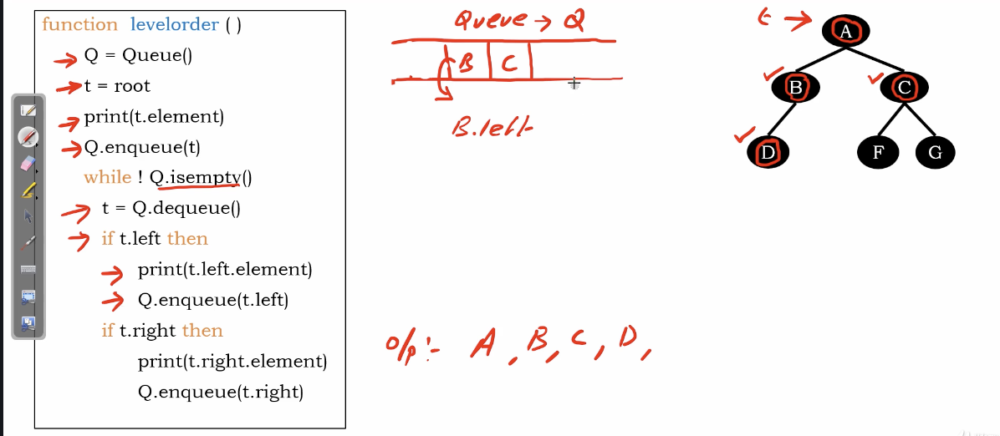</img>

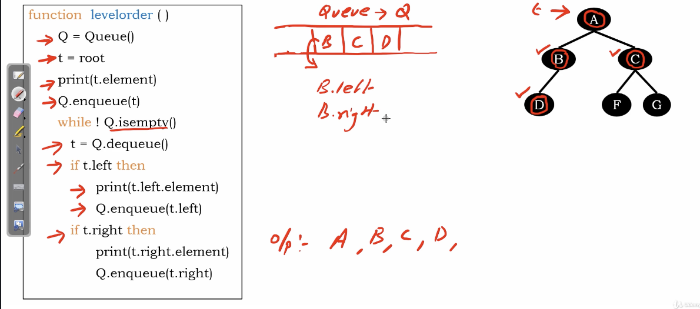</img>

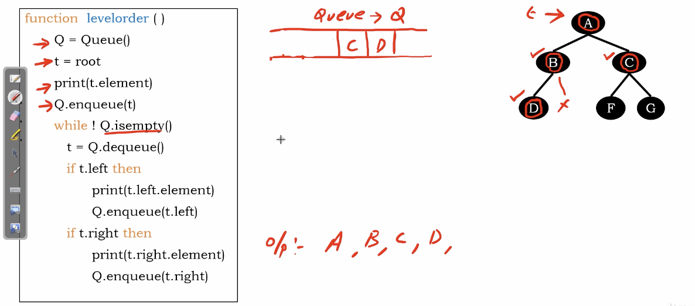</img>

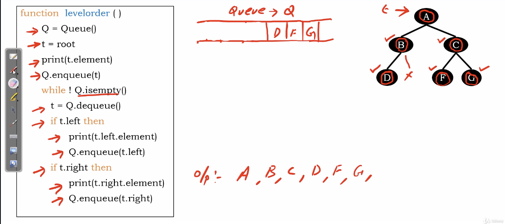</img>

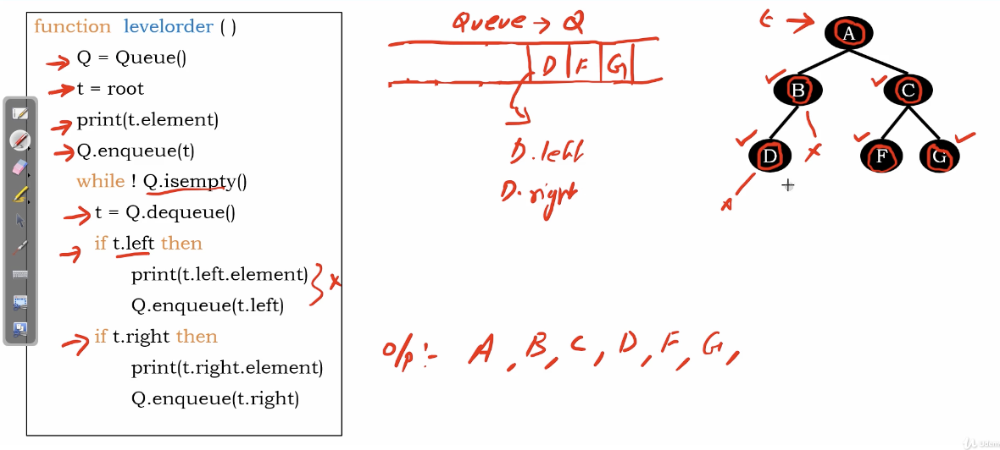</img>

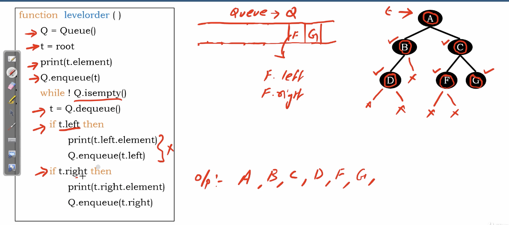</img>

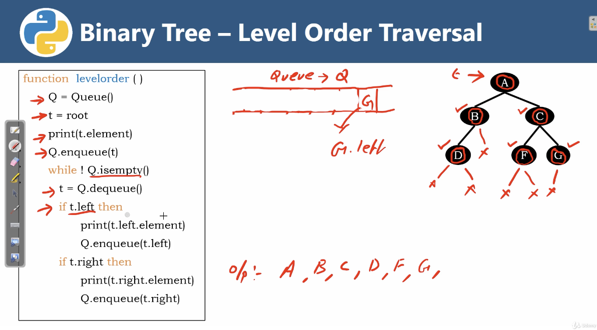</img>

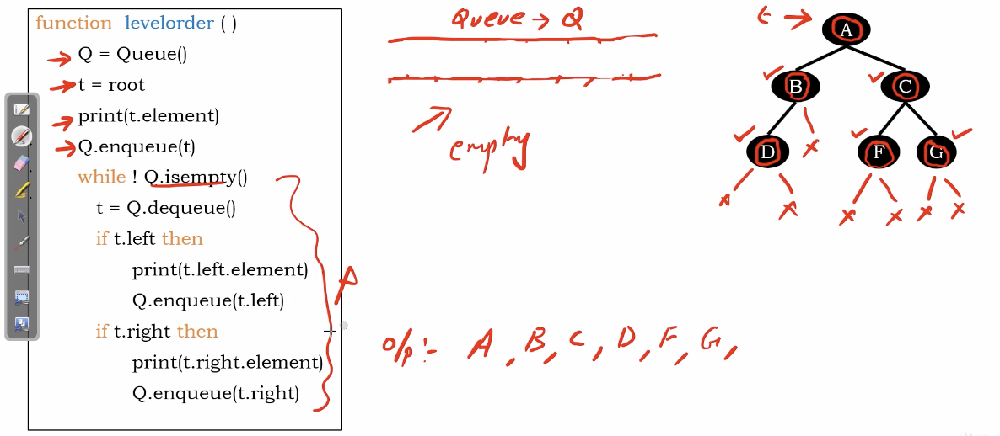</img>
