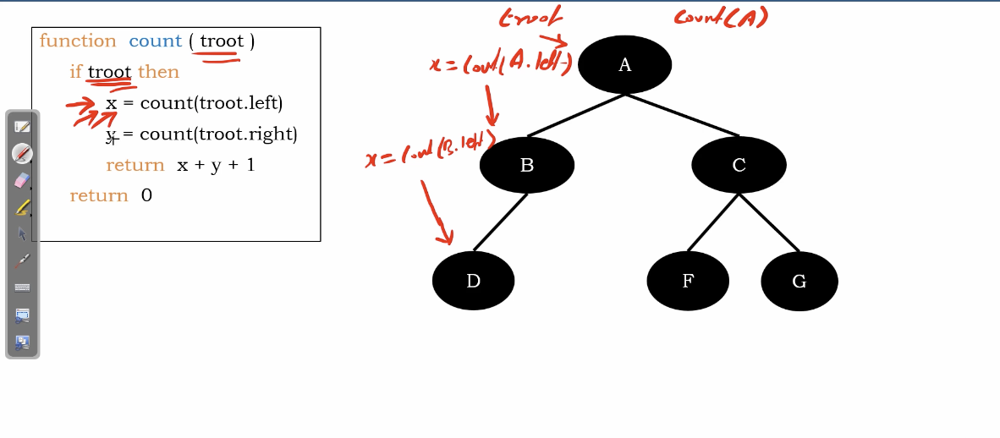
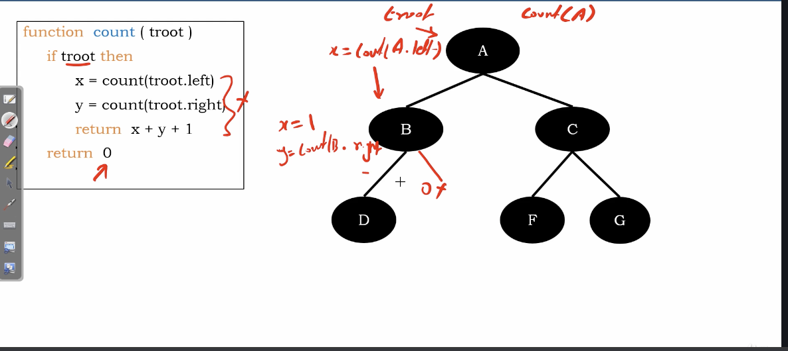
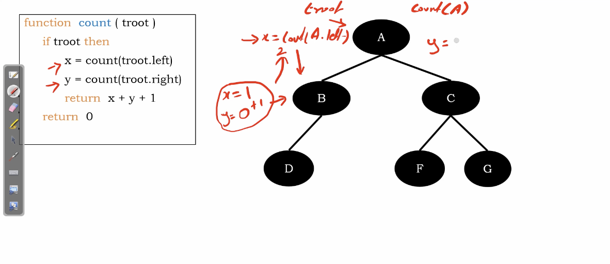
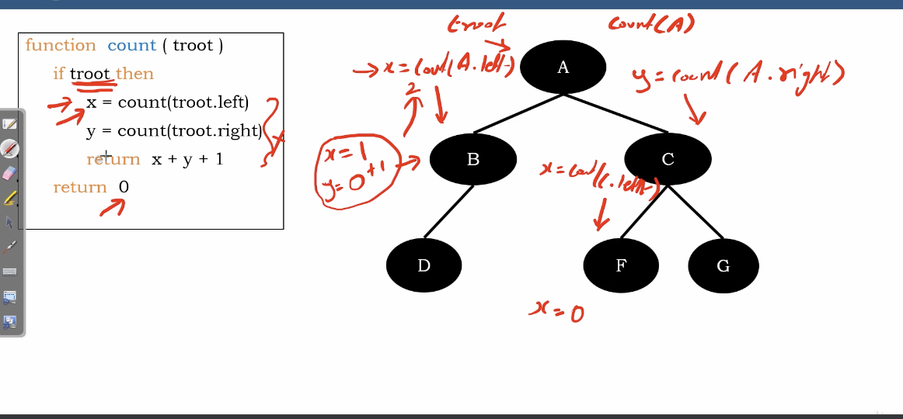
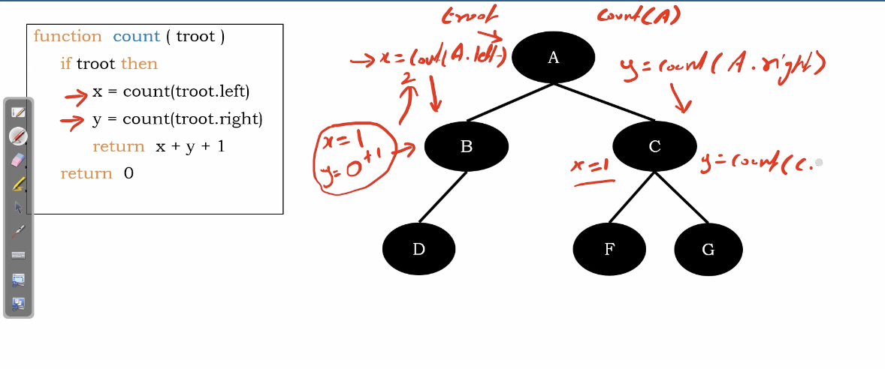
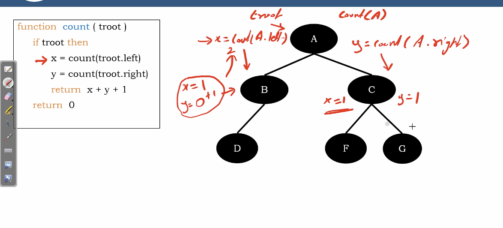
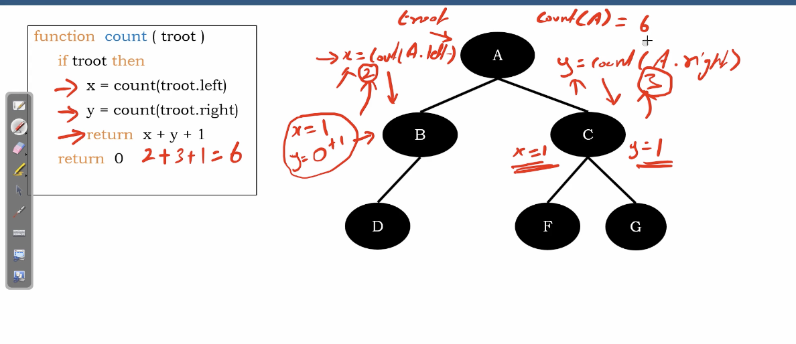

# Count number of nodes in Binary Tree

Recursively style.

**In summary, any traversal method can be used when count how many nodes.**

# Algorithm

``` Python
function count(troot)
  if troot then
    x = count(troot.left)
    y = count(troot.right)
    # +1 for tree root
    return x+y+1
  return 0
```

Time compelexity basically $O(2^{h})$, h for the number of height.

# Example

</img>

</img>

</img>

</img>

</img>

</img>

</img>

</img>

the x, y values will propergate the node counts as a `local variavle` and `return` statement.
