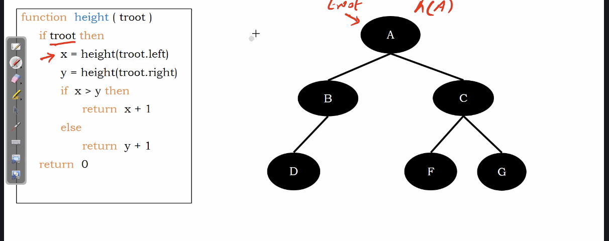
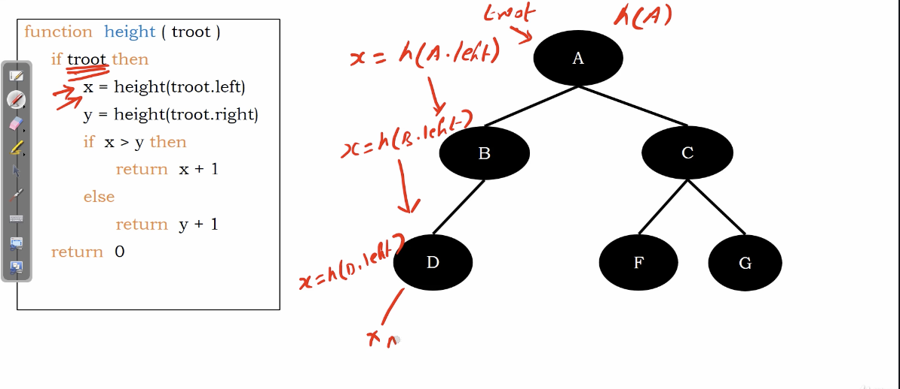
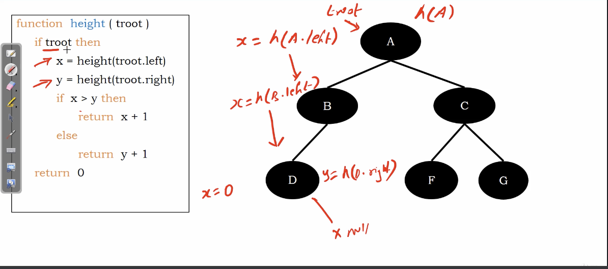
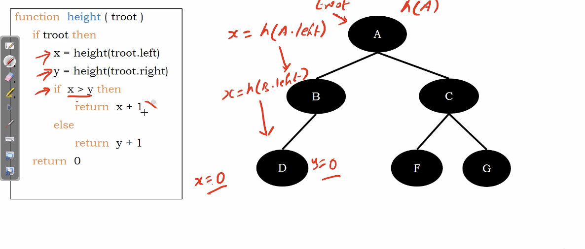
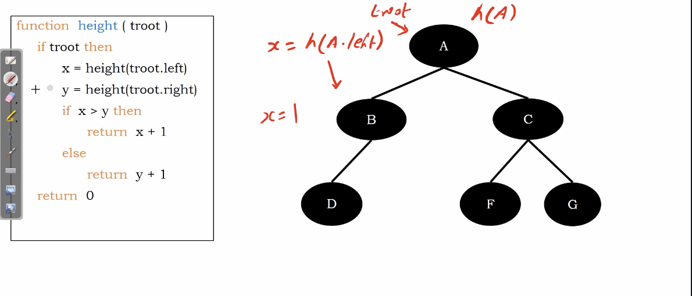
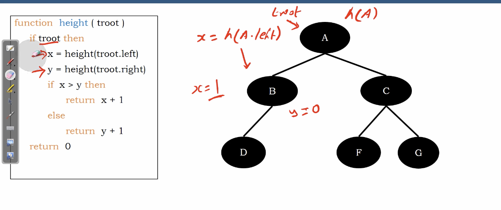
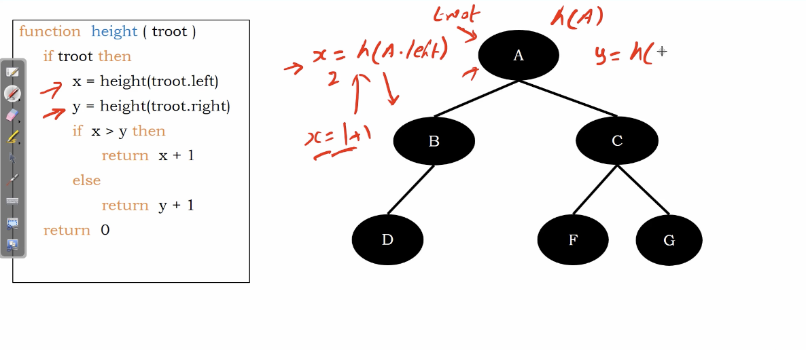

# Count number of nodes in Binary Tree

Recursively style.

**In summary, any traversal method can be used when count how many nodes.**

# Algorithm

``` Python
function height(troot)
  if troot then
    x = height(troot.left)
    y = height(troot.right)
    if x > y then
      return x + 1
    else
      return y + 1
  return 0
```

<!-- Time compelexity basically $O(N)$, N for the number of nodes. -->

# Example

</img>

</img>

Return $x=0$ when we goes to node $D$
</img>

And no $y$ there.
</img>

$x = y = 0$, we return $y+1$

</img>

</img>

</img>
