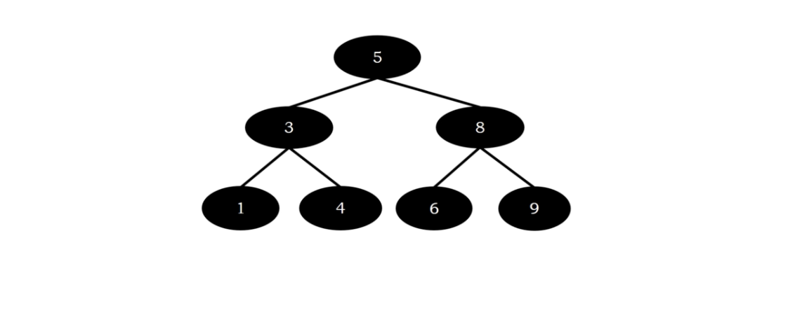
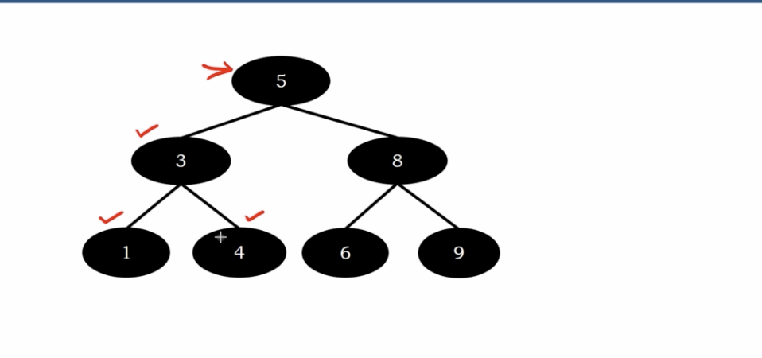
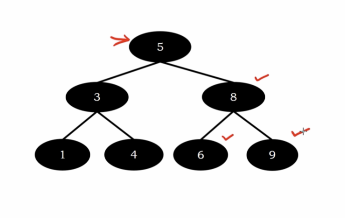
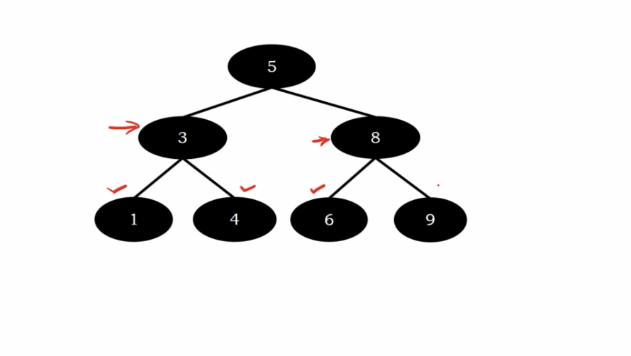
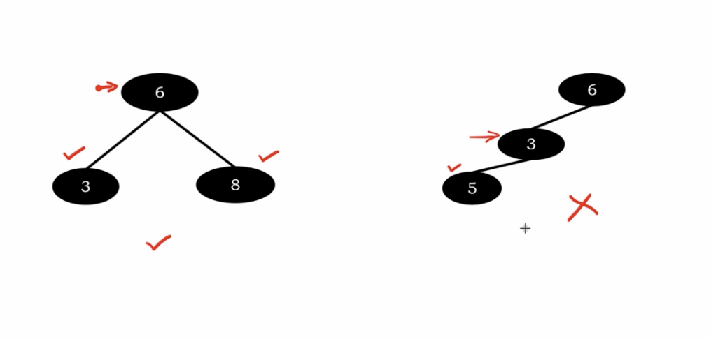
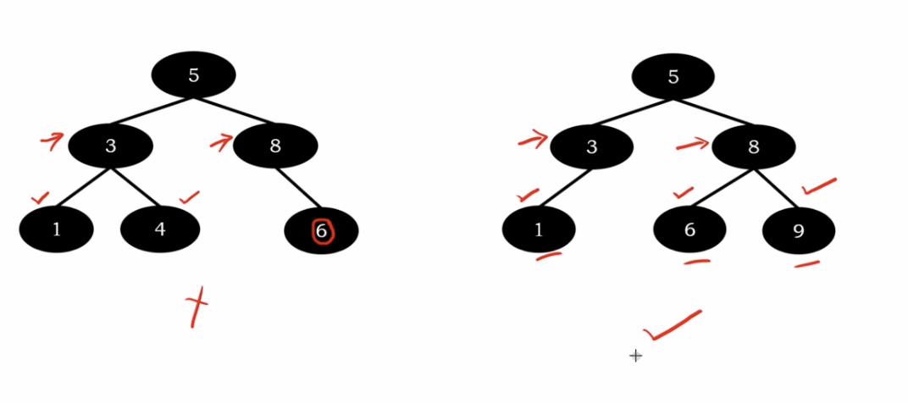
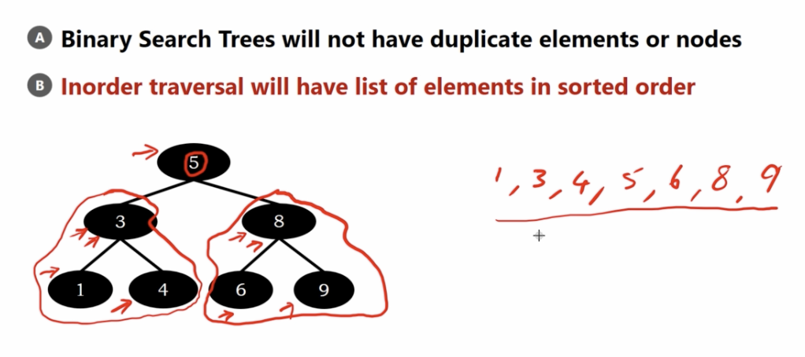
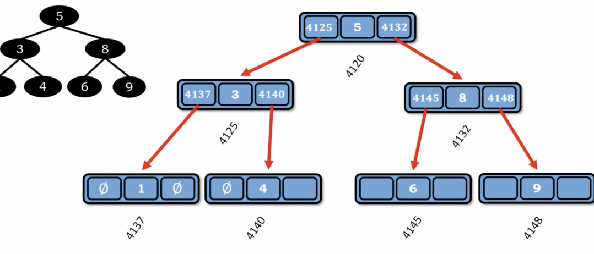

# Binary Search Tree

1. all left child are smaller than the node
2. all right child are greater than the node 

</img>
</img>
</img>
</img>

# More Examples

All binary search tree is binary tree. but binary tree maybe not a binary search tree.

</img>

</img>

# More complete definition

1. Every node has a key
2. Key in Left Sub-Tree of node are Smaller than the key in the node.
3. Key in the Right Sub-Tree of nodes are Greater than the key in the node.
4. Left and Right Sub-Trees are also Binary Search Trees.

# Properties

1. Binary Search Tree will not have duplicate element or nodes.
2. Inorder traversal will have list of elements in sorted order.

</img>

# Representation

1. array-based (less memory efficient, for skew binary search tree)
2. linked list based 

</img>
