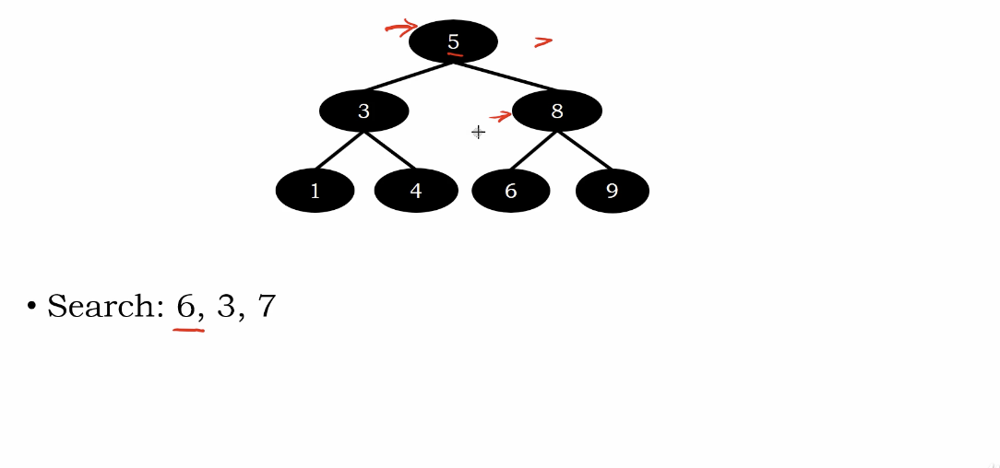
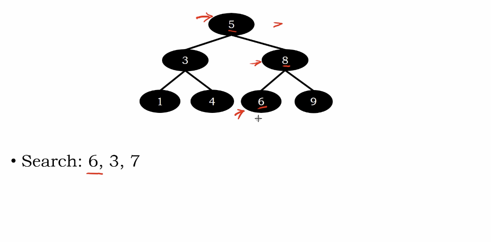
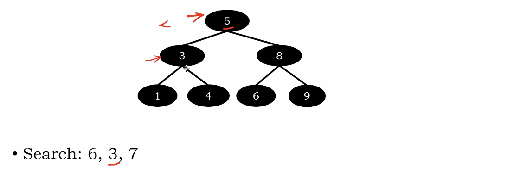
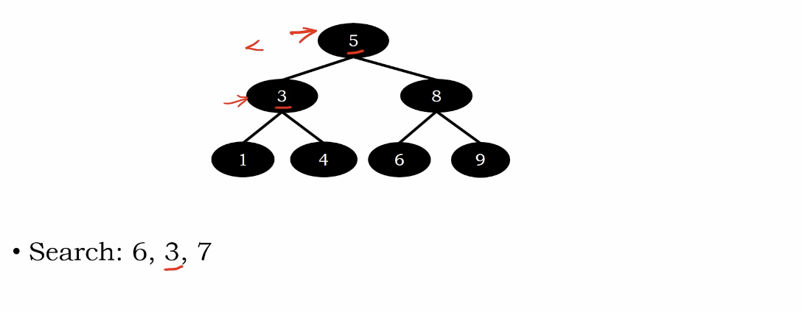
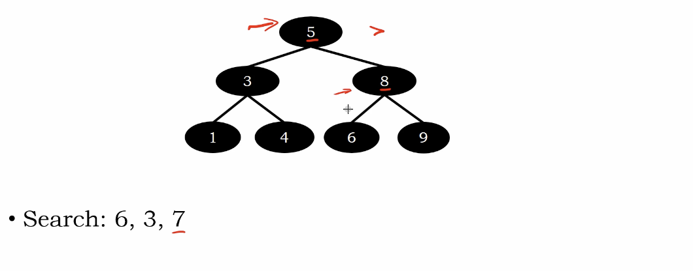
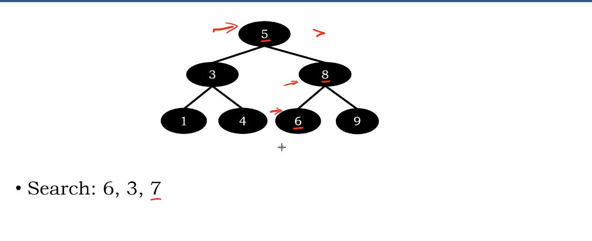
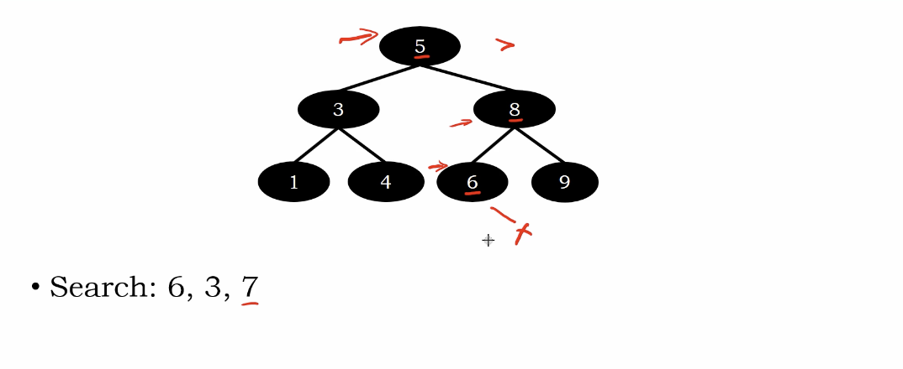

# Searching in Binary Search Tree

if smaller, search the left sub-tree

else, search the right sub-tree

equal, return the value

search to the leaves -> not exist

# Example

</img>
</img>

Found!

</img>
</img>

Found!

</img>
</img>
</img>

Not Found!

return False

# Time Complexity

$O(h)$ - where $h$ is the height of the tree.

# Algorithm - Iteraitve Search Function

``` Python
Algorithm seach_iter(key)
    troot = root
    while troot then
        if key == troot.element then
            return True
        elif key <= troot.element then
            troot = troot.left
        elif key > troot.element ten
            troot = troot.right
    return False
```

# Algortihm - Recirsive Search Function

``` Python
Algorithm search_rec(troot, key)
   if troot then
      if key == troot.element then
          return True
      elif key < troot.element then
          return search_rec(troot.left, key)
      elif key > troot.element then
          return search_rec(troot.right, key) 
   else
       return False
```
