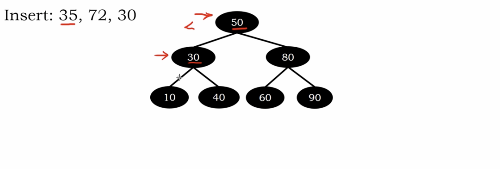
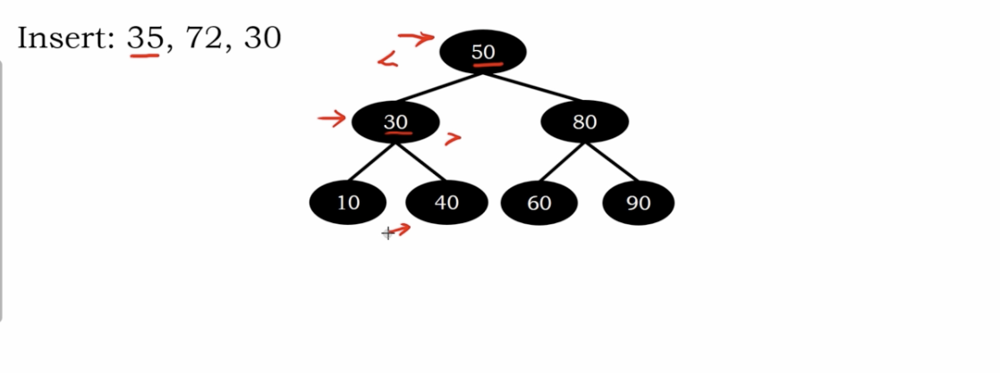
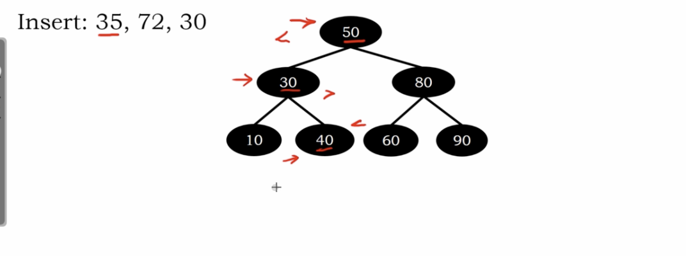
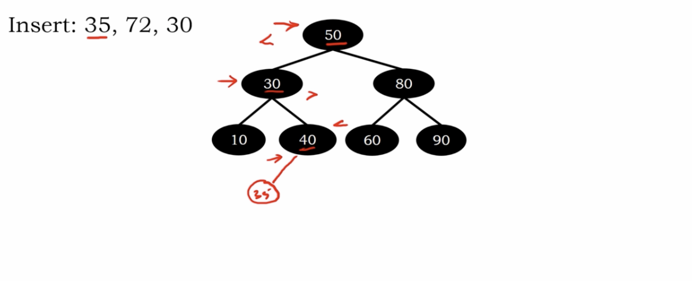
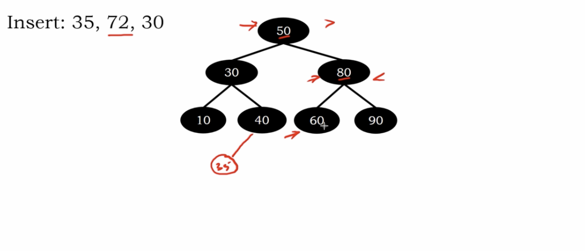
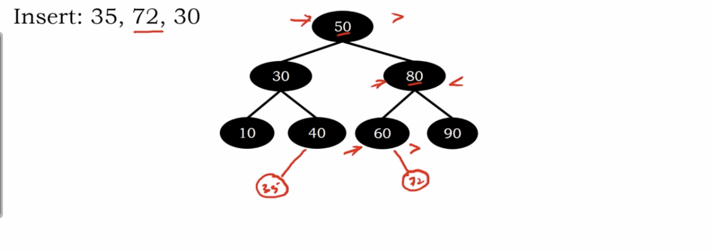
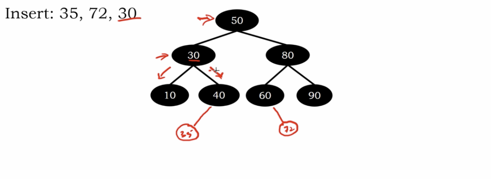
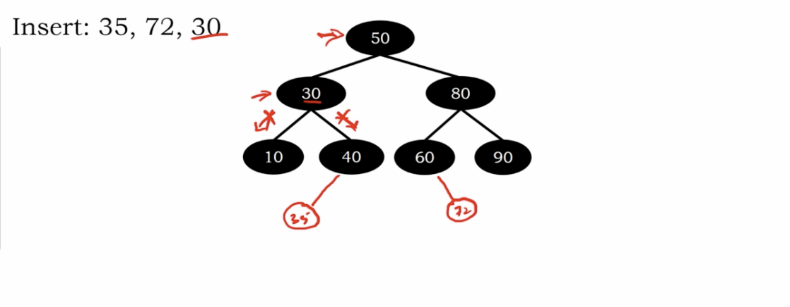

# Insertion in Binary Search Tree

if smaller, search the left sub-tree

else, search the right sub-tree

equal, return the value

search to the leaves -> not exist

# Example

</img>
</img>
</img>
</img>

get the place to insert!

</img>
</img>
</img>

get the place to insert!

</img>

find the same element, do nothing

we store unique values in the bst(Binary Search Tree)

# Algorithm

``` Python
Algorithm insert_iter(troot, e)
    temp = null
    # Searching 
    while troot then
       temp = troot
       if e == troot.element then
          return
       elif e < troot.element then
          troot = troot.left
       elif e > troot.element then
          troot = troot.right 
    # Insertion
    n = Node(e)
    if root then
        if e < temp.element then
           temp.left = n
        else
           temp.right = n
    else
        root = n
```

``` Python
Algorithm insert_rec(troot, e)
   # Searching
   if troot then
      if e < troot.element then
         troot.left = insert_rec(troot.left, e)
      elif e > troot.element then
         troot.right = insert_rec(troot.right, e)
    else
    # Insertion
      n = Node(e)
      troot = n
    return troot    
```
