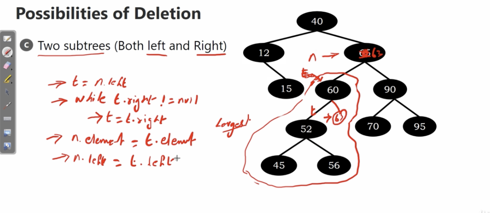

# Deletion in Binary Search Tree

More complex than insertion and searching

We might wanna remove

1. lead node
2. one subtree(left or right)
3. two subtree(both left and right)

# Leaf node

Seach the node, and delete it

</img>

</img>

How to do that?

we find the element 15 first.

back to the parent node 12

assign the right pointer to None, delete 15

same idea, we can apply this methodology to delete node 70

</img>

# One subtree(left or right)

Consider we wanna delete leaf 12

</img>

Now we have a question. If we delete 12, the child node 15? What will we suppose to do?

Let's think about what we have : 

P Node : 40
n Node : 12
n.right : 15

We can do the up-stream bubbling style

P.left = n.right 

to parse value 15 to the position which 12 occupy.

</img>
</img>

## A more complex example

Consider we wanna delete the node 60

</img>

P : 65

n : 60

n.left : [52, 45, 56]

Now we need to up-stream bubbling the sub-tree (52-45-56)

But the process is the same.

</img>

# Two subtrees

Consider we wanna delete the node 65.

Now there are two subtree linked with node 65

We need a new strategy.

</img>

Due to this is a binary search tree.

So the node on the left hand should be smaller than the right hand.

Strategy : find largest node of left sub-tree or smallest node of the right sub-tree as new tree node.

</img>

</img>

In this case, we choose 60 to be the new tree node

But if there is a right sub-tree. We should take them(they are larger)

</img>

</img>

</img>

n = 65

n.left = 60

t = n.left

while t.right != null

(using this statement to get the largest node)

n.element = t.element

Then create links to link the remained sub-tree

## More Complex example

Consider the tree node 63 

If we wanna delete the node 65

</img>

We'll find the largest element is 63 in the left subtree

The node 65 will become node 60.

two subtrees will be maintained in the same way.

</img>

How about the smallest element in the right subtree?

The left most element is 70. 

</img>
