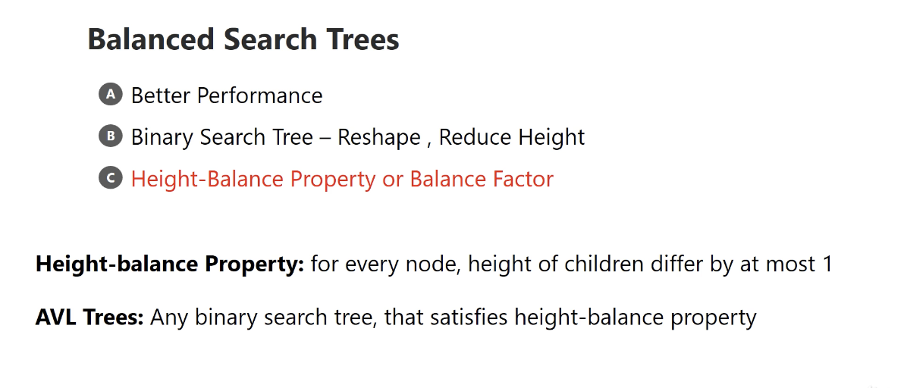
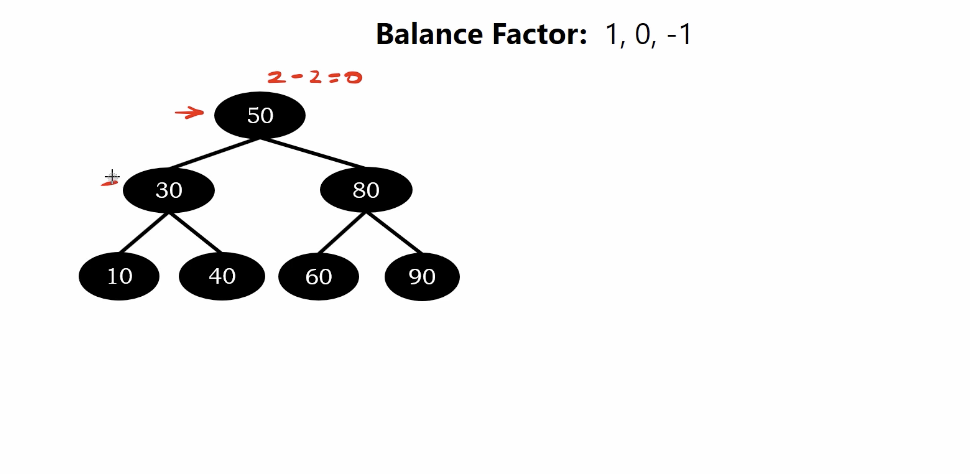
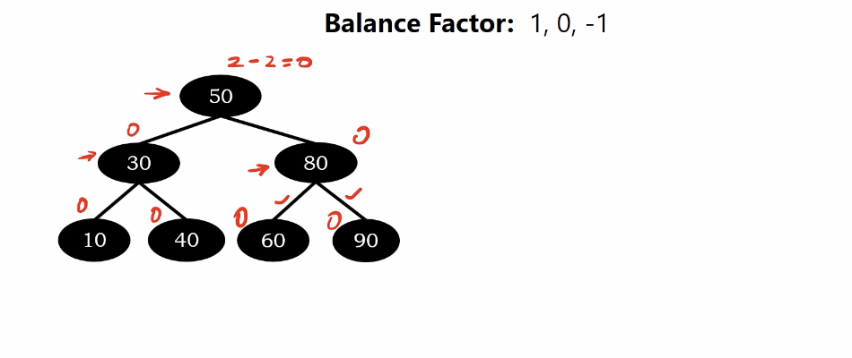
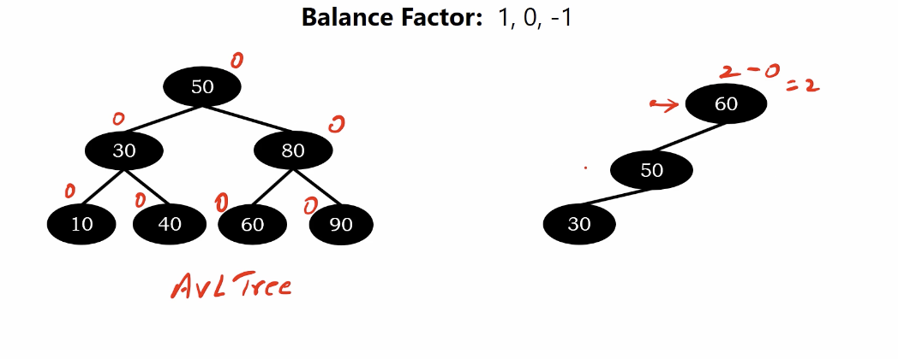

# Binary Search Tree, Perforamnce and Problem

Binary Search Tree = Height $h$, Number of Nodes(unique value) $n$

Sapce Complexity : $O(N)$

Time Complexity : $O(h)$

Insertion : $O(h)$

Deletion : $O(h)$

</img>

# How the height of bst affect the performance?

7 elements but random order. which is $n=7$

</img>

Balance bst.$h=2$

</img>

Imblance bst.$h=4$

</img>

Extremely imblance bst. $h=6$
