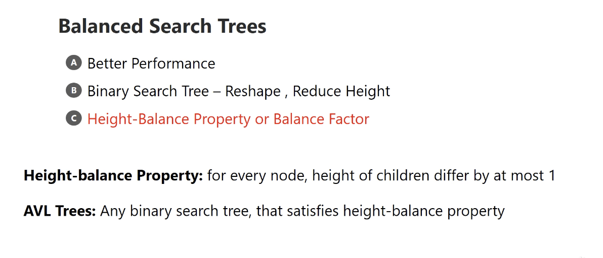
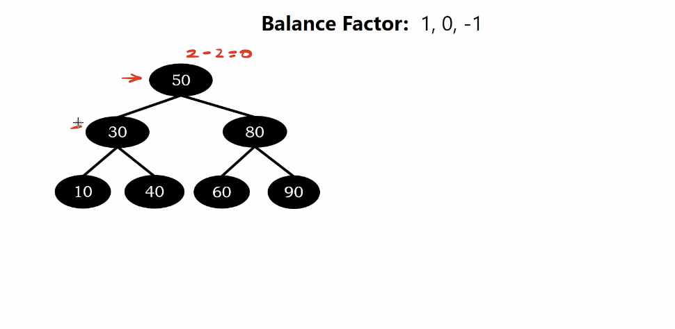

# AVL Trees

Adelson-Velsky and Landis Tree - The most early developed blanced binary search tree.

Height-balance Property - for every node, height of children differ by at most 1.

</img>

AVL Trees : Any binary search tree that satisfies height-balance property.

# Example

</img>

height of left sub-tree - hl
height of right sub-tree - hr

50 : hl - hr = 2 - 2 = 0
30 : hl - hr = 1 - 1 = 0
10 : hl - hr = 0 - 0 = 0

</img>

Another example 

60 : hl - hr = 2 - 0 = 2
50 : hl - hr = 1 - 0 = 1
30 : hl - hr = 0 - 0 = 0

</img>

</img>

we defined the AVL trees : the balance factor for all node must in (-1, 0, 1)

# More Examples

</img>

</img>

Actually the insertion / deletion of AVL trees is similar to binary search.

But we need to reshape the tree every insertion / deletion to make all the nodes well balanced.

The operation of reshaping as known as rotation.
