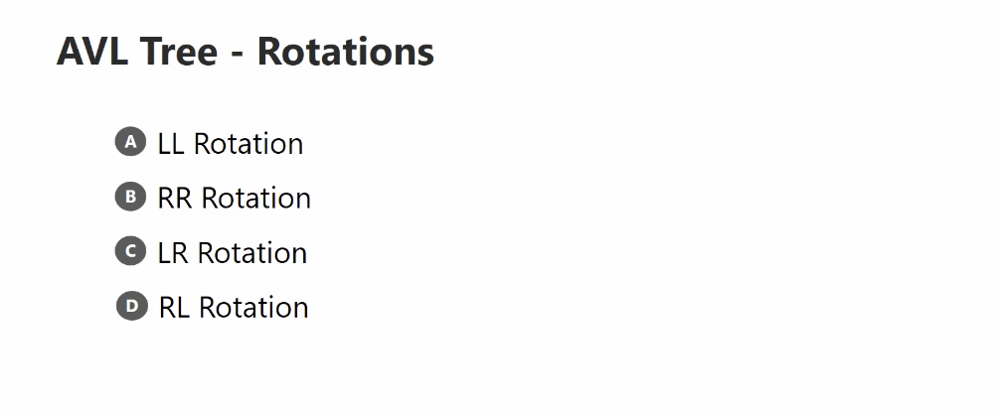
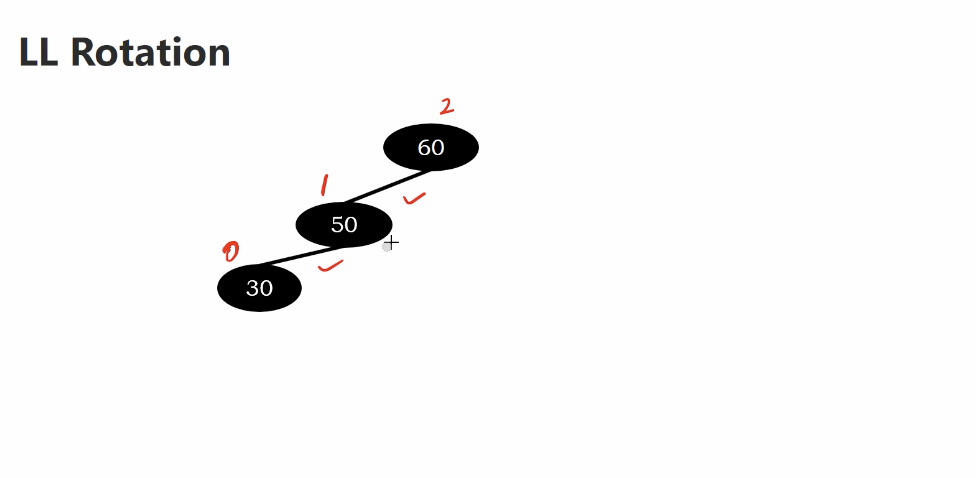
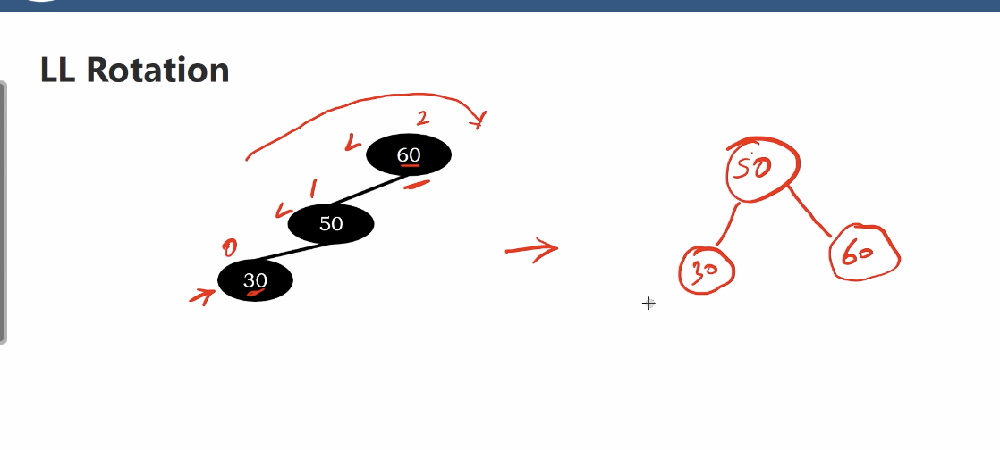
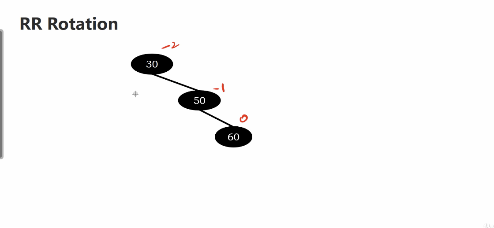
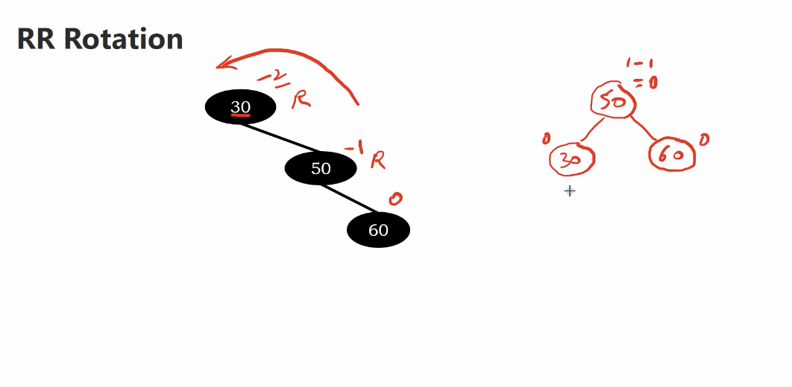
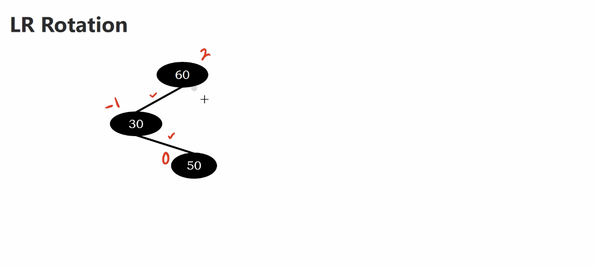
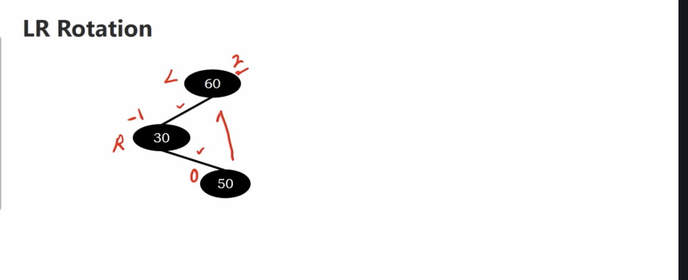
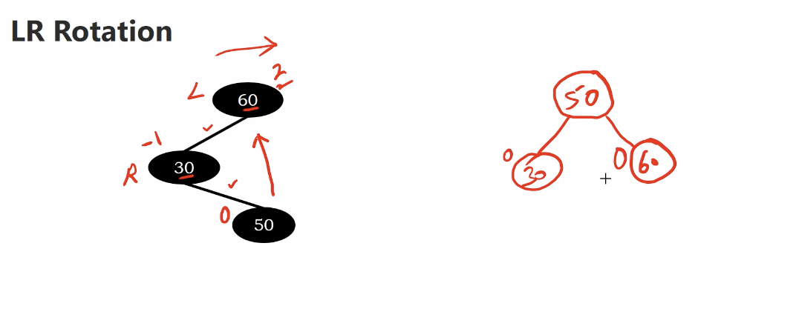
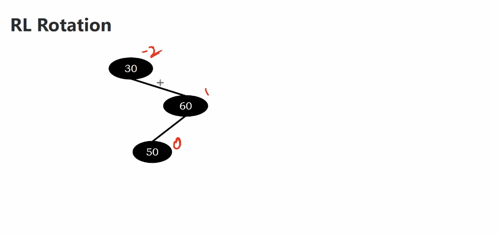
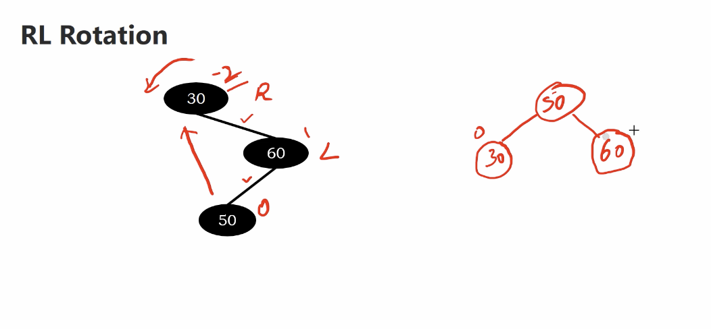

# Rotation after insertion

4 types rotations

</img>

## LL rotation

</img>

1. compute balance factor.
2. move the leaf node clockwised(remomber that maintain the tree is binary search tree)

</img>

Even the tree is big. We only move 3 nodes!

## RR Rotation

</img>

1. compute balance factor.
2. move the leaf node counter clockeise(remomber that maintain the tree is binary search tree)

</img>

## LR Rotation

</img>

</img>

</img>

## RL Rotation

</img>

</img>
