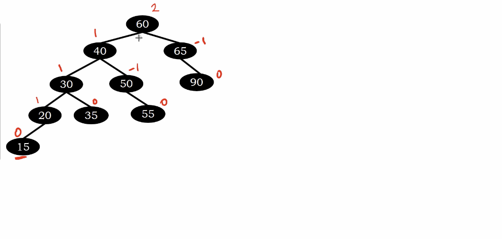

# LL Rotation

## Bigger tree example

</img>

</img>

$B_{R}$ is smaller than B, B is smaller than A

so we can move $B_{R}$ to $A_{L}$

# Example

1, 2, -1 --> LL rotation

</img>

The balanced factor of 60 is 2.

we need do the rotation.

</img>

</img>

</img>

