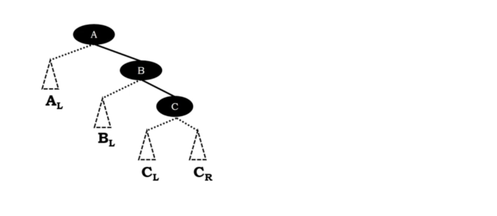
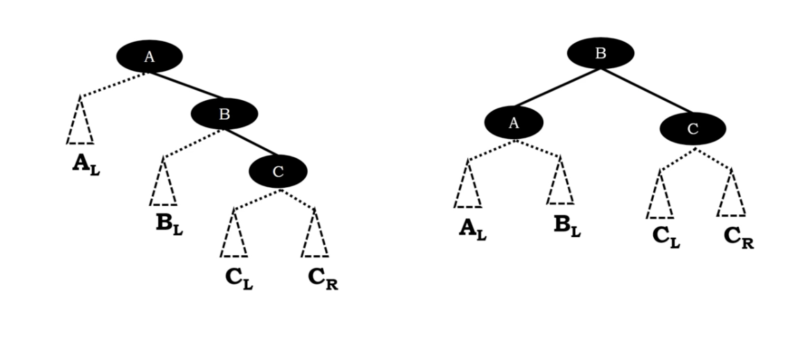
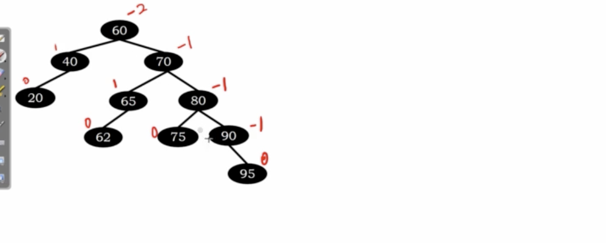
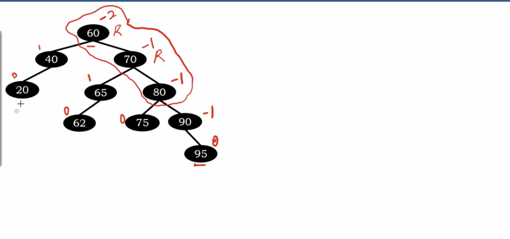
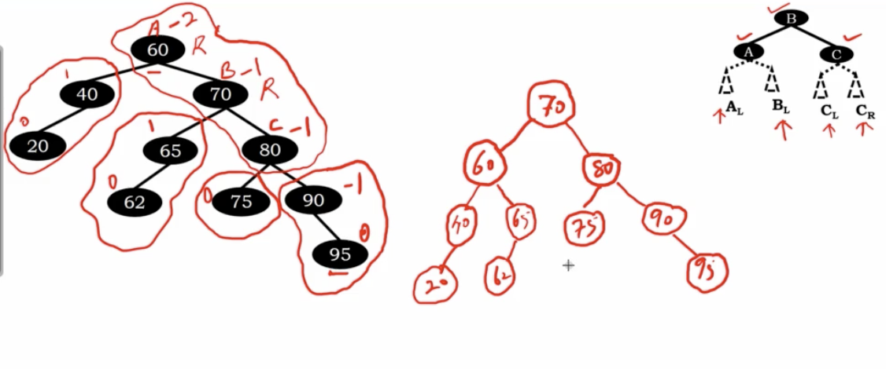

# RR Rotation

</img>

node A is unblanced

</img>

The $B_{L}$ is smaller than $B$ and bigger than $A$

## Practical tree example
 
 </img>

1, -2, -1 -> performing RR rotation.

</img>

following the fomular : 

A : 60, B : 70, C : 80

</img>

