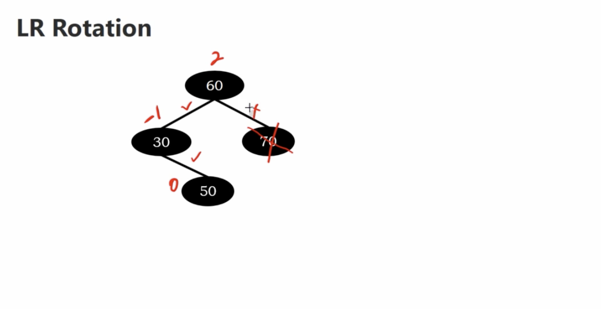
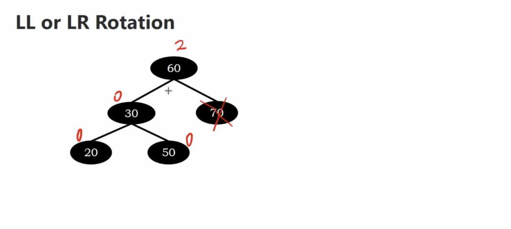

# Rotations after Deletion

LL rotation
RR rotation
LR rotation
RL rotation

## LL rotation

The balance factor shows below

</img>

if we delete 70,

The balance factor shows below

</img>

we perform LL rotation

</img>

# LR Rotation

</img>

If we delete element 70

</img>

</img>

## LL or LR Rotation

</img>

if we perform LL rotation

</img>

</img>

## RR

</img>

</img>

## RL

</img>

</img>

## RR or RL 

</img>

if we perform RR

</img>

if we perform RL

</img>