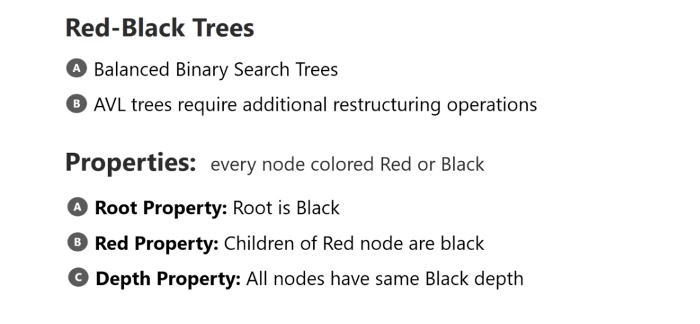
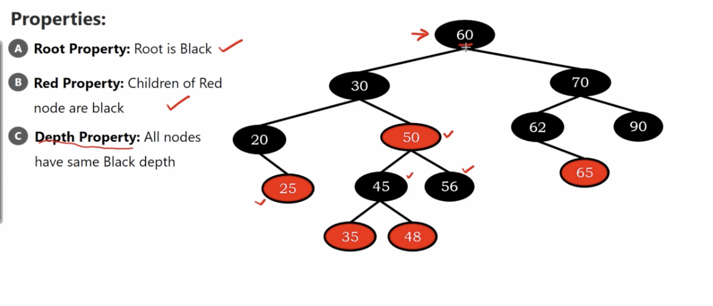

# Red-Black Trees

## Why Red-Black Trees

### Additional metrials

[紅黑樹 wiki](https://zh.wikipedia.org/wiki/%E7%BA%A2%E9%BB%91%E6%A0%91)

[資料結構與演算法：Red Black Tree 紅黑樹 part 1](https://josephjsf2.github.io/data/structure/and/algorithm/2020/04/28/red-black-tree-part-1.html)

[有了二叉查詢樹、平衡樹為啥還需要紅黑樹？](https://www.mdeditor.tw/pl/pdHL/zh-tw)

1. Red black tree offer a loose condition for height balance. only rotate when needed. Otherwise, just do recoloring.
2. base on 1, Red black tree offer a faster insertion/deletion respect to AVL tree.

3. brief thinking path : 

* Binary Search Tree - good for searching, but there is some unblanced problem.

* AVL tree - self-balanced binary search tree, especially for  contantly searching
* RB tree - self-balanced binary search tree, especially for contantly insertion/deletion

* They both self-balanced search tree(AVL tree and RB tree) offer searching / insetion / deletion time complexity : $O(log n)$

## Definition

every node colored red or black

1. Root property - root is black.
2. Red Property - children of red node are black.
3. Depth Property : All nodes have same black depth.

</img>

# Example

</img>

A, B is easy to check.

C : 

60-30-20 : black depth = 3

60-30-45 : black depth = 3

60-30-56 : black depth = 3

60-70-62 : black depth = 3

60-70-90 : black depth = 3

