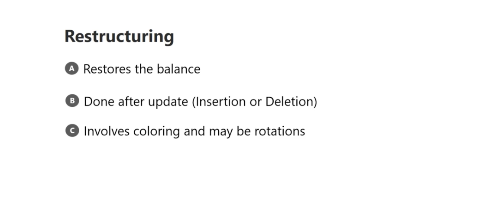
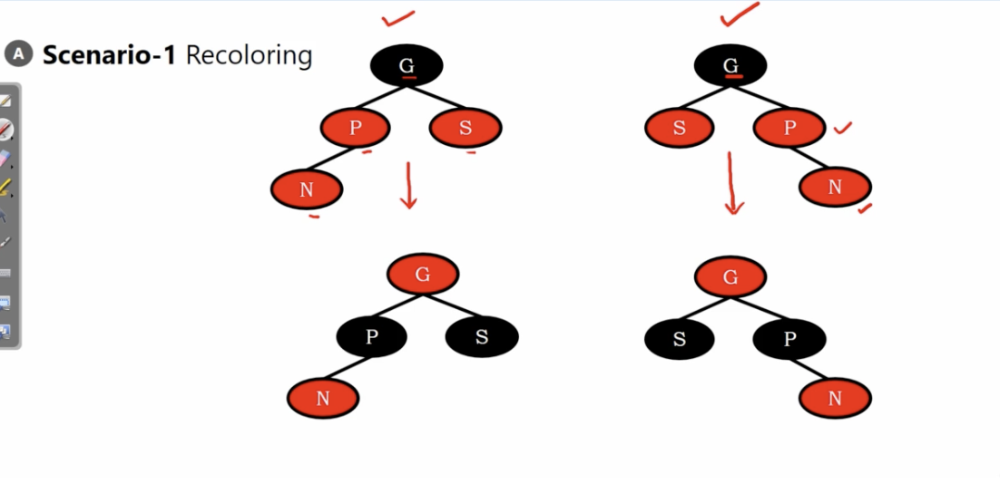
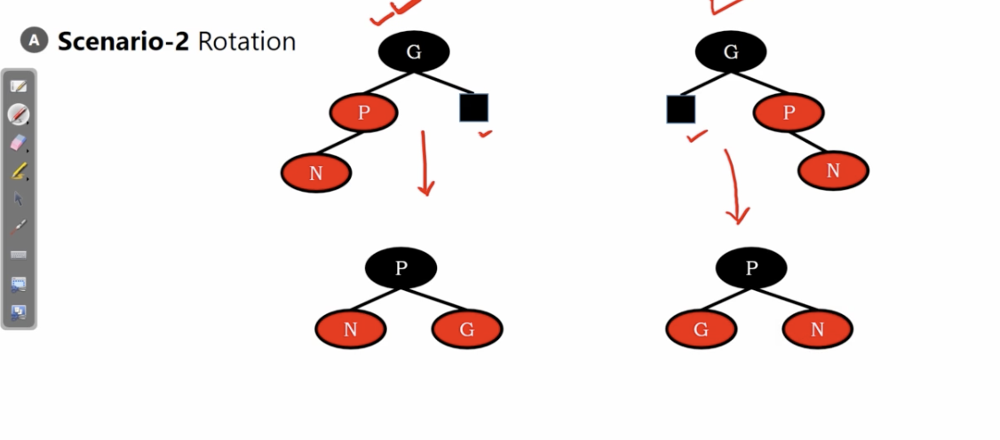
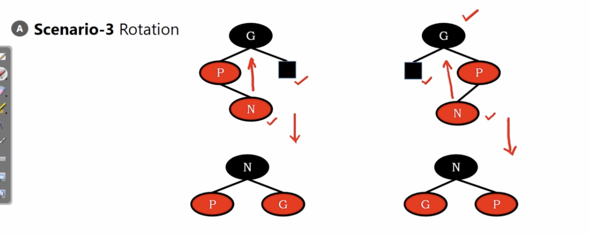

# Red-Black Trees restructing

red-black tree is well designed for restructing!

also knowns as coloring(it may rotate or not)

</img>

# scenario 1 : recoloring

upper : the insertion

lower : after re-coloring

</img>

if new node and the slibling of the parent is red : 

1. parent and the sibling -> black
2. grand-parent -> red

# scenario 2 : rotation

A tree insert node $N$. but there is not sibling of node $P$.

Then we need to rotate the tree. 

node $P$ is the root. and it'll be the black node.

child node will be colored as the red node.

</img>

# scenario 3 : rotation

another scenario which needs rotation.

</img>