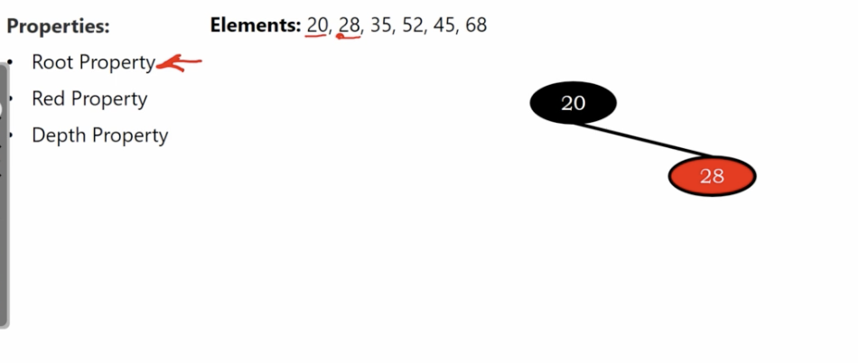
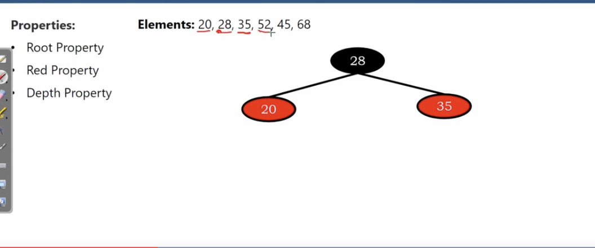

# Red-Black Trees insertion

binary search tree plus rb-tree coloring property.

</img>

</img>

</img>

break red property(child of red node should be black)

performing restructing(rotating in this case)

</img>

</img>

element 52 insertion break red property.

perform restructing(re-coloring in this case)

</img> 

</img> 

element 45 insertion break red property.

perform restructing(rotation this time)

</img>

</img>

element 68 insertion break red property.

perform restructing(re-coloring this time)

</img>