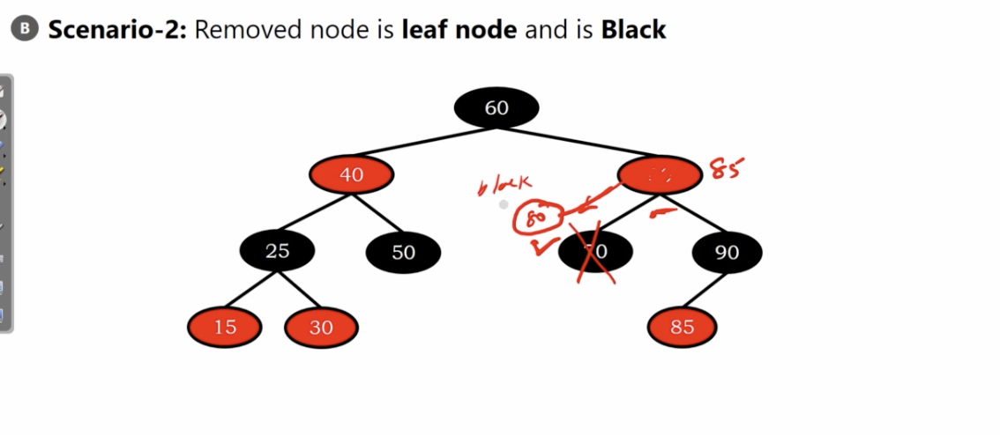
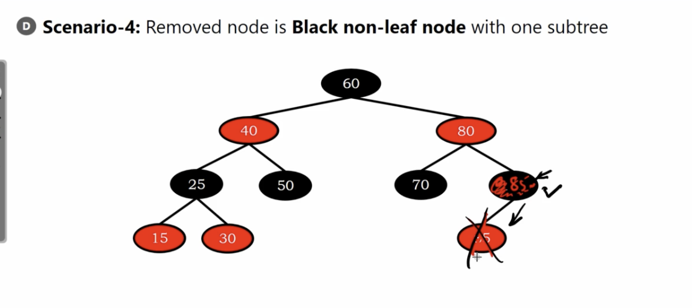

# Red-Black Trees insertion

Deleting node is same as binary search tree.

6 scenarios (still a lot of dirty work...)

</img>

# S1

</img>

it's fine. it'll not breaking any rb tree rules.

# S2

</img>

delete 70

break rules -> do restructing(rotation)

# S3

</img>

# S4

</img>

delete 90

85 rotate to position 90

# S5

</img>

delete node 80

</img>

rotate 70 to 80

# S6

</img>

delete 25

node 15 take the place

</img>

recoloring

</img>

# Summary

1. remove a red node is easy.
2. reomve a black node whatever a leaf node or non-leaf node, it can be complex.(restructing and bst deletion)

