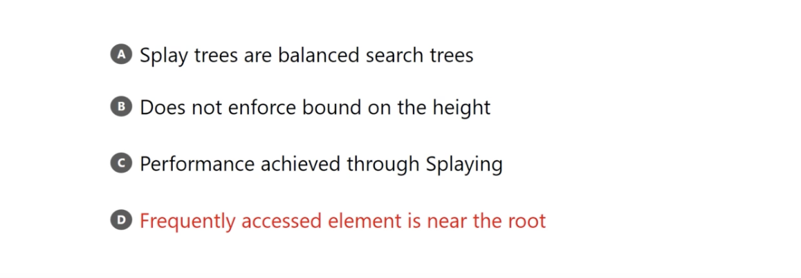
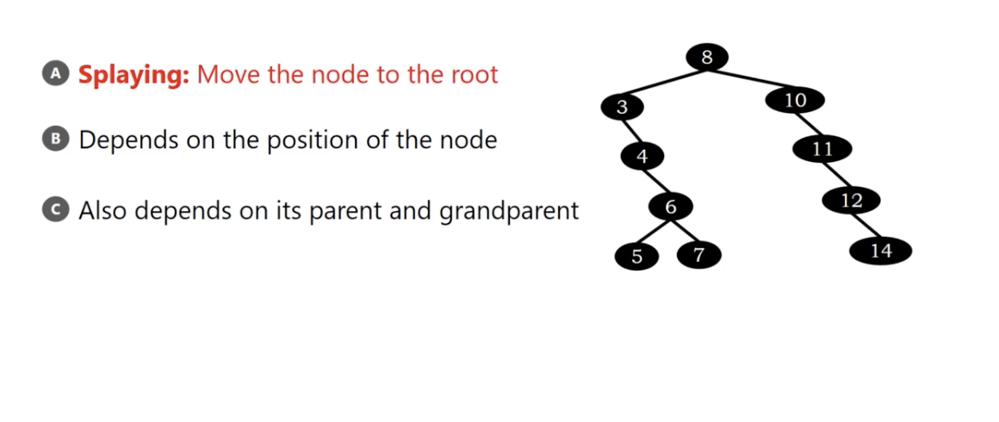
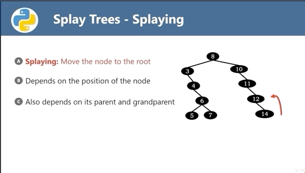
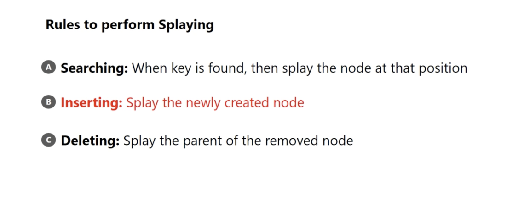
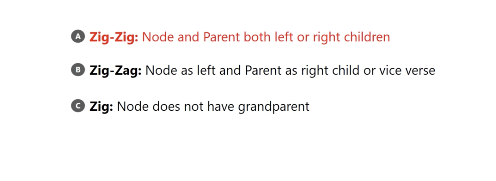

# Red-Black Trees insertion

</img>

does not enforce bound on the height.

main idea : more frequently searched element, be more near the root.

# Why we need this kind of tree?

[伸展樹 wiki](https://zh.wikipedia.org/wiki/%E4%BC%B8%E5%B1%95%E6%A0%91)

1. Another idea to build a self-balanced search tree
2. Pros:
   1. fast searching if there are some node is frequently seached.
   2. low space requirement(compare to AVL and RB tree)
3. Cons:
   1. Possible to reduce a linked list
   2. Even if you guy build a read-only search tree, the tree structure still being unpredictable. It's hard to maintain the tree under a multi-thread application.

# More detail

</img>

</img>

</img>

</img>