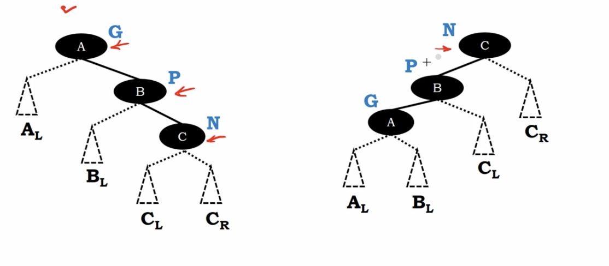
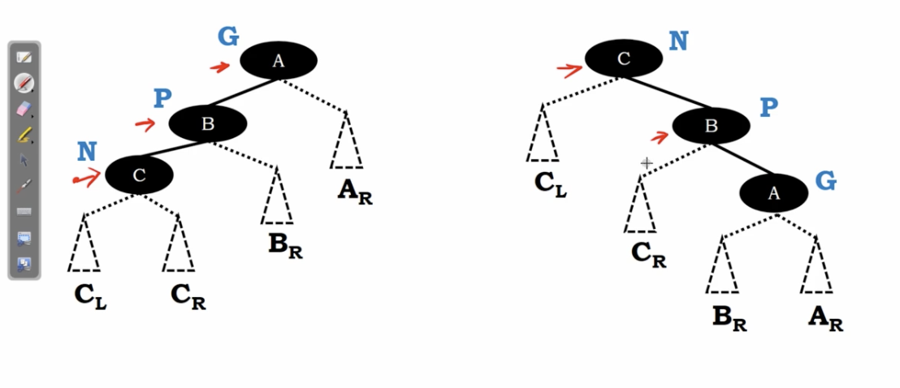

# splay tree - zig zig restructuring

</img>

Case I 

left : Node C is searched

right : Move Node C to **grandparent**

but we need to maintain the balanced search tree properties.

the right-type tree will switch to left-type tree

and the subtree can be maintained.(the right figure.)

# Another Case

</img>

If we start from a left-type search-tree, then transform to right-type search-tree.

# Summary

In this way. everytime we search the node. the node will be more near to the root. the restructuring also maintain the balanced search tree properties.