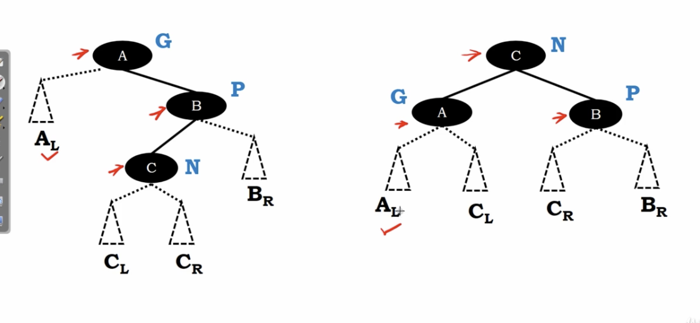
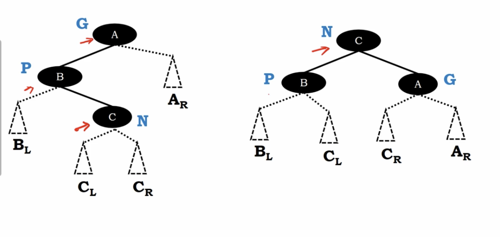

# splay tree - zig zag restructuring

</img>

If the tree match the shape like the left figure.

Then do zig-zag restructuring.

node $N$ will become the **granparent**.

subtree can be hold with node $G$ and node $B$.

# Anothe case

</img>

Same idea. Just different shape.