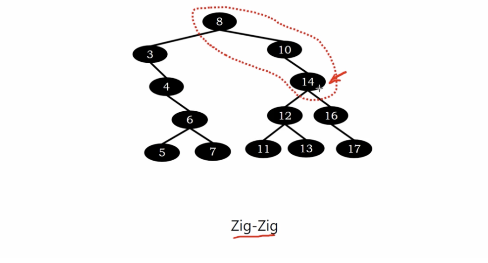

# splay tree - zig zag restructuring

</img>

# Example

</img>

consider we've inseted/searched node 14.

first we need to perform zig-zag rotation.

</img>

</img>

Then we need to perform zig-zig rotation.

</img>

Then we need to perform zig-zig rotation again

</img>

after we put the 14 to the root.

</img>

# Summary

splaying is a sequence operation to make sure the insertion/searched node can be moved to the root.