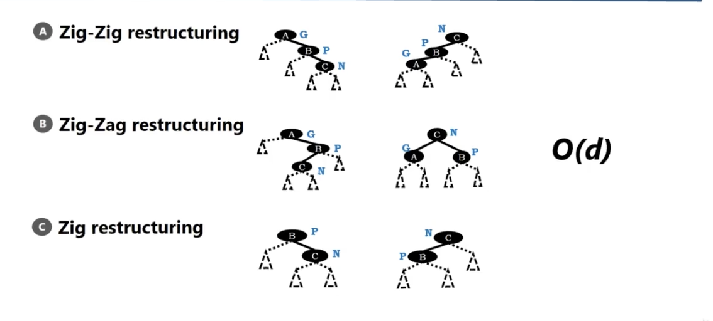

# splay tree - zig zag restructuring

</img>

Consider the rotation can reduce the insertion/searched node depth 2 or 1.

The time complexity is $O(d)$, $d$ is the depth of the searched/insertion node.

</img>

The time complexity of seaching/insertion/deletion is $O(h)$

There is no grauntee about the height. might be $O(n)$(linked list)